# <a id="Linux_Processes_Basics"></a>Linux Processes Basics

In short, **processes are running programs on your Linux host** that perform operations such as writing to a disk, writing to a file, or running a web server for example.

Process have a **owner** and they are identified by a **process ID** (also called **PID**)

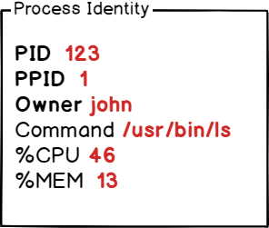

On the other hand, **programs** are lines or code or lines of machine instructions stored on a persistent data storage.

They can just sit on your data storage, or they can be in execution, i.e running as processes.

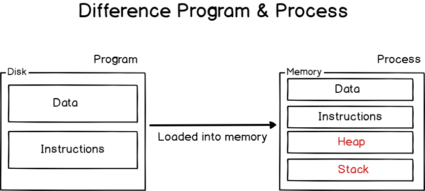

In order to perform the operations they are assigned to, processes need **resources** : **CPU time**, **memory** (such as **RAM** or **disk space**), but also virtual memory such as **swap space** in case your process gets too greedy.

Obviously, processes can be **started**, **stopped**, **interrupted** and even **killed**.

Before issuing any commands, let’s see how processes are created and managed by the kernel itself.

## <a id="Process_Initialization_on_Linux"></a>Process Initialization on Linux

As we already stated, processes are **managed by the Kernel** on Linux.

However, there is a core concept that you need to understand in order to know how Linux creates processes.

By default, when you boot a Linux system, your Linux kernel is loaded into memory, it is given a virtual filesystem in the RAM (also called **initramfs**) and the initial commands are executed.

One of those commands starts **the very first process on Linux.**

Historically, this process was called the [init process](https://en.wikipedia.org/wiki/Init) but it got replaced by the [systemd initialization process](https://en.wikipedia.org/wiki/Systemd) on many recent Linux distributions.

To prove it, run the following command on your host

```
$ ps -aux | head -n 2
```

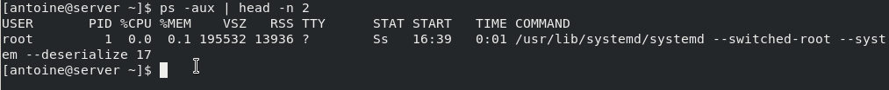

As you can see, the systemd process has **a PID of 1.**

If you were to print all processes on your system, using a tree display, you would find that all processes are children of the systemd one.

```
$ pstree
```

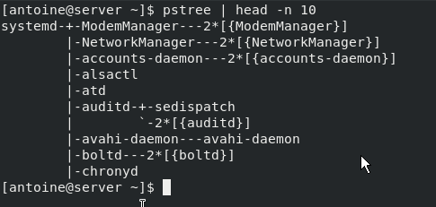

It is noteworthy to underline the fact that all those initialization steps (except for the launch of the initial process) are done in a reserved space called **the kernel space.**

The kernel space is **a space reserved to the Kernel** in order for it to run essential system tools properly and to make sure that your entire host is running in a consistent way.

On the other hand, **user space is reserved for processes** launched by the user and managed by the kernel itself.

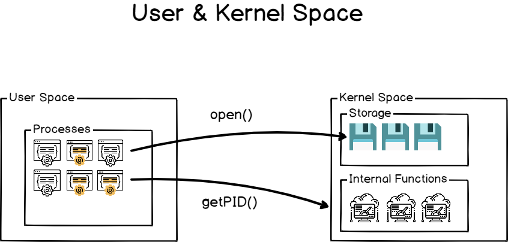

As a consequence, the systemd process is the very first process launched in the user space.

## <a id="Process_Creation_using_Fork_and_Exec"></a>Process Creation using Fork and Exec

When you are creating and running a program on Linux, it generally involves two main steps : **fork** and **execute**.

### <a id="Fork_operation"></a>Fork operation

[Fork](http://man7.org/linux/man-pages/man2/fork.2.html) is a clone operation, it takes the current process, also called the parent process, and it clones it in a new process with a brand new process ID.

When forking, everything is copied from the parent process : **the stack**, **the heap**, but also the file descriptors meaning **the standard input, the standard output and the standard error.**

It means that if my parent process was writing to the current shell console, the child process will also write to the shell console.

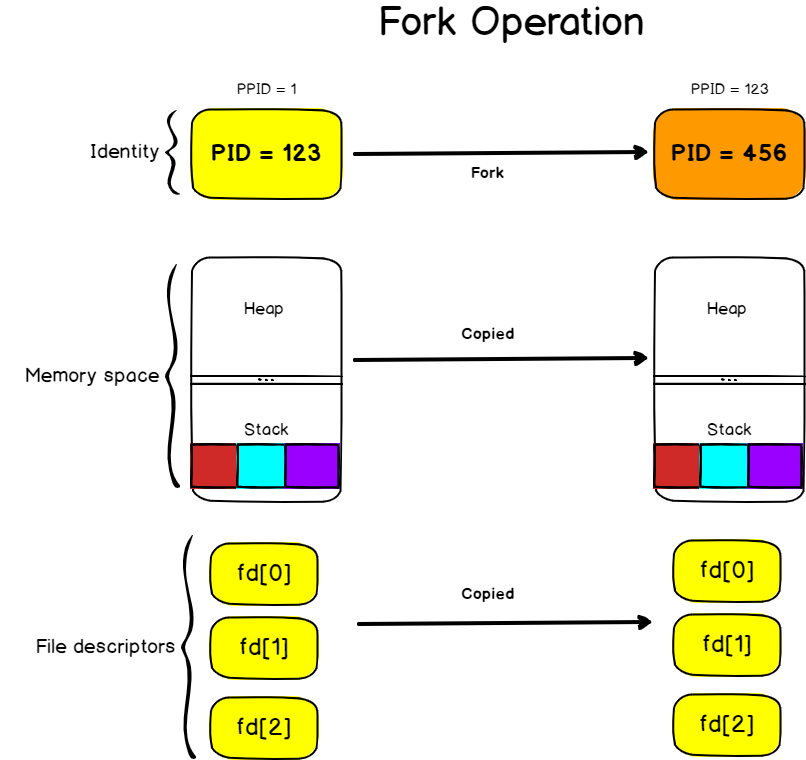

The execution of the cloned process will also start **at the same instruction as the parent process.**

### <a id="Execute_operation"></a>Execute operation

The execute operation is used on Linux **to replace the current process image with the image from another process.**

On the previous diagram, we saw that the stack of the parent process contained three instructions left.

As a consequence, the instructions were copied to the new process but they are not relevant to what we want to execute.

The [exec](http://man7.org/linux/man-pages/man3/exec.3.html) operation will replace the process image (i.e the set of instructions that need to be executed) by another one.

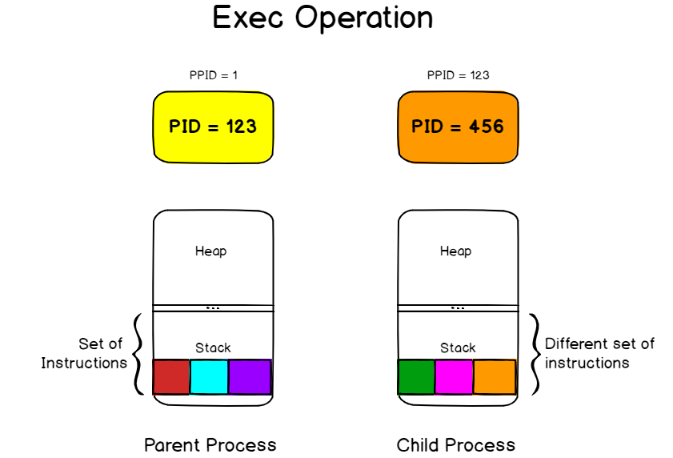

If you were for example to execute the exec command in your bash terminal, your shell would terminate as soon as the command is completed as your current process image (your bash interpreter) would be replaced with the context of the command you are trying to launch.

```
$ exec ls -l
```

If you were to trace the system calls done when creating a process, you would find that the first C command called is the exec one.

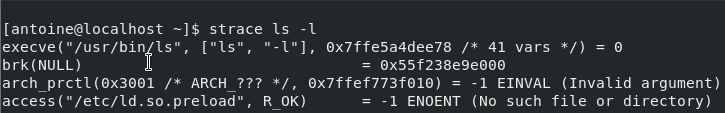

### <a id="Creating_processes_from_a_shell_environment"></a>Creating processes from a shell environment

When you are launching a shell console, the exact same principles apply when you are launching a command.

A shell console is a process that waits for input from the user.

It also launches a bash interpreter when you hit Enter and it provides an environment for your commands to run.

But the shell follows the steps we described earlier.

When you hit enter, **the shell is forked to a child process** that will be responsible for running your command. The shell will wait patiently until the execution of the child process finishes.

On the other hand, **the child process is linked to the same file descriptors** and it may share variables that were declared on a global scope.

The child process executes the “**exec**” command in order to replace the current process image (which is the shell process image) in the process image of the command you are trying to run.

The child process will eventually finish and it will print its result to the standard output it inherited from the parent process, in this case the shell console itself.

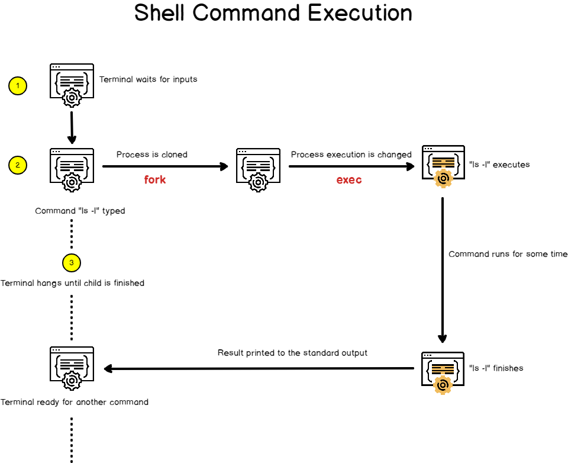

Now that you have some basics about how processes are created in your Linux environment, let’s see some details about processes and how they can be identified easily.

## <a id="Identifying_running_processes_on_Linux"></a>Identifying running processes on Linux

The easiest way to identify running processes on Linux is to run the **ps** command.

```
$ ps
```

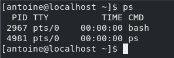

By default, the ps command will show you the list of the current running processes owned by the current user.

In this case, only two processes are running for my user : **the bash interpreter** and the **ps command** I have run into it.

The important part here is that processes have **owners**, most of the time the user who run them in the first place.

To illustrate this, let’s have a listing of the first ten processes on your Linux operating system, with a different display format.

```
$ ps -ef | head -n 10
```

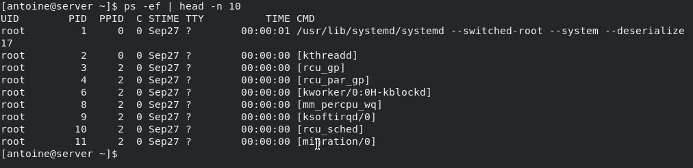

As you can see here, the top ten processes are owned by the user “**root**“.

This information will be particularly important when it comes to interacting with processes with signals.

To display the processes that are owned and executed by the current connected user, run the following command

```
$ ps u
```

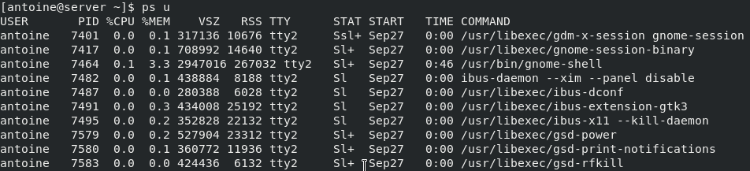

There are plenty of different options for the ps command, and they can be seen by running the manual command.

```
$ man ps
```

From experience, the two most important commands in order to see running processes are

```
ps aux

USER PID %CPU %MEM VSZ RSS TTY STAT START TIME COMMAND
```

That corresponds to a **BSD-style process listing**, where the following command

```
ps -ef

UID  PID  PPID C STIME TTY  TIME CMD
```

Corresponds to a **POSIX-style process listing**.

They are both representing current running processes on a system, but the first one has the “u” option for “user oriented” which makes it easier to read process metrics.

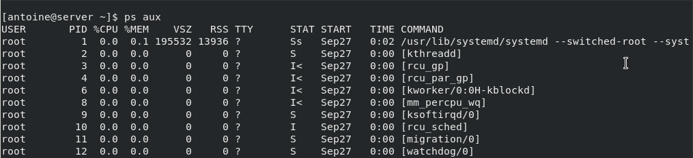

Now that you have seen what processes are and how they can be listed, let’s see what background and foreground processes are on your host.

# <a id="Background_and_foreground_processes"></a>Background and foreground processes

The definition of background and foreground processes are pretty self-explanatory.

## <a id="Jobs_and_processes_in_the_current_shell"></a>Jobs and processes in the current shell

**A background process on Linux is a process that runs in the background, meaning that it is not actively managed by a user through a shell for example.**

On the opposite side, **a foreground process is a process that can be interacted with via direct user input.**

Let’s say for example that you have opened a shell terminal, and that you typed the following command in your console.

```
$ sleep 10000
```

As you probably noticed, your terminal will hang until the termination of the sleep process. As a consequence, the process is not executed in the background, it is executed in the foreground.

I am able to interact with it. If I press Ctrl + Z, it will directly send a stop signal to the process for example.

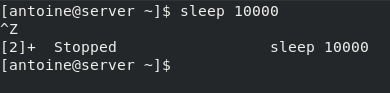

However, there is a way to execute the process in the background.

To execute a process in the background, simply put a “**&**” sign at the end of your command.

```
$ sleep 10000 &
```

As you can see, the control was directly given back to the user and the process started executing in the background

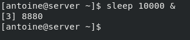

To see your process running, in the context of the current shell, you can execute the jobs command

```
$ jobs
```

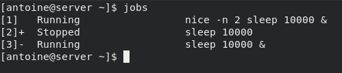

Jobs are a list of processes that were started in the context of the current shell and that may still be running in the background.

As you can see in the example above, I have two processes currently running in the background.

The different columns from left to right represent the the **job ID, the process state** (that you will discover in the next section), and **the command executed.**

## <a id="Using_the_bg_and_fg_commands"></a>Using the bg and fg commands

In order to interact with jobs, you have two commands available : **bg** and **fg**.

**The bg command is used on Linux in order to send a process to the background** and the syntax is as follows

```
$ bg %<job_id>
```

Similarly, in order to send a process to the foreground, you can use the **fg** in the same fashion

```
$ fg %<job_id>
```

If we go back to the list of jobs of our previous example, if I want to bring the job 3 to the foreground, meaning to the current shell window, I would execute the following command

```
$ fg %3
```

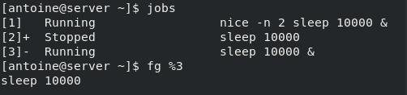

By issuing a Ctrl + Z command, I am able to stop the process. I can link it with a bg command in order to send it to the background.

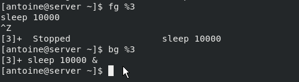

Now that you have a better idea of what background and foreground processes are, let’s see how it is possible for you to interact with process using signals.

# <a id="Interacting_with_processes_using_signals"></a>Interacting with processes using signals

On Linux, signals are a form of **interprocess communication** (also called **IPC**) that creates and sends asynchronous notifications to running processes about the occurrence of a specific event.

Signals are often used in order to **send a kill** or a **termination command** to a process in order to shut it down (also called kill signal).

In order to send a signal to a process, you have to use the **kill** command.

```
$ kill -<signal number> <pid>|<process_name>
```

For example, in order to force a HTTPD process (PID = 123) to terminate (without a clean shutdown), you would run the following command

```
$ kill -9 123
```

## <a id="Signals_categories_explained"></a>Signals categories explained

As explained, there are many signals that one can send in order to notify a specific process.

Here is the list of the most common used ones :

- **SIGINT** : short for signal interrupt is a signal used in order to interrupt a running process. It is also the signal that is being sent when a user pressed Ctrl + C on a terminal;
- **SIGHUP** : short for signal hangup is the signal sent by your terminal when it is closed. Similarly to a SIGINT, the process terminates;
- **SIGKILL** : signal used in order to force a process to stop whether it can be gracefully stopped or not. This signal can not be ignored except for the init process (or the systemd one on recent distributions);

- **SIGQUIT** : specific signal sent when a user wants to quit or to exit the current process. It can be invoked by pressing Ctrl + D and it is often used in terminal shells or in SSH sessions;
- **SIGUSR1, SIGUSR2** : those signals are used purely for communication purposes and they can be used in programs in order to implement custom handlers;
- **SIGSTOP** : instructs the process to stop its execution without terminating the process. The process is then waiting to be continued or to be killed completely;
- **SIGCONT** : if the process is marked as stopped, it instructs the process to start its execution again.

In order to see the full list of all signals available, you can run the following command

```
$ kill -l

 1) SIGHUP       2) SIGINT       3) SIGQUIT      4) SIGILL
 5) SIGTRAP      6) SIGABRT      7) SIGBUS       8) SIGFPE
 9) SIGKILL     10) SIGUSR1     11) SIGSEGV     12) SIGUSR2
13) SIGPIPE     14) SIGALRM     15) SIGTERM     16) SIGSTKFLT
17) SIGCHLD     18) SIGCONT     19) SIGSTOP     20) SIGTSTP
21) SIGTTIN     22) SIGTTOU     23) SIGURG      24) SIGXCPU
25) SIGXFSZ     26) SIGVTALRM   27) SIGPROF     28) SIGWINCH
29) SIGIO       30) SIGPWR      31) SIGSYS      34) SIGRTMIN
35) SIGRTMIN+1  36) SIGRTMIN+2  37) SIGRTMIN+3  38) SIGRTMIN+4
39) SIGRTMIN+5  40) SIGRTMIN+6  41) SIGRTMIN+7  42) SIGRTMIN+8
43) SIGRTMIN+9  44) SIGRTMIN+10 45) SIGRTMIN+11 46) SIGRTMIN+12
47) SIGRTMIN+13 48) SIGRTMIN+14 49) SIGRTMIN+15 50) SIGRTMAX-14
51) SIGRTMAX-13 52) SIGRTMAX-12 53) SIGRTMAX-11 54) SIGRTMAX-10
55) SIGRTMAX-9  56) SIGRTMAX-8  57) SIGRTMAX-7  58) SIGRTMAX-6
59) SIGRTMAX-5  60) SIGRTMAX-4  61) SIGRTMAX-3  62) SIGRTMAX-2
63) SIGRTMAX-1  64) SIGRTMAX
```

## <a id="Signals_and_Processes_States"></a>Signals and Processes States

Now that you know that it is possible to interrupt, kill or stop processes, it is time for you to learn about processes states.

Processes have many different states, they can be :

- **Running** : processes running are the ones using some computational power (such as CPU time) in the current time. A process can also be called “runnable” if all running conditions are met, and it is waiting for some CPU time by the CPU scheduler.
- **Stopped** : a signal is stopped is linked to the SIGSTOP signal or to the Ctrl + Z keyboard shortcut. The process execution is suspended and it is either waiting for a SIGCONT or for a SIGKILL.
- **Sleeping** : a sleeping process is a process waiting for some event or for a resource (like a disk) to be available.

Here is a diagram that represents the different process states linked to the signals you may send to them.

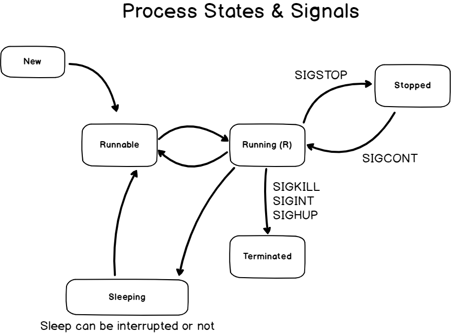

Now that you know a bit more about process states, let’s have a look at the pgrep and pkill commands.

# <a id="Manipulating_process_with_pgrep_and_pkill"></a>Manipulating process with pgrep and pkill

On Linux, there is already a lot that you can do by simply using the ps command.

You can narrow down your search to one particular process, and you can use the PID in order to kill it completely.

However, there are two commands that were designed in order for your commands to be even shorter : **pgrep and pkill**

## <a id="Using_the_pgrep_command"></a>Using the pgrep command

The **pgrep** command is a shortcut for using the ps command piped with the grep command.

**The pgrep command will search for all the occurrences for a specific process using a name or a defined pattern.**

The syntax of the pgrep command is the following one

```
$ pgrep <options> <pattern>
```

For example, if you were to search for all processes named “bash” on your host, you would run the following command

```
$ pgrep bash
```

The pgrep command is not restricted to the processes owned by the current user by default.

If another user was to run the bash command, it would appear in the output of the pgrep command.

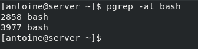

It is also possible to search for processes using [globbing characters.](https://en.wikipedia.org/wiki/Glob_%28programming%29)

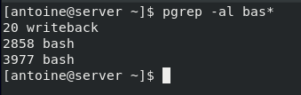

## <a id="Using_the_pkill_command"></a>Using the pkill command

On the other hand, the pkill command is also a shortcut for the ps command used with the kill command.

The pkill command is used in order to send signal to processes based on their IDs or their names.

The syntax of the pkill command is as follows

```
$ pkill <options> <pattern>
```

For example, if you want to kill all Firefox windows on your host, you would run the following command

```
$ pkill firefox
```

Similarly to the pgrep command, you have the option to narrow down your results by specifying a user with the -u option.

To kill all processes starting with “fire” and owned by the current user and root, you would run the following command

```
$ pkill user,root fire*
```

If you don’t have the rights to stop a process, you will get a permission denied error message to your standard output.

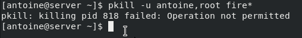

You also have the option to send specific signals by specifying the signal number in the pkill command

For example, in order to stop Firefox with a SIGSTOP signal, you would run the following command

```
$ pkill -19 firefox
```

# <a id="Adjusting_process_priority_using_nice_and_renice"></a>Adjusting process priority using nice and renice

On Linux, not all processes are given the same priority when it comes to the CPU time.

Some processes, such as very important processes run by root, are given a higher priority in order for the operating system to work on tasks that truly matter to the system.

**Process priority on Linux is called the nice level.**

The nice level is a priority scale going from **-20 to 19.**

The lower you go on the niceness scale, the higher the priority will be.

Similarly, the higher you are on the niceness scale, the lower your priority will be.

In order to remember it, you can remember the fact that **“the nicer you are, the more you are willing to share resources with others”.**

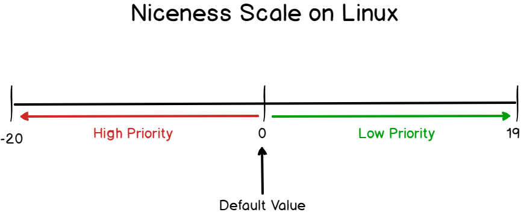

In order to start a certain program or process with a given nice level, you will run the following command

```
$ nice -n <level> <command>
```

For example, in order to run the tar command with a custom tar level, you would run the following command

```
$ nice -n 19 tar -cvf test.tar file
```

Similarly, you can use the renice command in order to set the nice level of a running process to a given value.

```
$ renice -n <priority> <pid>
```

For example, if I have a running process with the PID 123, I can use the renice command in order to set its priority to a given value.

```
$ renice -n 18 123
```

## <a id="Niceness_and_permissions"></a>Niceness and permissions

If you are not a member of the sudo group (or a member of the wheel group on Red Hat based distributions), there are some restrictions when it comes to what you can with the nice command.

To illustrate it, try to run the following command as a non-sudo user

```
$ nice -n -1 tar -cvf test.tar file

nice: cannot set niceness: Permission denied
```

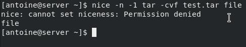

When it comes to niceness, there is one rule that you need to know :

**As a non-root (or sudo) user, you won’t be able to set a nice level lower than the default assigned one (which is zero), and you won’t be able to renice a running process to a lower level than the current one.**

To illustrate the last point, launch a sleep command in the background with a nice value of 2.

```
$ nice -n 2 sleep 10000 &
```

Next, identify the process ID of the process you just created.

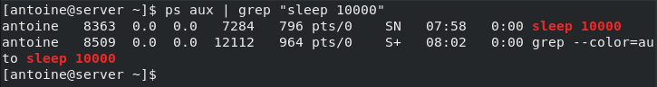

Now, try to set the nice level of your process to a value lower to the one you specified in the first place.

```
$ renice -n 1 8363
```

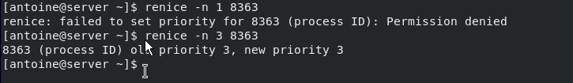

As you probably noticed, you won’t be able to set the niceness level to 1, but only to a value higher than the one you specified.

Now if you choose to execute the command as sudo, you will be able to set the nice level to a lower value.

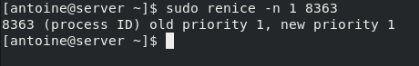

Now that you have a clear idea of the nice and renice commands, let’s see how you can monitor your processes in real time on Linux.

# <a id="Monitoring_processes_on_Linux_using_top_and_htop"></a>Monitoring processes on Linux using top and htop

In a previous article, we discussed how it is possible to build a complete monitoring pipeline in order to [monitor Linux processes in real time.](https://devconnected.com/monitoring-linux-processes-using-prometheus-and-grafana/)

## <a id="Using_top_on_Linux"></a>Using top on Linux

**Top is an interactive command that any user can run in order to have a complete and ordered listing of all processes running on a Linux host.**

To run top, simply execute it without any arguments.

Top will run in interactive mode.

```
$ top
```

If you want to run top for a custom number of iterations, run the following command

```
$ top -n <number>
```

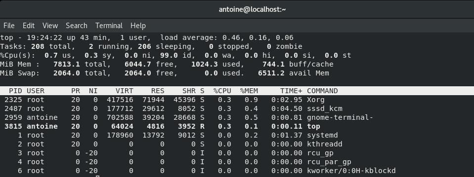

The top command will first show recap statistics about your system at the top, for example the number of tasks running, the percentage of CPU used or the memory consumption.

Right below it, you have access to a live list of all processes running or sleeping on your host.

This view will refresh every three seconds, but you can obviously tweak this parameter.

To increase the refresh rate in the top command, press the “d” command and choose a new refresh rate

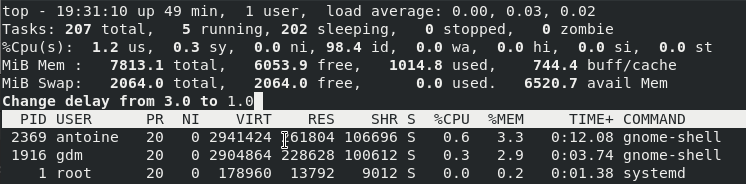

Similarly, you can change the nice value of a running process live by pressing the “r” key on your keyboard.

The same permissions rules apply if you want to modify processes to a value lower to the one they are already assigned.

As a consequence, you may need to run the command as sudo.

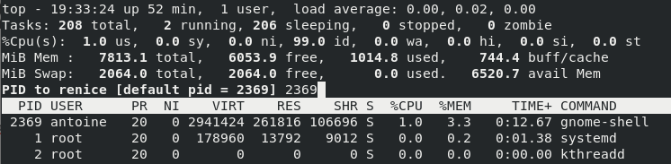

## <a id="Using_htop_on_Linux"></a>Using htop on Linux

Alternatively, if you are looking for a nicer way to visualize processes on your Linux host, you can use the htop command.

By default, the htop command is not available on most distributions, so you will need to install it with the following instructions.

```
$ sudo apt-get update
$ sudo apt-get install htop
```

If you are running a Red Hat based distribution, run the following commands.

```
$ sudo yum -y install epel-release
$ sudo yum -y update
$ sudo yum -y install htop
```

Finally, to run the htop command, simply run it without any arguments.

```
$ htop
```

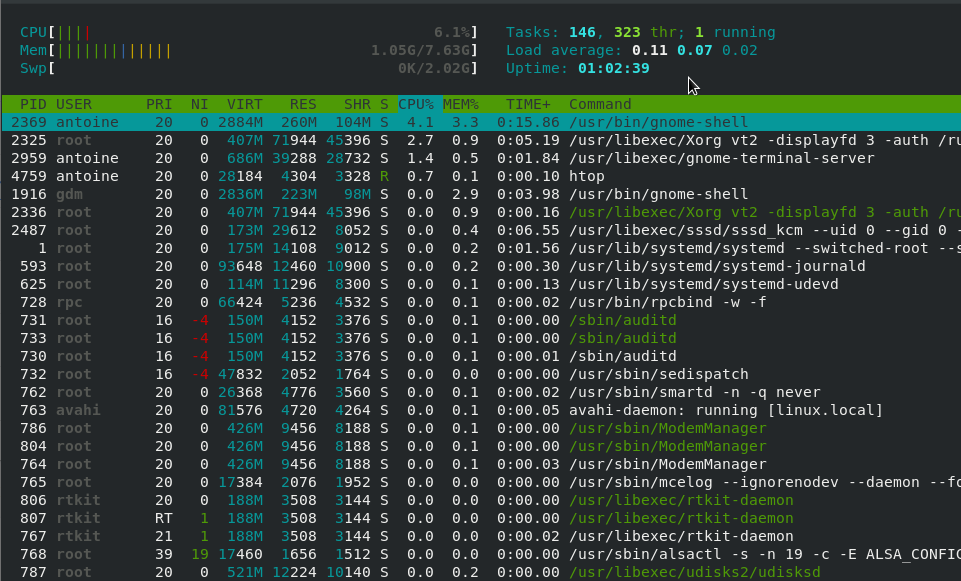

As you can see, the output is very similar except that it showcases information in a more human friendly output.

# <a id="Conclusion"></a>Conclusion

In this tutorial, you learnt many concepts about processes : how they are created, how they can be managed and how they can be monitored effectively.

If you are looking for more tutorials related to Linux system administration, we have a complete section dedicated to it on the website, so make sure to check it out.