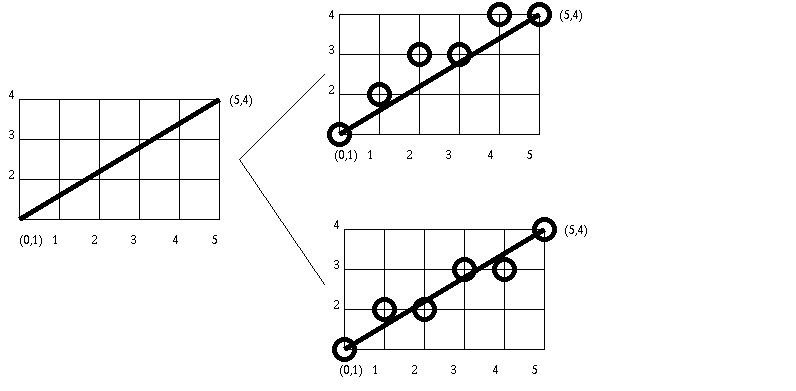
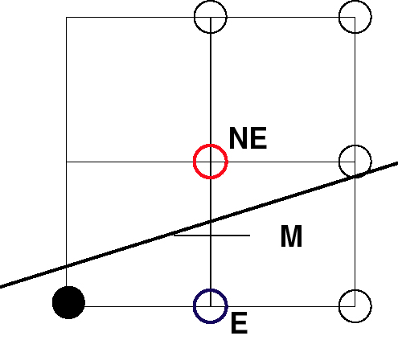
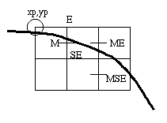

# LINE DRAWING

Given the specification for a straight line, find the collection of addressable pixels which most closely approximates this line.

##  Goals: 
-  Straight lines should appear straight.
- Lines should start and end accurately, matching endpoints with connecting lines.
- Lines should have constant brightness.
- Lines should be drawn as rapidly as possible.
(not all of them are achievable with the discrete space of a raster device)
- **Problem**: How do we determine which pixels to illuminate to satisfy the above goals?

- Vertical, horizontal, and lines with slope = +/- 1 easy.
- Others create problems - staircasing/ jaggies - aliasing



What we are going to look at are algorithms to choose which pixels to illuminate.

* * *

## SOLUTION METHODS

### Direct Solution:

- Solve y=mx+b where (0,b) is the y-intercept and m is the slope.

- Go from x0 to x1 calculate round(y) from the equation.

- In the above example, b=1 and m = 3/5.

```
          If     x=1, y= 2
                 x=2, y= 2
                 x=3, y= 3
                 x=4, y= 3
                 x=5, y= 4.0
```

- Why not use this?

- \* and / are expensive
- round function needed
- Can get gaps in the line (if slope > 1)

Example:

y=10x+2

x=1, y=12

x=2, y=22

* * *

### DDA - Digital Difference Analyzer

- Incremental Algorithm.

- Based on y = (y1-y0)/(x1-x0) x + b

- Assume x1 > x0 and |dx| > |dy| (can be easily modified for the other cases.)

- The Algorithm:

```
        dx = x1-x0
        dy = y1 -y0
        m = dy/dx
        y=y0
        for (x=x0 to x1)
            draw_point (x, round(y))
            y=y+m
        end for
```

- Problems:

Still uses floating point and round() inside the loop.

- How can we get rid of these?

* * *

 

### 📍MIDPOINT LINE ALGORITHM

- Incremental Algorithm
- Given the choice of the current pixel, which one do we choose next (Assume first octant)
- E or NE?



```
        x       = x0
        y       = y0
        dy      = y1-y0
        dx      = x1 -x0
        d       = 2dy -dx
        deltaE = 2dy
        deltaNE = 2(dy -dx)

        PlotPoint(x,y)

        while (x <= x1)

          if d <=0    /* Choose E */
            d = d +deltaE
          else        /* Choose NE */
            d = d+ deltaNE
            y = y+1

          x = x+1
          PlotPoint(x,y)

        end while
```

***

# CIRCLE DRAWING

- Only considers circles centered at the origin with integer radii. Can apply translations to get non-origin centered circles.

- Explicit equation: y = +/- sqrt(R2 - x2)

- Implicit equation: F(x,y)= x2 + y2 - R2 =0
Note: Implicit equations used extensively for advanced modeling (e.g., liquid metal creature from "Terminator 2")

- Use of Symmetry: Only need to calculate one octant, can get points in the other 7 as follows:

```
        Draw_circle(x,y)
                Plotpoint (x,y)
                Plotpoint (x,-y)
                Plotpoint (-x,y)
                Plotpoint (-x, -y)
                Plotpoint (y,x)
                Plotpoint (y, -x)
                Plotpoint (-y, x)
                Plotpoint ( -y, -x)
```

1.  Direct Solution -

- draw 2nd octant by incrementing x from 0 to R/sqrt(2)
- at each step solve y = + sqrt(r2 - x2)

3.  Midpoint Algorithm -

- Just like before, we will find if the midpoint is above or below the curve.

## MIDPOINT CIRCLE ALGORITHM

- Will calculate for the second octant. 
    
- Use above procedure to calculate the rest.

- Now will choose between pixel S and SE.



###The Midpoint Circle algorithm: (Version 1)

```
        x=0
        y=R
        h = 1 - R
        DrawCircle(x,y)
        while (y > x)
           if h < 0         /* select E */
               h = h + 2x + 3
           else             /* select SE *
               h =h + 2(x-y) +5
               y = y -1
           x = x +1
           DrawCircle(x,y)
        end_while
```

- Problems with this?

- Requires at least 1 multiply and 3 adds per pixel. Why? because deltaE and deltaSE are linear functions not constants.
- Can we do better?

- Sure we can.

- All we have to do is calculate the differences for deltaE and deltaSE (these will be constants) : deltadeltaE and deltadeltaSE.

- If we chose E, the we calculate deltadeltaE and deltadeltaSE based on this, same if we chose SE.

- If we chose E, go from (x<sub>p</sub>, y<sub>p</sub>) to (x<sub>p</sub>+1, y<sub>p</sub>)

* * *

## 📍 The MidPoint Circle Algorithm (Version 2):

```
        x=0
        y=radius
        h= 1 -R
        deltaE=3
        deltaSE=(-2 *R +5)
        DrawCircle(x,y)
        while (y > x)
           if h < 0      /* select E */
              h = h +deltaE
              deltaE= deltaE + 2
              deltaSE= deltaSE + 2 
           else         /* select SE */
              h = h + deltaSE
              deltaE= deltaE + 2
              deltaSE= deltaSE + 4
              y = y -1
           x = x+1
           DrawCircle(x,y)
         end_while
```