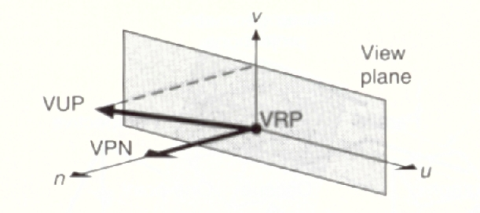
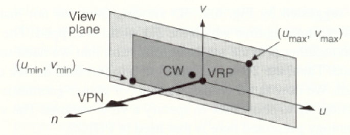
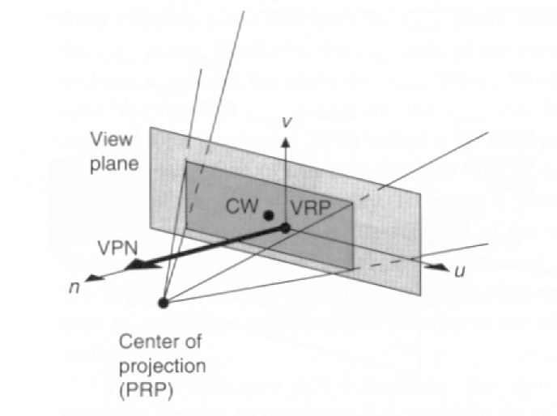
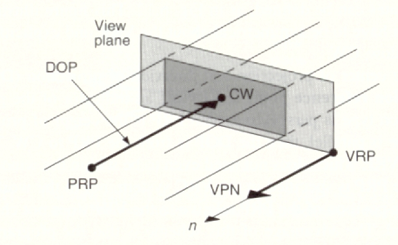
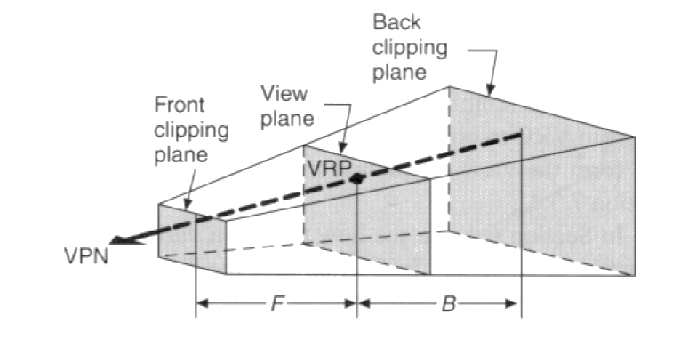
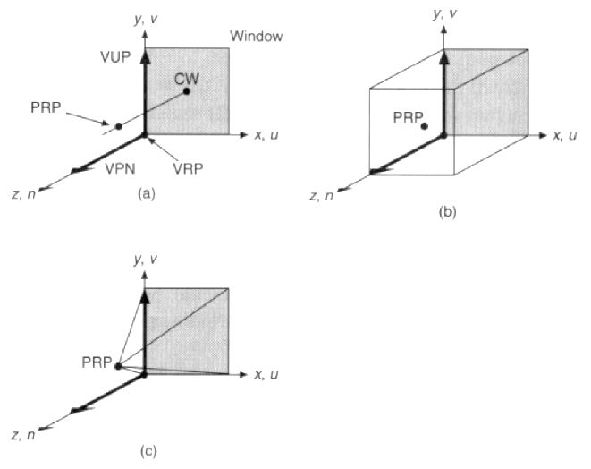
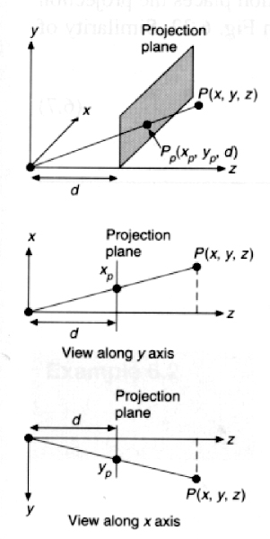
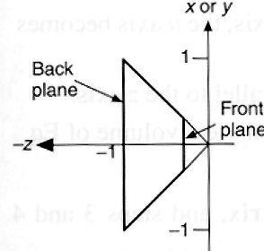
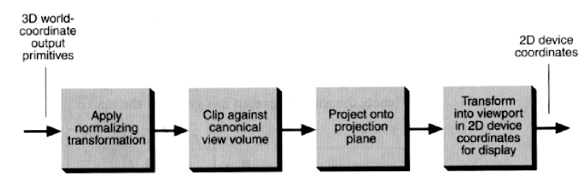

# Specification of a View Volume

### View Plane (projection plane) is defined by :

- VRP = View Reference Point
    
- VPN = View Plane Normal
    
- Window on the View Plane: To specify a min & max value for 2 orthogonal directions on the view plane, we introduce the Viewing Reference Coordinate(VRC) System.
    
- then define umin, umax, vmin,vmax
    

### View Reference Coord. system(VRC):

- Origin = VRP
- n axis: VPN
- v axis: Projection of View Up Vector (VUP) onto the View Plane
- u axis: an axis mutually orthogonal to n & v to make a RH coordinate system

Projection:

- Center of Window (CW)
    
- Projection Reference Point (PRP) - defines the center of projection and the direction of projection (also called COP)
    
- specified in VRC, not world coordinates
    

\- Projection type

- Perspective Projection:

- Parallel Projection:

* * *

- The View Volume is then the portion of the world that is to be projected onto the projection plane and then transformed to the viewport.
    
- Perspective View volume: truncated pyramid with apex at the PRP (COP) and the edges passing through the corners of the window.
    
- Introduce  hither(front) and yon(back) clipping planes to give a finite view volume.
    

- Reasons for doing this:
    
- Clip away objects that are too close to the PRP and would make the rest of the scene hard to understand.
    
- Clip away objects that are very far away and won’t add any useful information to the final scene. This will reduce the computational expense of computing the final image.
    

* * *

- Default Viewing parameters in Normalized Projection coordinates(NC) or WC:

VRP(WC)=(0,0,0),VUP(wc)=y,VPN(wc)=Z, PRP(nc)= (.5, .5, 1)

- (a) The Default Viewing Specification
- (b) Default Parallel Projection View Volume
- © Defaul Perspective Projection View Volume

* * *

# Viewing Transfomations

Basic Case

- Assume VP is normal to  the Z axis
    
- PRP=(0,0,0)
    
- The projection plane is at z=d 
    

\- By Similar triangles,

Xp/d = x/z        Yp/d = y/z

Xp = x/ (z/d)   Yp = y/(z/d)

In a 4x4 Matrix, this becomes

| 1  0     0    0 | Mper= | 0  1     0    0 |       | 0  0     1    0 |       | 0  0    1/d   0 |

\[X Y Z W\]T = Mper * \[x y z 1\]T = \[ x y z z/d\]

Now projecting back to 3 space (divide by w)

\[ x/(z/d)  y/(z/d) d\].

* * *

Projections and the Canonical View Volume

- The canonical perspective view volume:

- 6 clipping planes:

x=z, x= -z, y=z, y=-z, z=zmin,  z= -1

- Why clip against this?

> - Easier
>     
> - Suitable for perspective
>     

- So, we need to find the transformation that takes our perspective view volume and

transforms it to the canonical view volume

- In Summary,

3D Viewing Process

* * *

# 3D Clipping

- We will look at entending Sutherland-Hodgman to 3D.
    
- Others can be extended just as easily.
    
- For perspective canonical view volume, the  tests are real simple:
    

Inside if:

Left:   x > z Right:  x &lt; -z Bottom: y &gt; z Top:    y &lt; -z Back:   z &gt; -1 Front:  z < zmin

Sample Intersection Calculation:

use parametric representation of the line:

x = x0 + t (x1-x0)      (1) y = y0 + t (y1-y0)      (2) z = z0 + t (z1-z0)      (3)

y=z plane:

equation 2=equation 3 gives t = (z0 - y0) /((y1- y0) - (z1 -z0)) plug back into equations 1 & 2 to get x & y, know z=y.

* * *

# BackFace Removal (culling)

- Assume we have outward pointing polygon normals ( & they are normalized).

Take cross product of first edge with last edge , since polygons defined clockwise.

(P0->P1 x Pn P0).

- Form the eye vector (PRP -P0 ) & normalize.
    
- If we take N · E, this gives us the cosine of  the angle between them (* magnitude of each vector =1).
    
- The polygon is facing us if the angle is <= 90 degrees.
    
- Reject as a backface if N · E  < 0.
    
- What will this do for us?
    
- It gets rid of polygons that we won’t see in closed opaque objects.
    
- In wireframes of a convex polyhedron, it does hidden line removal.
    
- In shaded rendering of a closed polyhedron, it does hidden surface removal.
    

\- How much computation should this save?

* * *

Note: Most of the figures in this chapter are scanned from and copyrighted in *Introduction to Computer Graphics* by Foley, Van Dam, Feiner, Hughes, and Phillips, Addison Wesley 1994.

* * *