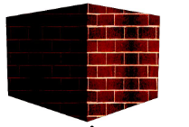
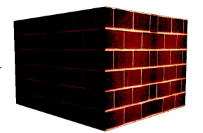

- Models are mathematical descriptions of geometric elements called primitives
    - lines and segments
        
    - polygons: quads (2 triangles), triangles, ...
        
    - circles
        
    - polyhedrons
        
    - polygonal meshes : connected triangles
        

**Rasterization**

- Raster screen (or image) is a screen (or image) discretised in pixels
- Rasterization is the process of taking geometric shapes (defined by vertices and their coordinates) and converting them into an array of pixels stored in the framebuffer to be displayed (b&w or color)

**Scan Conversion**

- Scan conversion is the final step of rasterization (end of the rendering pipeline)
- Takes place after clipping
- Takes triangles (or higher-order primitives) and maps them to pixels on screen
- For 3D rendering also takes into account other processes, like lighting and shading

# 📍Scan Converting Lines

- Slope-intercept form
    - f(x) = y = m ⋅ x + b
- Point-slope form
    - y − y0 = m(x − x0)
- Implicit form
    - f(x, y) = ax + by + c = 0
    - Avoids infinite slopes
    - Provides symmetry between x and y

```c++
void MidpointLine(int x0, int y0, int x1, int y1)
{
    int dx = (x1 - x0), dy = (y1 - y0);
    int d = 2 * dy - dx;
    int incrE = 2 * dy;
    int incrNE = 2 * (dy - dx);
    int x = x0, y = y0;
    WritePixel(x, y);
    while (x < x1) {
        if (d <= 0) d += incrE; // East Case
        else { d += incrNE; ++y; } // NorthEast Case
        ++x;
        WritePixel(x, y);
    }
}
```

# 📍Scan Converting Circles

- Explicit equation:
    - R² = x²+ y²
- Parametric equation:
    - x = R * cos(α) + xcenter
    - y = R * sin(α) + ycenter
    - α : angle from 0 to 2π
- Implicit equation: f(x, y) = x² + y² − R² = 0
    - f(x, y) = 0 : on circle
    - f(x, y) < 0 : inside
    - f(x, y) > 0 : outside

```c++
x = x0 + a;
y = y0 + b;
void CirclePoints(float x, float y)
{
    WritePixel(x, y);
    WritePixel(x, -y);
    WritePixel(-x, y);
    WritePixel(-x, -y);
    WritePixel(y, x);
    WritePixel(y, -x);
    WritePixel(-y, x);
    WritePixel(-y, -x);
}
```

```c++
MidpointCircle(R)
{ /* the entire circle with radius R */
    int x = 0, y = R;
    int deltaE = 2 * x + 3; // = 3
    int deltaSE = 2 * (x - y) + 5; // = 5 - 2R
    float decision = 5.0/4 – R;
    CirclePoints(x, y);
    while ( y > x ) {
        if (decision < 0)
        { // Move East
        x++;
        decision += deltaE;
        deltaE += 2; deltaSE += 2; // Update deltas
    } else { // Move SouthEast
        y--; x++;
        decision += deltaSE;
        deltaE += 2; deltaSE += 4; // Update deltas
    }
        CirclePoints(x, y);
    }
}
```

# Filling with Patterns

Patterns can be cosmetic or geometric

- **Cosmetic**: texture applied after projection transformations
    
- **Geometric**: texture applied onto geometry, before projection transformation (perspectivized / filtered)
    

# 📍Clipping

- Clipping a rectangle gives a rectangle
    
- Clipping a convex polygon gives a convex polygon
    
- Clipping a concave polygon can lead to several concave polygons
    
- Clipping a circle can create up to 4 arcs
    
    ```
    ComputeOutCode(x0, y0, outcode0); ComputeOutCode(x1, y1, outcode1);
    Repeat
        Check for trivial reject or trivial accept;
        Pick a point (x0,y0) or (x1,y1) that is outside the clip rectangle;
        if TOP then
            x = x0 + (x1 - x0) * (ymax - y0) / (y1 - y0);
            y = ymax;
        else if BOTTOM then
            x = x0 + (x1 - x0) * (ymin - y0) / (y1 - y0);
            y = ymin;
        else if RIGHT then
            y = y0 + (y1 - y0) * (xmax - x0) / (x1 - x0);
            x = xmax;
        else if LEFT then
            y = y0 + (y1 - y0) * (xmin - x0) / (x1 - x0);
            x = xmin;
        if (x0,y0) was chosen
            x0 = x; y0 = y; ComputeOutCode(x0, y0, outcode0);
        else
            x1 = x; y1 = y; ComputeOutCode(x1, y1, outcode1);
    Until done
    ```