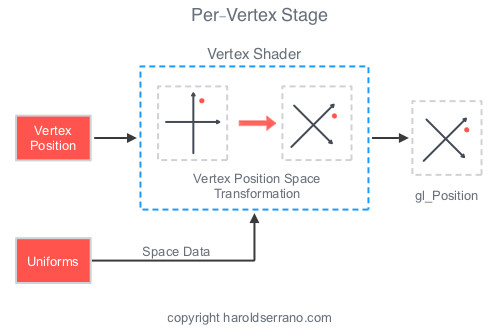
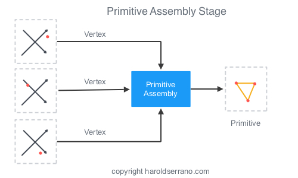
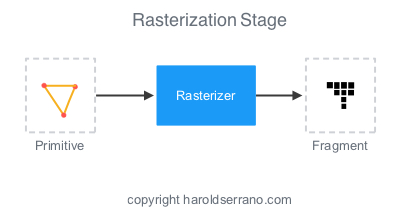
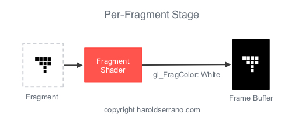

## Introduction

Once data has been [loaded in an OpenGL buffer](http://www.haroldserrano.com/blog/loading-vertex-normal-and-uv-data-onto-opengl-buffers) and the [rendering sequence started](http://www.haroldserrano.com/blog/starting-the-primitive-rendering-process-in-opengl), the OpenGL rendering pipeline is started. The rendering pipeline is responsible for assembling the vertices of a character, apply a texture, converting the vertices to the right coordinate system and displaying the character on the default framebuffer, i.e, the screen.

The OpenGL rendering pipeline consists of six stages:

- Per-Vertex Operation
- Primitive Assembly
- Primitive Processing
- Rasterization
- Fragment Processing
- Per-Fragment Operation

### Per-Vertex Operation

In the first stage, called **Per-Vertex Operation**, vertices are processed by a shader, known as the **Vertex Shader**.

Each vertex is multiplied with a transformation matrix, effectively changing its 3D coordinate system to a new *coordinate system*. Just like a photographic camera transforms a 3D scenery into a 2D photograph. The *Vertex Shader* changes the 3D coordinate system of a cube into a projective coordinate system.

### Primitive Assembly

After three vertices have been processed by the vertex shader, they are taken to the **Primitive Assembly** stage.

This is where a **primitive** is constructed by connecting the vertices in a specified order.

### Primitive Processing

Before the primitive is taken to the next stage, **Clipping** occurs. Any primitive that falls outside the **View-Volume**, i.e. outside the screen, is *clipped* and ignore in the next stage.

### Rasterization

What you ultimately see on a screen are pixels approximating the shape of a primitive. This approximation occurs in the **Rasterization** stage. In this stage, pixels are tested to see if they are inside the primitive’s perimeter. If they are not, they are discarded.

If they are within the primitive, they are taken to the next stage. The set of pixels that passed the test is called a **fragment**.

### Fragment Processing

A **Fragment** is a set of pixels approximating the shape of a primitive. When a fragment leaves the rasterization stage, it is taken to the **Per-Fragment** stage, where it is received by a **shader**.

This shader is called a **Fragment Shader** and its responsibility is to apply *color* or a *texture* to the pixels within the fragment.

### Per-Fragment Operation

Before the pixels in the fragment are sent to the framebuffer, fragments are submitted to several tests like:

- Pixel Ownership test
- Scissor test
- Alpha test
- Stencil test
- Depth test

At the end of the pipeline, the pixels are saved in a **Framebuffer**, more specifically the **Default-Framebuffer**. These are the pixels that you see in your mobile screen.