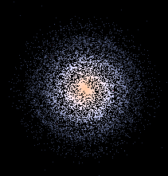
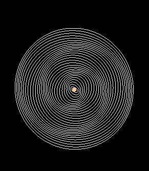
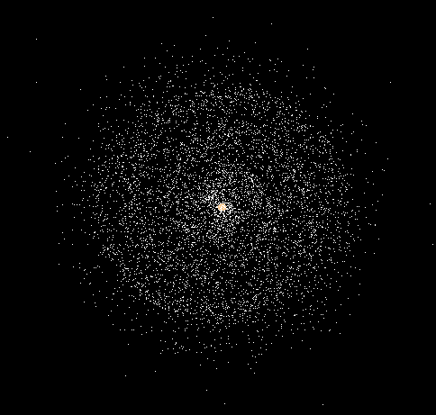
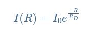
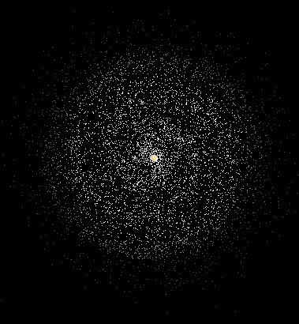
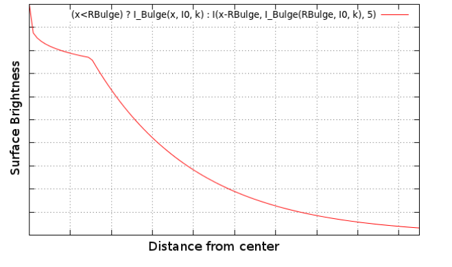
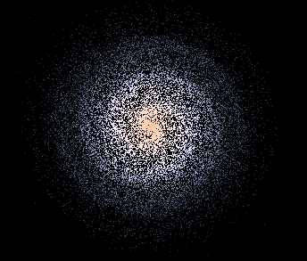
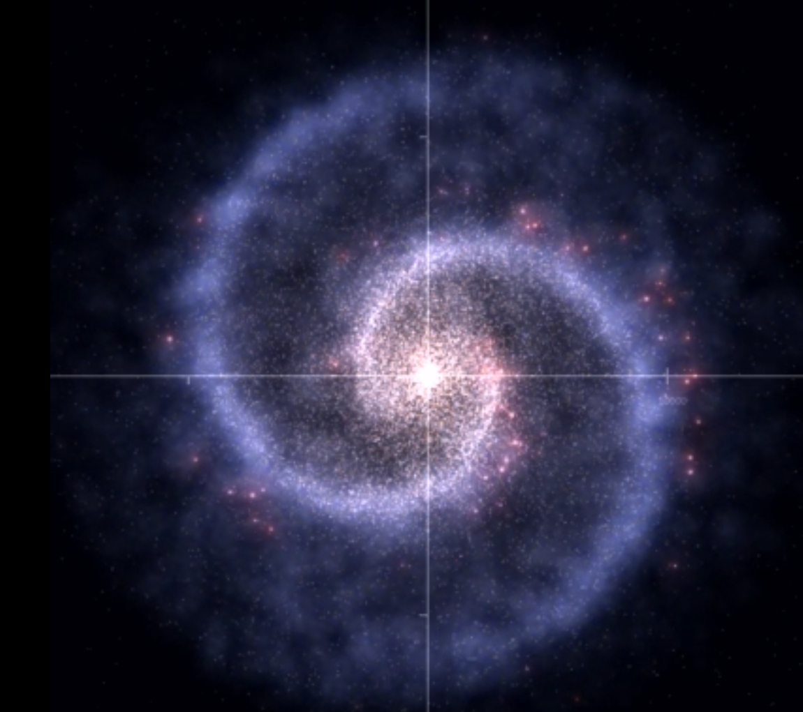

# Simplest Galaxy renderer

INF2110 - Introduction à l’Informatique Graphique

<center>**Philippe Kévin**</center><center>kv.philippe@gmail.com</center><center>Université Bretagne Sud</center><center>



</center>

# Usage

**compile** `make -f Makefile outputName`

**run** `./outputName`

# Résumé

Ce mini projet en introduction à l’informatique graphique, est inspiré de l’article de Beltoforion [Rendering a Galaxy with the density wave theory](https://beltoforion.de/en/spiral_galaxy_renderer/ "Rendering a Galaxy with the density wave theory") avec une implémentation simplifié, ne prenant pas en compte la théorie de la densité, ni les lois de Kepler.

Le projet c’est établi suivant 3 étapes :

- Trajectoire et initialisation des étoiles
- Luminosité
- Couleur

Mots clé : QGLViewer, Midpoint Algorithm, glsl Shaders

```
.
├── include
│   ├── Galaxy.h
│   ├── Shader.h
│   ├── specrend.h
│   ├── utils.h
│   └── Viewer.h
├── main.cpp
├── Makefile
├── shader.frag
├── shader.vert
├── src
│   ├── Galaxy.cpp
│   ├── Shader.cpp
│   ├── utils.cpp
│   └── Viewer.cpp
├── tp8.pro
└──  tp8.pro.user
```

# 1 Trajectoire et initialisation des étoiles

La création des étoiles est assez bancale et mériterait de suivre une loi normale ou une strategie plus effective pour pouvoir être généralisé. Elle donne cependant un bon résultat pour les données prédéfinit, en lancant le programme sans arguments.

Pour simplifier le problème, nous supposons que la trajectoire des étoiles suivent des ellipses qui se décalent petit à petit. Il s’agit donc de créer des étoiles suivant ces ellipses avec une répartition réaliste, pour que l’univers soit plus dense au centre.

Pour cela j’ai commencé par dessiner le centre de la galaxy avec le MidPoint circle algorithm et les ellipses autour. J’ai ensuite intialisé le nombre moyen d’étoiles par éllipse, accompagné d’un ratio suivant la distance au centre, et un vecteur de décalage aléatoire sur x et y pour que ce soit plus réaliste. La vitesse est calculé par soustraction entre le prochain point sur l’ellipse, le plus proche, et la position du point sur l’ellipse sans son vecteur de décalage.

<center></center>

# 2 Luminosité

L’article stipule que conformément à Freeman, K. C., [*“On the Disks of Spiral and so Galaxies”*](http://adsabs.harvard.edu/cgi-bin/bib_query%3F1970ApJ...160..811F) (1970). Astrophysical Journal, vol. 160, p.811   La luminosité peut être décrite suivant une loi exponentiel :

 avec I<sub>0</sub> l’intensité centrale, R la distance au centre et Rd une distance à laquelle l’intensité descend de 50%

J’ai décidé d’utiliser le fragment shader avec comme variables uniform, la position de l’étoile dans la galaxy  on a donc :

```C
uniform float x;
uniform float y;
uniform float z;

void main()
{   
    float dx = abs(x);
    float dy = abs(y);
    float dist = sqrt(dx*dx + dy*dy);

    float lumOfCenter = 10.0;

    float l = lumOfCenter * exp(-dist/10.0);
    if (l < 0.3) l = 0.3;

    vec4 col = vec4(1.0,1.0,1.0,l);
    gl_FragColor=col;
}
```

L’utilisation d’un vecteur en variable uniform serait preferable

<center></center>

# 3 Couleurs

D’après la loi de Planck, la température de surface des étoiles dans la galaxie simulée se situe entre 3000 et 9000 Kelvin. En réalité, la température de surface d’une étoile est sujette à des changements tout au long de sa vie, au fur et à mesure qu’elle progresse dans sa trajectoire dans le diagramme de Hertzsprung Russell.

L’article cite alors,  d’un programme de John Walker appelé [specrend.c](https://www.fourmilab.ch/documents/specrend/specrend.c) (1996, April 25). Publié dans le domaine publique et qui peut calculer les valeurs RGB pour une température donnée. Il explique l’algorithmie sur son site :  [“Colour Rendering of Spectra.”](http://www.fourmilab.ch/documents/specrend/) J’utilise alors son programme pour calculer la couleurs des étoiles et les donner au fragment shader

# Conclusion

<center>



</center>Le résultat est très différent de la réalité, les simplifications sont, sans doute, trop nombreuses. Il faudrait implémenter une sorte de blur et de fumée. Mais il reste agréable à regarder

Des améliorations peuvent naturellement être apporté comme énoncé ci dessus, ou revoir l’initialisation et la vitesse des étoiles, créer différents types d’étoiles et vérifier les performances et fuite de mémoire.