# Polygonal Surfaces

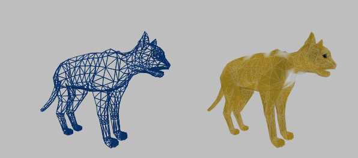

Set of flat geometric primitives (quads, triangles)
3 vertices define a plane ax + by + cz + d = 0

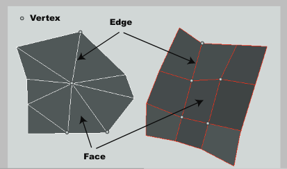

### Good for rendering

- Easy/fast ray-triangle intersection
- Surface normal = cross product of 2 consecutive edges
- Normals per point
- Graphics boards render triangles (fast)

### Not as good for modeling

- Only approximates the surface
    
- Modeling is a tedius task
    
- Good for flat surfaces: planes, cubes, tables...
    
- Not so good for curved surfaces (more triangles)
    
- More polygons = better approximation of the surface
    

### Usually good for animation

- Manipulation of vertices
    
- Animation might be slow if too many triangles
    

* * *

## Mesh

- Easy to set up
- ⚠ Duplicates (using an index solves the problem)
- ⚠ Coherency (there is an order !)

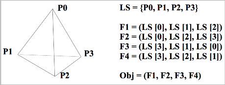

### No Self-intersecting

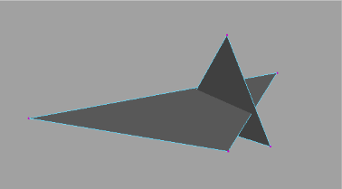

### Manifold

**no hole and no singularity**

**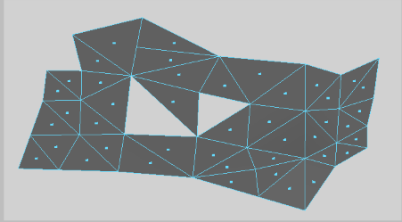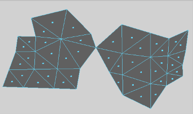**

# Voxel

Describe the volume of the object by (regularly) subdividing the space

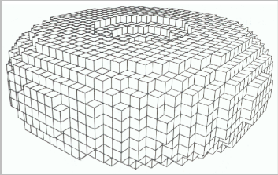

- Approximate the volume (same as meshes)
    
- Expensive in terms of memory
    
- Efficient visualization if combined with an octree
    

# Parametric Curves (1D)

Defined by a few Control Points/Vertices

- **Approximating** (go around): Cardinal splines, Bezier
    
- **Interpolating** (go through): cubic B-Splines, Hermite
    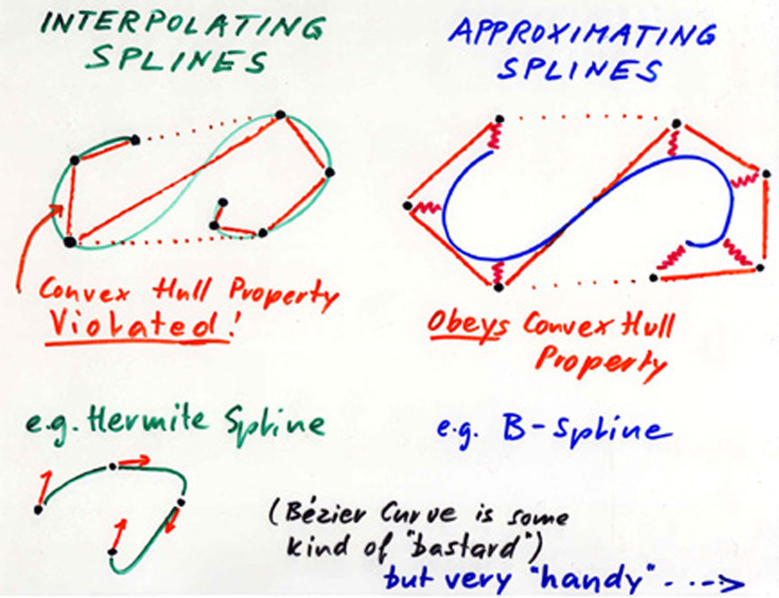
    

> Let P = {P1, . . . , Pk } be a set of k points in the plane. Let F = {F1, . . . , Fk } be a set of k functions defined on \[0, 1\] to R. We call spline curve
> generated by the couples (Pi , Fi ), 1 ≤ i ≤ k,
> 
> the curve C which parametric equation is:
> `∀t ∈ [0, 1], C(t) = 1-k∑Fi (t)Pi (1)`
> Pi points are the control points of C .
> Fi Functions are called influence or basis functions of C .

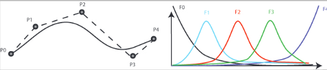

## Advantages

- Shape influenced by control points (easier for modeling)
    
- Deformation is local
    
    - If one CP moves, only a portion of the curve will deform
        
    - To change a whole portion of the curve, only 1 CP needs to be moved
        
- A curve can be closed (first CP re-used) or open
    
- Behavior defined by the properties
    

### Normality

> A spline curve C is normal if
> 
> `∀t ∈ [0, 1],0-k∑Fi (t) = 1`

- Invariant to affine transformations (affine transformation is applied to the CPs)
- Invariant to barycentric transformations (weighted mean of several splines can be computed from the weighted mean of their CPs)

<ins>Consequence</ins>

- The shape of a normal spline is independent of the frame (coordinate system) in which the CPs are expressed
    
- Translation, rotation and homotecy move the curve but do not change its shape
    
- Morphing realized by interpolation of the CPs
    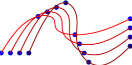
    

### Positivity

> A spline curve C is positive if
> `∀t ∈ [0, 1], ∀i = 1. . . k, Fi (t) ≥ 0`

A normal and positive curve is entirely enclosed in its **convex hull**

- Bounding box (collisions detection)
- Straight line if CPs are aligned

### Regularity

A curve is regular if the number of intersections between a plane and the
curve is at most the number of intersections between this plane and the
control network of the curve

- Useful to control the oscillations of the curve
    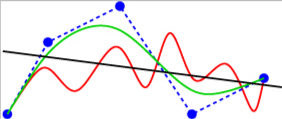

### Locality

> The locality controls the influence of the CPs on the curve
> 
> Each Fi is defined by segment
> Fi (t) = polynomei (t) for t ∈ \[T −i, T +i \], 0 otherwise
> ∀t &lt; T − i , Fi (t) = 0 and ∀t &gt; T +i, Fi (t) = 0
> 
> The set of all t for which the same CPs affect C (t) is a **curve segment**
> 
> A spline curve C (t) is local of order m if each CP affects at most m
> 
> or... A curve segment is computed thanks to m control points

Consequences

- \+/\- easy modeling
- Effects +/- local
- \+/\- fast to compute

### Strict Convex Hull

A normal, positive, regular and local spline curve is entirely enclosed in the union of the convex hulls of its control network

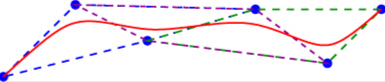

### C Continuity

> A spline curve C has a parametric continuity of order n (noted as C n) if
> the function t 7 → dnC/dtn (t) is defined and continuous on \[0, 1\]

### G Continuity

> A spline curve C has a geometric continuity of order n (noted as G n) if the function s → dnC/dsn (s) is defined and continuous on \[0, 1\] (s is the arc length of the curve)

## Hermite

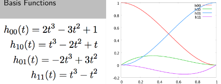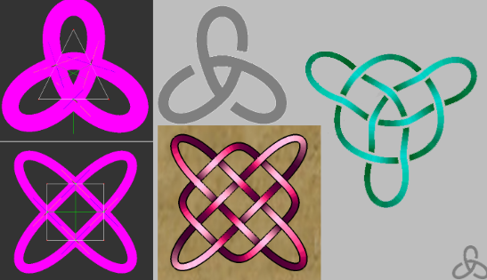

## Bézier

```
B0(t) = (1 − t)3
B1(t) = 3t(1 − t)2
B2(t) = 3t2(1 − t)
B3(t) = t3
```

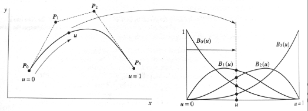

## NURBS

Non-Uniform Rational B-Spline

> <sub>            0-n</sub>∑wiBi(t)Pi
> c(t) = ─────────
>           <sub>0-n</sub>∑ wi Bi (t)
> 
> - Non-Uniform: weights wi
> - Rational: fraction
> - B-Spline: uses functions Bi (t) from the B-Spline basis (usually cubic functions)
> 
> Used in Maya

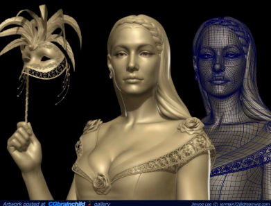