- We will use a right-handed coordinate system.
    
- Left-handed suitable to screens.
    
- To transform from right to left, negate the z values.
    

Right Handed Space                        Left Handed Space

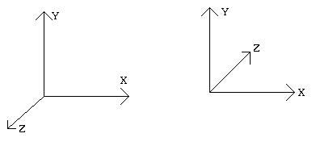

Transformations will be represented by 4x4 matrices.

## Scaling

|     |     |     |     |
| --- | --- | --- | --- |
| sx  | 0   | 0   | 0   |
| 0   | sy  | 0   | 0   |
| 0   | 0   | sz  | 0   |
| 0   | 0   | 0   | 1   |

## Translation

|     |     |     |     |
| --- | --- | --- | --- |
| 1   | 0   | 0   | tx  |
| 0   | 1   | 0   | ty  |
| 0   | 0   | 1   | tz  |
| 0   | 0   | 0   | 1   |

## Shear (xy)

|     |     |     |     |
| --- | --- | --- | --- |
| 1   | 0   | shx | 0   |
| 0   | shy | 0   |     |
| 0   | 0   | 1   | 0   |
| 0   | 0   | 0   | 1   |

## Rotation (along Z axis)

|     |     |     |     |
| --- | --- | --- | --- |
| cosq | -sinq | 0   | 0   |
| sinq | cosq | 0   | 0   |
| 0   | 0   | 1   | 0   |
| 0   | 0   | 0   | 1   |

## Rotation (along X axis)

|     |     |     |     |
| --- | --- | --- | --- |
| 1   | 0   | 0   | 0   |
| 0   | cosq | -sinq | 0   |
| 0   | sinq | cosq | 0   |
| 0   | 0   | 0   | 1   |

## Rotation (along Y axis)

**(sign of sine reversed to maintain right-handed coordinate system)**

|     |     |     |     |
| --- | --- | --- | --- |
| cosq | 0   | sinq | 0   |
| 0   | 1   | 0   | 0   |
| -sinq | 0   | cosq | 0   |
| 0   | 0   | 0   | 1   |

# Compositing 3D transformations

The example from the text:

Objective: Transform the directed line segments P1P2 and P1P3 from their starting position to their final position as indicated in the figure below. Thus,

- Point P1 is to be translated to the origin,
- P1P2 is to lie on the positive Z axis and
- P1P3 is to lie in the positive y-axis half of the (y,z) plane.

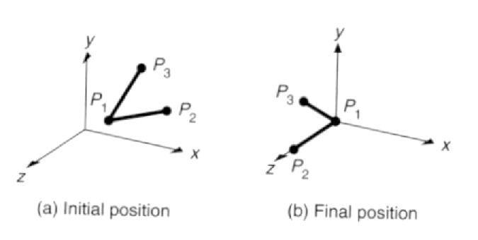

4 Steps:

- 1.  Translate P1 to the origin
- 2.  Rotate about the Y axis

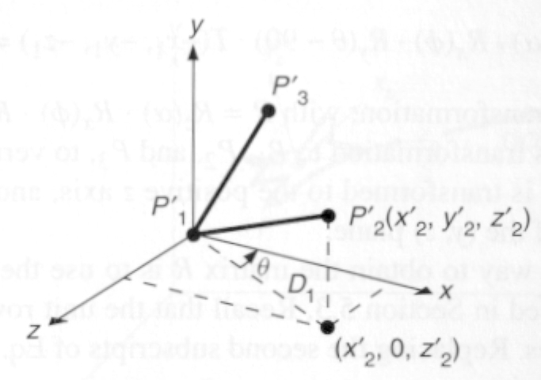

- 3.  Rotate about the X axis
- 4.  Rotate about the Z axis 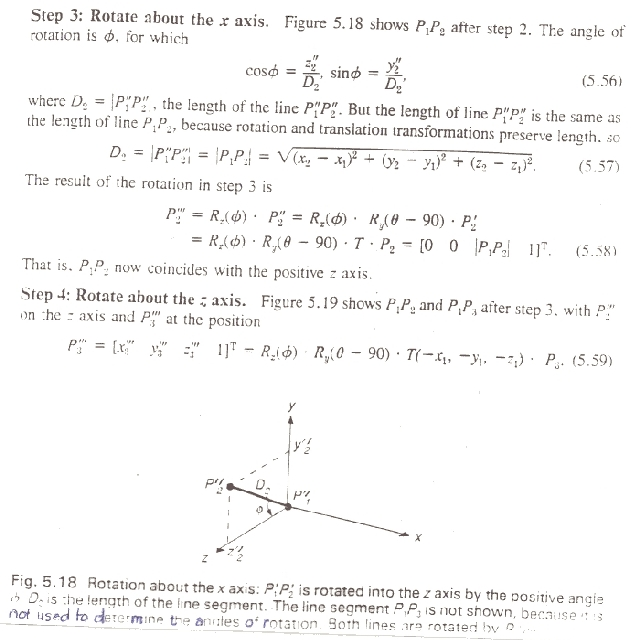

* * *

Rotation About an Arbitrary Axis in Space

- Assume we want to perform a rotation about an axis in space passing through the point (x0, y0, z0) with direction cosines  (cx, cy, cz) by d degrees.  - How do we do this?

1.  First of all, we want to translate by -(x0, y0, z0)= |T|.
    
2.  Next, we rotate the axis into one of the principle axes, let’s pick Z (|Rx|, |Ry|).
    
3.  We rotate next by d degrees in Z ( |Rz(d)|).
    
4.  Then we undo the rotations to align the axis.
    
5.  We undo the translation: translate  by (x0, y0, z0)
    

- The tricky part is (2) above.
    
- This is going to take  2 rotations,
    

1 about x  (to place the axis in the xz plane) and 1 about y (to place the result coincident with the z axis).

* * *

\- Rotation by Alpha about x:

How do we determine Alpha?

- Project  the vector into the yz plane as shown below.

The y and z components are cy and cz, the direction cosines of the unit vector along the arbitrary axis.

- It can be seen from the diagram below that

d= sqrt(cy2 + cz2), therefore cos(a) = cz/d sin(a) = cy/d

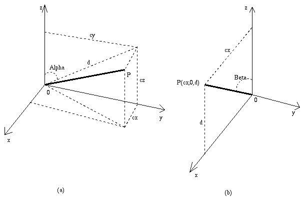

* * *

\- Rotation by Beta about y:

How do we determine Beta?

Similar to above:

determine the angle Beta to rotate the result into the Z axis:

- The x component is cx and the z component is d.
- It can be seen from the diagram that:

cos(Beta)= d =  d/(length of the unit vector) sin(Beta)= cx =  cx/(length of the unit vector).

* * *

- Final Transformation:

M = |T|-1 |Rx|-1 |Ry|-1 |Rd| |Ry| |Rx| |T|

- If you are given 2 points instead, you can calculate the direction cosines as follows:

V =|(x1 -x0)| **   |(y1 -y0)|** **   |(z1 -z0)|**

cx =  (x1 -x0)/ |V| cy =  (y1 -y0)/ |V| cz =  (z1 -z0)/ |V|, where |V| is the length of V

* * *

Transformations as a Change in Coordinate Systems

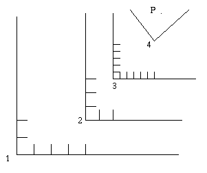

\- P(i) is the representation of the point P in  coordinate system i.

- Mi<-j is the transformation that converts the representation of point in coordinate system j into coordinate system i.
    
- P(i) = Mi<-j \* Mj<-k \* P(k)
    
- The example Above:
    

M1<-2 = T(4,2) **M2<-3 = T(2,3)* S(0.5, 0.5)*\* **M3<-4 = T(6.7,1.8)* R(-45)*\* **M1<-4 =  T(6,5)* S(0.5, 0.5) \*T(6.7,1.8)\*R(-45)**

- Note that Mi<-j = Mj<-i -1

* * *

# The 3D Viewing Pipeline

- Objects are modeled in object (modeling) space.
    
- Transformations are applied to the objects to position them in world space.
    
- View parameters are specified to define the view volume of the world, a projection plane, and the viewport on the screen.
    
- Objects are clipped to this View volume.
    
- The results are projected onto the projection plane (window) and finally mapped into the viewport.
    
- Hidden objects are then removed, the objects scan converted and shaded if necessary.
    

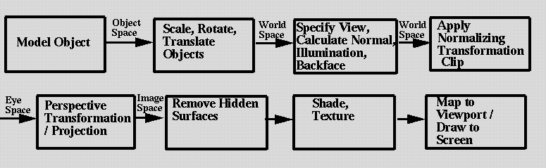

* * *

## Spaces

### Object Space

definition of objects. Also called Modeling space.

### World Space

where the scene and viewing specification is made

### Eyespace (Normalized Viewing Space)

where eye point (COP) is at the origin looking down the Z axis.

### 3D Image Space

A 3D Perspected space.

Dimensions: -1:1 in x & y, 0:1 in Z.

Where Image space hidden surface algorithms work.

- Screen Space (2D)

Coordinates 0:width, 0:height

* * *

## The Computer Graphics Pipeline Viewing Process

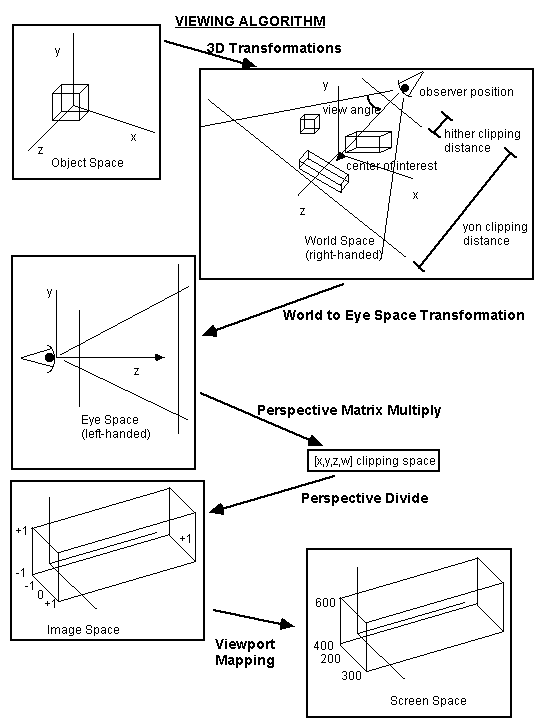

* * *

# Projections

We will look at several planar geometric 3D to 2D projection:

### Parallel Projections

Orthographic Oblique

### Perspective

- Projection of a 3D object is defined  by straight projection  rays (projectors) emanating from the center of projection (COP) passing through each point of the object and intersecting the  projection plane.

* * *

\- Perspective Projections:

- Distance from COP to projection plane is finite.
    
- The projectors are not parallel  & we specify a center of projection.
    
- Center of Projection is also called the Perspective Reference Point COP = PRP
    
- Perspective foreshortening: the size of the perspective projection of the object varies inversely with the distance of the object from the center of projection.
    
- Vanishing Point: The persepctive projections of any set of parallel lines that are not parallel to the projection plane converge to a vanishing point.
    

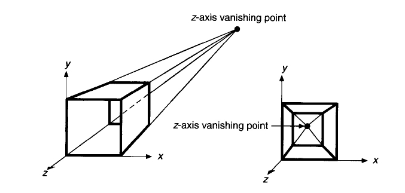

- Example:

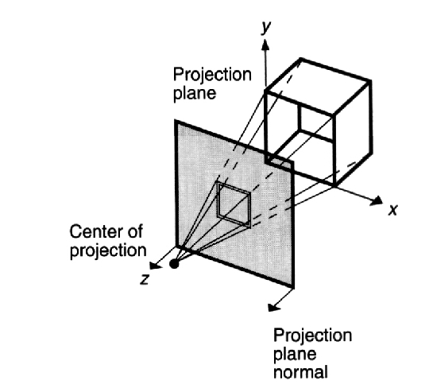

* * *

- Example: 2 Point Perspective Projection

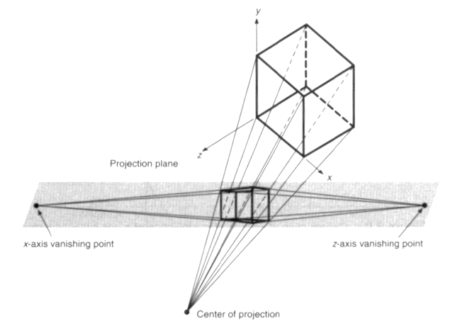

* * *

\- Parallel Projection

- Distance from COP to projection plane is *infinite.*
    
- Therefore,  the projectors are parallel lines & we specify a direction of projection (DOP)
    
- Orthographic: the direction of projection and the normal to the projection plane are the same. (direction of projection is normal to the projection plane)
    
- Example Orthographic Projection:
    

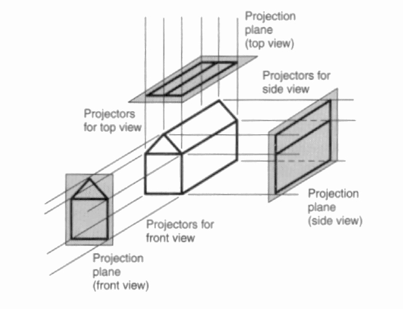

- Axometric orthographic projections use planes of projection that are not normal to a principal axis. (they therefore show mutiple face os an object.)
    
- Isometric projection: projection plane normal makes equal angles with each principle axis
    

All 3 axis are equally foreshortened allowing measurements along the axes to be made with the same scale.

- Example Isometric Projection:

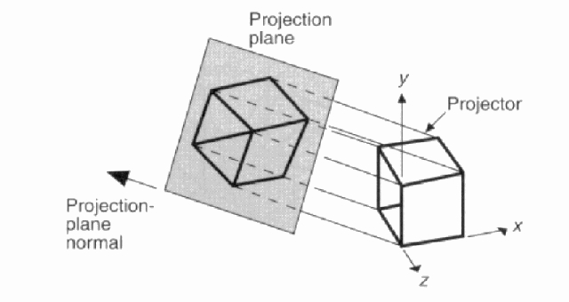

* * *

- Oblique projections : projection plane normal and the direction of projection differ.
    
- Plane of projection is normal to a principle axis
    
- Projectors are not normal to the projection plane
    
- Example Oblique Projection
    

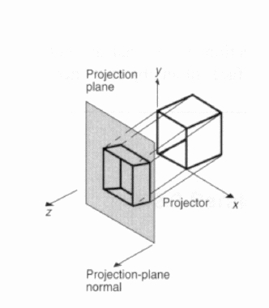

* * *

Classification of Geometric Projections:

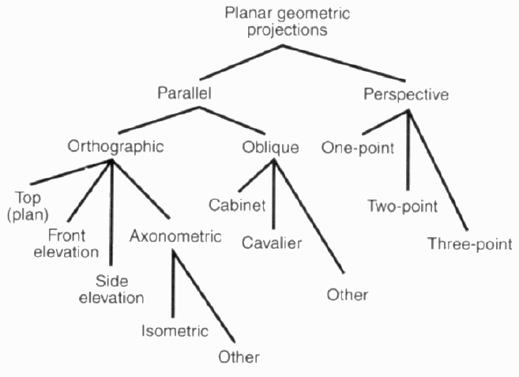

* * *

Note: Most of the figures in this chapter are scanned from and copyrighted in *Introduction to Computer Graphics* by Foley, Van Dam, Feiner, Hughes, and Phillips, Addison Wesley 1994.

* * *