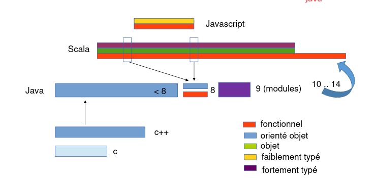

# Java 5 : Généricité

- Méthode qui s’applique sur n’importe quel type
    
    - une méthode par type et par collection
        - type primitifs
        - objets
        - Polymorphisme
- ## collections
    
    - ### ArrayList contient des **Objects**
        
        ```Java
        ist list = new ArrayList();
        list.add(new Integer(2));
        list.add("hello");
        ```
        
    - Retrouver le type par cast
        
        ```java
        Integer a = (Integer) list.get(0);
        String chaine = (String) list.get(1);
        ```
        

## Généricité

Le code devient plus générique il dépend moins du type Plus facile à maintenir ou à faire évoluer **Laissez définitivement tomber les tableaux et les boucles à indice**

- - ### ArrayList de Strings
        
        - Un seul type pour la Collection
            
            ```java
            List<String> chaines = new ArrayList<String>(); 
            chaines.add("bonjour"); 
            String uneChaine = chaines.get(0);
            ```
            

- - - - ### Itération
                
                ```java
                List<String> chaines = new ArrayList<String>();
                chaines.add("bonjour");
                for(String uneChaine : chaines){
                    System.out.println(uneChaine);
                }
                ```
                
                PAS D’INDICE
                
            - ### Itérateurs :
                
                ```java
                List<String> chaines = new ArrayList<String>();
                chaines.add("bonjour") ;
                Iterator<String> iterateur = list.iterator();
                while(iterateur.hasNext()){
                    String uneChaine = iterateur.next();
                    ...
                }
                ```
                
                - Outil (méthode) pour parcourir les éléments d’une collection
                - pas d’indice
                    - Indépendant de la représentation interne mémoire
                    - **Ordre conservé ou pas**
                    - **local ou pas**
                    - parallèle ou pas
                - très différent d’un parcours élément par élément

## Créer une classe générique

```java
public interface Paire<K, V> 
{
    public K getClé();
    public V getValeur();
}

public class PaireOrdonnée<K, V> implements Paire<K, V> 
{
    private K clé;
    private V valeur;
    
    public PaireOrdonnée(K clé, V valeur) {
        this.clé = clé;
        this.valeur = valeur;
    }
    
    public K getKey() { return clé; }
    public V getValue() { return valeur; }
    }
```

## Rajouter le mécanisme itérateur

```java
public class MaCollection<E> implements Iterable<E>
{
    public Iterator<E> iterator() {
        return new MonIterateur<E>();
    }
}

public class MonIterateur <T> implements Iterator<T> {
    public boolean hasNext() {
        ...
    }
    public T next() {
        ...
    }
}
```

# Java 8