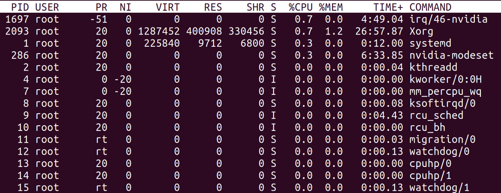
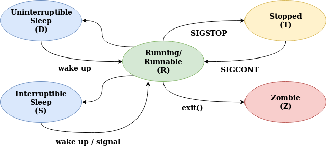

# Linux Process States and Signals

When troubleshooting a system, it’s important to understand the process life-cycle and how the scheduler divides the CPU cores between the running processes and how the kernel communicates with process and how the processes communicate among themselves.

To see the system process states, you can look for the column S of `top` output (or column STAT of `ps x` output):

top command output, the process state is the column “s”

Linux has basically 5 states:

- **Running/Runnable :** running processes are processes using a CPU core right now, a runnable process is a process that has everything to run and is just waiting for a CPU core slot.
- **Sleeping:** a sleeping process is a process waiting for a resource to be available (for example, a I/O operation to complete) or an event to happen (like a certain amount of time to pass). The difference between process in **Interruptible Sleep (S)** state and **Uninterruptible Sleep (D)** is that the former will wake up to handle signals while the former won’t. We’ll talk about signals in a moment, but let’s suppose that a process is waiting for a I/O operation to complete before wake up. If in the meantime, it receives a signal to terminate (**SIGKILL**), it will terminate before having the chance to handle the requested data. That’s why I/O operations *normally* go to uninterruptible sleep while waiting for the result: they will wake up with when the operation is ready, handle the result and, only then, check for any pending signal to handle. Processes that can be terminated before the wake up condition is fulfilled without any consequence usually go to interruptible sleep instead.
- **Stopped (T):** a process becomes stopped when it receives the **SIGSTOP** signal (not unlike when you press `<ctrl>+z` in the shell, although `<ctrl>+z` sends a **SIGTSTP** instead). When stopped, the process execution is suspended and the only signals it will handle are **SIGKILL** and **SIGCONT**. The former will remove the process permanently, while the later will put the process back to the *Running/Runnable* state (like when you run `fg` or `bg` after pressing `<ctrl>+z` in the shell).
- **Zombie (Z):** we briefly talked about zombie processes when we discussed [system calls](https://medium.com/@cloudchef/linux-system-calls-c2867c7c30c1). When a process finishes with `exit()` system call, its state needs to be “reaped” by its parent (calling `wait()`); in the meantime, the child process remains in *zombie* state (not alive nor dead).

The diagram below helps understand the transition between process states:

# Signals

Signals are one of the ways process communicate among themselves and with the kernel. They can be sent using the system call [**kill**](http://www.tutorialspoint.com/unix_system_calls/kill.htm) (despite the name, it can send any signal, not only **SIGKILL**) and the commands `kill` and `killall`.

When receiving a signal, a process can chose to take one of the following actions:

- execute the signal default action
- block the signal setting a signal mask (this is done using the system call [**sigmask**](http://www.tutorialspoint.com/unix_system_calls/sigprocmask.htm))
- assign a custom handler to the signal, executing a custom action (using the system call [**signal**](http://www.tutorialspoint.com/unix_system_calls/signal.htm))

Exceptionally, **SIGKILL** and **SIGSTOP** signals cannot be handled or blocked.

The list of the most commonly used signals follow:

- **SIGTERM:** surprisingly, the default signal sent by `kill` command. Asks the process to terminate voluntarily.
- **SIGKILL:** unlike **SIGTERM,** forces the process to terminate. Can’t be blocked or handled.
- **SIGSTOP:** suspend the process execution, putting it in *stopped* state. In this state, the process will do nothing but accept **SIGKILL** and **SIGCONT** signals. Can’t be blocked or handled.
- **SIGTSTP:** almost identical to **SIGSTOP**; the only difference is it can be blocked or handled. This is the signal sent when you type `<ctrl>+z` in the terminal.
- **SIGCONT:** if a process is in stopped state, it will put it back in the *running/runnable* state and resume it execution. If the process is in any other state, it’s silently ignored.
- **SIGINT:** generated when the user type `<ctrl>+c` in the terminal. It interrupts the current command processing and wait for user’s next command.
- **SIGQUIT:** generated when the user type `<ctrl>+\` in the terminal. Normally, it will force the process to produce a [core dump](https://en.wikipedia.org/wiki/Core_dump) and terminate.
- **SIGALRM:** signal used to wake up sleeping process, normally scheduled by [**alarm**](http://www.tutorialspoint.com/unix_system_calls/alarm.htm) system call.
- **SIGCHLD:** signal send from a child process to its parent process when its state changes . The system call [**wait**](http://www.tutorialspoint.com/unix_system_calls/wait.htm) creates a signal handler for **SIGCHLD** in the parent process; by default it will trigger only when the child calls [**exit**](http://www.tutorialspoint.com/unix_system_calls/exit.htm), but it can be configured to be triggered by another state transitions as well.
- **SIGWINCH:** generated when the terminal detects a change on its size. For full-screen terminal applications, it can trigger a refresh, otherwise can be safely ignored.
- **SIGHUP:** this signal indicates the terminal handling the process has been disconnected and/or the parent process terminated. If you want to run a process that won’t terminate when the terminal disconnects, you can start it using the `nohup` command. Some daemons repurpose this signal to trigger a configuration reload without stopping its execution.
- **SIGUSR1, SIGUSR2:** these signals are reserved for implementing custom actions.