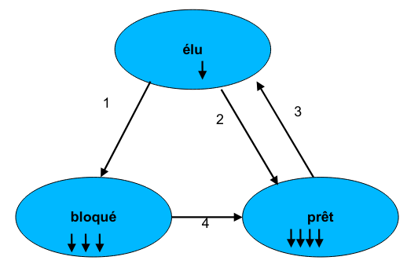
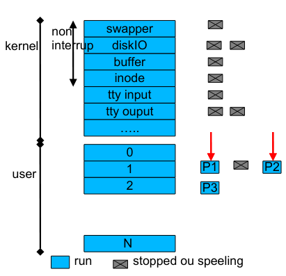

# Definition

Un processus est un programme en exécution, un fichier binaire chargé et lancé. Lors de l’exécution chaque processus est associé à un contexte d’exécution. Celui-ci contient au moins :

- Le compteur ordinal (le numéro de la case mémoire contenant la prochaine instruction à exécuter)
- un ensemble de registres dont l’accumulateur
- position dans la pile d’exécution
- adresse des espaces mémoires

# la commutation de contexte

Le processeur commute de processus en processus.

- sauvegarde le contexte du processus courant
- élection d’un nouveau processus
- chargement du contexte du processus
- exécution des instructions du processus à partir de son compteur ordinal

La partie du code qui élit un processus est l’ordonnanceur. “scheduler”

Le système gère une table des processus. La table contient :

- l ’état du processus
- son contexte d’éxecution
- des stats (temps dans le cpu, age …) Ces infos servent à l’ordonnanceur pour sa politique d’élection.

# Politique d’ordonnancement

Le Round-Robin (tourniquet) Le système gère une file d’attente de processus prêts .

Le premier de la liste est celui en execution. A la fin de son quantum, l’ordonnanceur met le processus en fin de liste et charge le premier de la liste.

L’ajout de nouveau processus prêt s’effectue en fin de liste

Un processus en cours d ’exécution demandant une ressource sort de cette liste des prêts

# L ’ordonnanceur : implémentation BSD

L ’ordonnancement des processus s’effectue en temps partagé avec différentes files. Une partie des processus noyau sont non-intéruptibles. Il n ’y a pas de temps partagé pour eux. Ce sont eux qui rendent explicitement la main à l’ordonnanceur. Si un événement apparaît qui met un de ces processus noyau à l’état prêt, le processus utilisateur courant est arrêté, même si il n’a pas terminé sur quantum de temps. L ’ordonnanceur donne alors la main au processus noyau. (Le processus utilisateur est dit préempté)

Les processus utilisateurs sont mis dans des files de bas niveau.

Un processus ne peut s’exécuter que si il n’a aucun processus de plus haut niveau dans les files.

Au sein d’une même file, le système utilise une politique de round robin.

Le système recalcule les priorités des processus pour faire remonter des vieux processus de plus faible prioritaire.

## Problème de famine.

Pour ne pas pénaliser les processus moins prioritaires, le système recalcule le numéro de file d’un processus régulièrement.

La table des processus

> \> ps x -o pid,pcpu,user,args,psr
> 
> PID %CPU USER COMMAND PSR
> 
> 2143 0.0 courtrai /lib/systemd/systemd --user 2 2144 0.0 courtrai (sd-pam) 1 2422 0.0 courtrai /usr/bin/pulseaudio --start 3 2426 0.0 courtrai /usr/lib/pulseaudio/pulse/g 3 11746 0.0 courtrai /usr/bin/gnome-keyring-daem 0 11748 0.0 courtrai /sbin/upstart --user 3 11831 0.0 courtrai upstart-udev-bridge --daemo 3

chaque entrée contient :

- état
- adresses (4 segments … maps )
- UID
- PID,PPID
- un descripteur d’événement lorsque le processus est endormi
- Priorité
- vecteur des interruptions (ensemble de signaux reçus mais pas encore traités par le processus
- divers : compteur CPU p-cpu
- la zone u (utilisée lorsque le processus est dans la CPU) 

## la zone u (utilisée lorque le processus est dans le CPU)

- uid et gid effectif
- compteur de temps (user et system)
- terminal associé
- erreur (dernier code d’erreur dans les appels système)
- retour (code de retour du dernier appel système)
- E/S adresses de buffer
- . et /
- limites de taille de fichier et mémoire (ulimit CSH ou SH)
- umask

## Les interruptions

Une interruption est un événement produit par :

- le matériel (E/S, tty , horloge)
- un déroutement d’erreur du processeur (débordement calcul, division par zéro, violation de segment (produit un fichier core), image du processus en mémoire)
- un appel système demande E/S bloquante

L’interruption produit un signal qui est détecté par le système.

Il y a en général un changement de contexte par le système. Le processus courant est préempté, le système prend en compte l’interuption, éventuellement change l’état d’un processus et l’ordonnanceur élit un nouveau processus.

Il y a différents niveaux d’interruption (0 horloge,1 disque, 2 console,3 autre périphérique, 4 appel système, 5 autre).