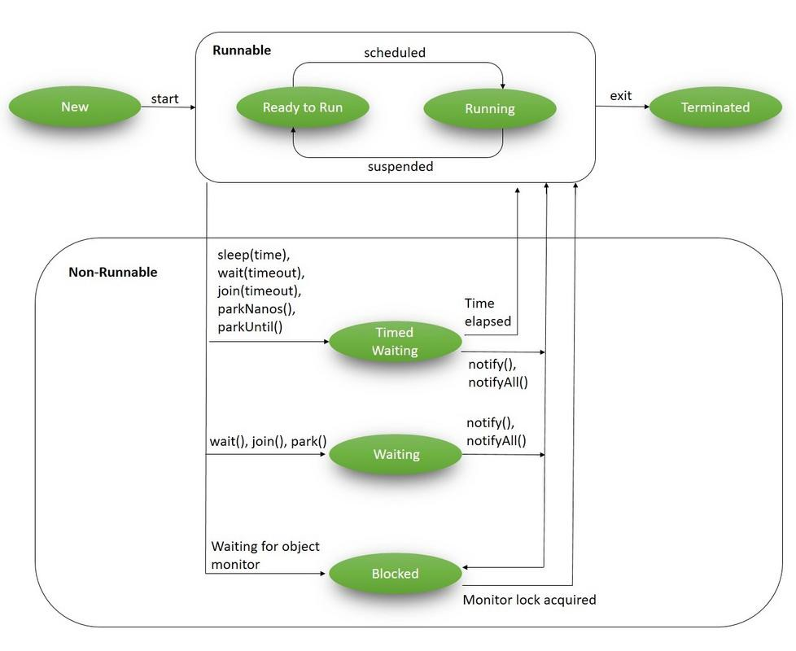
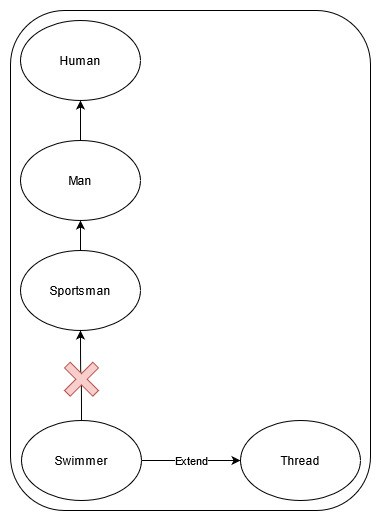
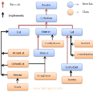

# Thread Life Cycle



(image:baeldung.com)

In the life cycle, there are 7 states. lets discuss about them,

## New

This the state where the thread is created.

## Ready/Runnable

When the `start()` method is invoked to a particular thread, it will switch state from **New** to **Ready or Runnable** state

## Running

The Thread will switch to Running state when `run()` method is invoked. which means when the process is executing. But it may go back to Ready/Runnable state and come back to Running state and this can happen again and again also.

## Blocked

This is the state where one thread blocked on the lock because other thread has already acquired this lock.

## Waiting

In this state, the thread will wait forever until if there is any interruption. Usually the invocation of `join()` or `wait()` method will put the thread in waiting state.

## Timed Waiting

When `sleep()` method or `join()` or `wait()` methods with timeout are invoked, that state is known as **Timed Waiting.** Name itself explains that the the thread will wait for a certain given time.

## Dead

This state represents the completion of process.

# how to create a Thread in Java ?

In Java, there are two ways to create a thread and they are,

- By Extend Thread class
- By Implement Runnable Interface

lets check it one by one,

## Extending Thread class

In here I am going to use 2 classes. So to create a Thread, we need to extend the Printer class with the Thread class as shown in the code below.

Now to run the thread, we have to create an instance of the Thread class in the main method of the Application class and invoke that `start()` to that instance as I mentioned in the code below.

So If I run the application I will get the output as,

```
<a id="7cde"></a>Main thread is running....
Child thread is running....
```

## Facts about creating thread by Extending Thread class,

- It is not must to override the run method in Thread class. Lets see why, when I call the `start()` it will check the Printer thread. Since I don’t have the `start()`method there, it will check the parent class witch is Thread class. In Thread class there will be a `start()` and that invokes `run()` method. So when calling run method it will the printer Thread class, since it doesn’t has the `run()` method, it will check the Thread class and it doesn’t do anything. Inside that run method, if the target is set then it will execute `target.run()` method. In our case we don’t have any target so it’s just don’t do anything. thats the reason it worked. So If we are not overriding the run method which means we are not doing any tasks, because all the process of threads have to go to `run()` method. This is only valid when we are Extend the Thread class. But when we implement the runnable interface, java program will force you to override the `run()` method. Because thats the behavior of the runnable interface which we are going to look next.
- As you can see from the above code snippet, even though the `start()` method invoked(in line number 7 on the Application class) before printing the sentence in the main thread, it was printed after the main thread prints. which means, there is no guarantee that invoking `start()` method will immediately run the thread and it is entirely depend on the JRE(based on the OS). In the previous point, I mentioned about `target` which is a runnable object. In our case printer object, so if it has `run()` method then it will execute it and if not it will got the super class and execute the `run()` method as I said before. lets see some example,

so in this child thread this should print from 1 to 10.

and in the main thread this should print from 1 to 100

So I run this program several time to test the result. (I have taken only first few lines of the output to avoid too many unwanted spaces in the article)

> 1st time output

```
<a id="dbf5"></a>Main thread is running....
Child thread is running....
main 0
child 0
child 1
main 1
main 2
main 3
child 2
main 4
child 3
main 5
child 4
main 6
.
.
```

> 2nd time output

```
<a id="37eb"></a>Main thread is running....
Child thread is running....
child 0
main 0
main 1
main 2
child 1
main 3
child 2
main 4
child 3
main 5
child 4
main 6
.
.
```

> 3rd time output

```
<a id="8c85"></a>Main thread is running....
Child thread is running....
child 0
main 0
child 1
main 1
child 2
main 2
child 3
main 3
child 4
main 4
child 5
main 5
child 6
main 6
.
.
```

So from the above results, each execution has different orders, so this gave a conclusion, that there is no guarantee the thread will start immediate whenever the `start()` method is invoked. Its because of the **Thread Scheduler** and this decides which thread should run (order) and its entirely depends on JRE (OS based) as I mentioned above.

- What will happen if we invoke `run()` method without the `start()` method ? lets find out,

So when I run the above program, I got the output as follows,

```
<a id="0493"></a>Main thread is running....
Child thread is running....
main main 0
child Thread-0 0
main main 1
child Thread-0 1
main main 2
child Thread-0 2
main main 3
child Thread-0 3
main main 4
child Thread-0 4
main main 5
child Thread-0 5
main main 6
main main 7
main main 8
main main 9
main main 10
child Thread-0 6
child Thread-0 7
child Thread-0 8
child Thread-0 9
main main 11
main main 12
main main 13
main main 14
main main 15
main main 16
main main 17
main main 18
main main 19
main main 20
.
.
.
main main 99
```

So as you can see from the above output, I got the thread names because in the code, I have invoked `getName()` for the current threads. So lets see,

as you can see I have removed the start method and used only run method and I got output as follows,

```
<a id="22ee"></a>Child thread is running....
child main 0
child main 1
child main 2
child main 3
child main 4
child main 5
child main 6
child main 7
child main 8
child main 9
Main thread is running....
main main 0
main main 1
main main 2
main main 3
main main 4
main main 5
.
.
.
main main 99
```

So as you can the from the output, it execute the child before executing the main because the `run()` method is not giving chance to create a threat which means we only have one thread in this scenario. So as a result it execute as a normal method call. So `start()` method is necessary because whenever this method is called, the JVM will handle lot of things such as, check whether the thread is already exist or not, whether the thread is ready to run and then it will register on the registers and add it to the thread pool and finally it will invoke the `run()` method. So if we invoke `run()` method without `start()` method then it won’t be a multi-threading scenario.

- What will happen if we override the `start()` method in the Thread class? Yes, but lets say we are invoking `start()` method in `Printer class`, what it does is, it will look for the immediate class and it has the method so it will run and it won’t go to the super class to create a thread. So is there any way to create the thread even overriding the `start()` method? answer is yes we can, by simply putting `super.start()` inside the `start()` method of the Printer class.
- What will happen if we overload the `run()` method? Yes, but Thread classes’ start method always invoke with the no arguments.
- Most of the programmers think that the java program will terminate once the main thread terminates. But in reality its not a daemon thread so the child thread can actually continue. what we can do is, we can change the printer thread object to a daemon thread by giving `printer.setDaemon(true);` in the main class. At this point when you run the program, when the main thread ends the child thread also suppose to end but you may notice that the child thread will run for a certain period of time even after the main thread ends because at the moment when the main thread printing the last line, the child thread already processed up to certain values and the delay is occurred because of the time taken to print.
- The main disadvantage of this method is, we will loose the hierarchy of the classes when we extend Thread class to that particular class because Java does not support multiple inheritances.



## Implement Runnable Interface

In the above code we have used implements Runnable instead of extending from Thread class.

Runnable interface is a **SAM (Single Abstract Method)** it has a single method called run and thats it. In this case we don’t have intermediate Thread class so we don’t have someone to implement the `run()` method. So what we did here is, We create an instance from a Thread class (which means we can pass Runnable instance to that as I mentioned in the previous thread creating method and also to give thread behavior) called `thread` and I pass the object `printer` as the parameter to the thread instance. Now `printer` is a **Runnable class**. That is why I invoked the start method from thread instance. And I got the output as follows,

```
<a id="7eea"></a>Main thread is running....
Child thread is running....
main main 0
child  0
main main 1
child  1
main main 2
child  2
main main 3
child  3
child  4
child  5
main main 4
child  6
main main 5
child  7
main main 6
child  8
main main 7
child  9
main main 8
child  10
main main 9
child  11
Main thread Ends here
child  12
child  13
child  14
child  15
child  16
child  17
child  18
child  19
===========================
```

So this the method of creating thread in the second approach.

There are eight constructors in the Thread class such as,

- Thread()

```
<a id="c9bd"></a>Thread T1 = new Thread();
```

- Thread(Runnable target)

```
<a id="3567"></a>Thread T2 = new Thread(printer);
```

- Thread(String name)

```
<a id="03a2"></a>Thread T3 = new Thread(name:"printerThread");
```

- Threat(Runnable target, String name)

```
<a id="4184"></a>Thread T4 = new Thread(printer, name:"printerThread");
```

- Thread(ThreadGroup group, String name)

```
<a id="d26c"></a>Thread T5 = new Thread(new ThreadGroup(),name:"printerThread");
```

- Thread(ThreadGroup group, Runnable target)

```
<a id="b8bf"></a>Thread T6 = new Thread(new ThreadGroup(),printer);
```

- Thread(ThreadGroup group, Runnable target, String name)

```
<a id="5afd"></a>Thread T7 = new Thread(new ThreadGroup(),printer,name:"printerThread");
```

- Thread(ThreadGroup group, Runnable target, String name, long stack size)

# Thread Priority

Every thread has a thread priority and it will run according to the priority. and I to 10 is the Range of thread priority in Java. Basically 10 is the highest priority, 1 is the lowest and 5 is the normal priority.

Lets see how to set the Thread Priority to the previous example,

So to set the priority we have to invoke setPriority method to the thread. In our case the name of the thread is `thread`. So I invoked the method as in the above code (line number 9) and set it as a lowest priority thread.

## Facts about the Thread Priority

- Most of the programmers think that 5 is the default priority for every threads but that is not the case. Lets say there are two threads T1(main) and T2(child) and the thread priority is set to 5 for both threads. In reality there will be no changes. There is actually a rule in Thread Priority which is Main thread’s default priority value s 5 because it was created by the system. thereafter any thread that are created will inherit the parent thread priority value. So when creating the T1, the priority will be 5 and once we create T2 from T1, it will also take the same value even we didn’t set anything. But later we can set the priority by invoking the `setPriority()` method to the particular thread.
- What will happen when we give priority value which are not in the range like 11 then what will happen ? I’ve tried to run a program by giving the thread priority to 11 and I got the output as follows,

```
<a id="3b01"></a>Exception in thread "main" java.lang.IllegalArgumentException
    at java.base/java.lang.Thread.setPriority(Thread.java:1137)
    at threadSample.Application.main(Application.java:9)
```

as you can see I got an error saying `IllegalArgumentException`. So there is no chance it will automatically set to 10.

- What will happen when we give priority value 1 and 10 for threads T1 and T2 respectively? most of the time there won’t be any big difference in the order of execution. Yes, the JVM will listen to the priority but we can’t be so sure that JVM will do accordingly. So if you want to see how it works, we have to implement this in the real project and there is way we can take the **Thread dump** and see. In there status of all threads will be recorded.

# Other Methods in Thread

## Join Method

Lets say there are two threads T1 and T2. T1 wants to wait for T2 to complete the task, then T1 should call the join method on T2 thread. We also can set time for T1 to wait. lets see what are those ways to call join method.

`T2.join()` — this will wait forever or until T2 dies

`T2.join(long millis)` —this will wait `millis` milliseconds for this thread to die.

`T2.join(long millis,int nanos)` — this will wait `millis` milliseconds plus `nanos` nanoseconds for this thread to die.

So whenever the join method is called, the thread will go to waiting state from Running state. In this example T1 thread will go to waiting state. Lets see on what case the T1 will go back to the running state,

1.  T2 complete its process
2.  Timeout (only if the time is set)
3.  When it is interrupted

## Yield Method

When the `yield()` method is invoked, then it will send a hint to the scheduler that the current thread is willing to yield its current use of a processor. It is a native method because it not implemented in Java. Lets say there are three threads T1,T2 and T3. So once the T1 calls the `yield()` method, the scheduler will give chance to other threads and it is not sure that T2 or T3 give get the chance immediately. Lets say T2 is getting the chance and once it completes at that moment also we can’t say that the scheduler will give the chance to T1. Its totally depend on the process called **Primitive Scheduling** and if the platform doesn’t support this process so you won’t able to see these kind of execution.

## Sleep Method

when this method is called, it can wait for a certain amount of time. In here there are two different approach to call this method such as,

1.  `sleep(long millis)` method which is a native method and simply we can give the sleep time in the parameter.
2.  `sleep(long millis,int nanos)` method which is not a native method(implemented in Java).

So if the sleep time finishes or if there is any interruption then the thread will go back to the running state.

## Interrupt Method

When this method is invoked, the particular thread will comeback to the ready state from the waiting state. That is why when calling a sleep method we should include try catch method as follows,

```
<a id="f78d"></a>try {
     Thread.sleep(1000);
} catch (InterruptedException e) {
    // TODO Auto-generated catch block
    e.printStackTrace();
}
```

so to interrupt the thread we have to call the method as follows,

```
<a id="7e07"></a>thread.interrupt();
```

In our example lets say`thread` is sleeping for 5000 ms and once we call the above method it will come back to the ready state. Important note here is one interrupt will only work for one sleep method. What if we call this method on the `thread` which is not sleeping. This will wait and execute the `interrupt()` method once the `sleep()` method is invoked until that it won’t do anything.

The **Synchronization** part will be discussed in a separate article.

# References

I have referred the following YouTube playlist to write this article, which was made by

[Krishantha Dinesh](https://medium.com/u/26403c4bd160?source=post_page-----1f5a074d5753-----------------------------------)

.

And I also referred the following to complete this article,

[\## Thread (Java Platform SE 7 )<br>\### Every thread has a priority. Threads with higher priority are executed in preference to threads with lower priority…<br>docs.oracle.com](https://docs.oracle.com/javase/7/docs/api/java/lang/Thread.html)

[\## Life Cycle of a Thread in Java | Baeldung<br>\### In this article, we’ll discuss in detail a core concept in Java - the lifecycle of a thread. We’ll use a quick…<br>www.baeldung.com](https://www.baeldung.com/java-thread-lifecycle)

## Sign up for NFT Weekly Digest

### By Nerd For Tech

Subscribe to our weekly News Letter to receive top stories from the Industry Professionals around the world [Take a look.](https://medium.com/nerd-for-tech/newsletters/nft-weekly-digest?source=newsletter_v3_promo--------------------------newsletter_v3_promo--------------)

By signing up, you will create a Medium account if you don’t already have one. Review our [Privacy Policy](https://policy.medium.com/medium-privacy-policy-f03bf92035c9?source=newsletter_v3_promo--------------------------newsletter_v3_promo--------------) for more information about our privacy practices.

## [More from Nerd For Tech](https://medium.com/nerd-for-tech?source=post_page-----1f5a074d5753-----------------------------------)

NFT is an Educational Media House. Our mission is to bring the invaluable knowledge and experiences of experts from all over the world to the novice. To know more about us, visit https://www.nerdfortech.org/.


[Ramsunthar Sivasankar](https://medium.com/@ramsunthar?source=post_page-----1f5a074d5753----0-------------------------------)

[·May 15, 2021](https://medium.com/nerd-for-tech/introduction-to-git-and-github-for-beginners-cb52d3ac7d6f?source=post_page-----1f5a074d5753----0-------------------------------)

[\## Introduction to GIT and GitHub for Beginners<br>If you’re totally new to Git, this guide will walk you through getting started with Git, knowing what it’s for, and some basic principles you’ll need to know. What is Version Control ? The method of storing and controlling changes to software code is known as version control, sometimes known as source control. …](https://medium.com/nerd-for-tech/introduction-to-git-and-github-for-beginners-cb52d3ac7d6f?source=post_page-----1f5a074d5753----0-------------------------------)

[Git](https://medium.com/tag/git?source=post_page-----1f5a074d5753---------------git--------------------)

[8 min read](https://medium.com/nerd-for-tech/introduction-to-git-and-github-for-beginners-cb52d3ac7d6f?source=post_page-----1f5a074d5753----0-------------------------------)

[](https://medium.com/nerd-for-tech/introduction-to-git-and-github-for-beginners-cb52d3ac7d6f?source=post_page-----1f5a074d5753----0-------------------------------)

* * *

Share your ideas with millions of readers.

[Write on Medium](https://medium.com/new-story?source=post_page_footer_cta_write----------------------------------------)

* * *


[Ramsunthar Sivasankar](https://medium.com/@ramsunthar?source=post_page-----1f5a074d5753----1-------------------------------)

[·May 15, 2021](https://medium.com/nerd-for-tech/floating-point-rounding-problem-in-programming-world-86c5639c102c?source=post_page-----1f5a074d5753----1-------------------------------)

[\## Floating Point Rounding problem in Programming World<br>Before starting anything, Look at the following java program, What do you think of this code, will it end when i hits 0 ?. lets look at the output, 10.0…](https://medium.com/nerd-for-tech/floating-point-rounding-problem-in-programming-world-86c5639c102c?source=post_page-----1f5a074d5753----1-------------------------------)

[Java](https://medium.com/tag/java?source=post_page-----1f5a074d5753---------------java--------------------)

[5 min read](https://medium.com/nerd-for-tech/floating-point-rounding-problem-in-programming-world-86c5639c102c?source=post_page-----1f5a074d5753----1-------------------------------)

[](https://medium.com/nerd-for-tech/floating-point-rounding-problem-in-programming-world-86c5639c102c?source=post_page-----1f5a074d5753----1-------------------------------)

* * *


[Rufat Khaslarov](https://medium.com/@rufat-khaslarov?source=post_page-----1f5a074d5753----2-------------------------------)

[·May 15, 2021](https://medium.com/nerd-for-tech/my-name-is-typescript-and-im-the-strictest-tool-on-earth-fce8fe41b353?source=post_page-----1f5a074d5753----2-------------------------------)

[\## My Name Is TypeScript, and I’m the Strictest Tool on Earth.<br>About 2 million NPM downloads per month. More than 50% of developers use it on a daily basis. Almost 80% of the new projects are started with it out of the box. Last year, it has surged in popularity, leaving Python in 3rd place on Stack Overflow Trends. …](https://medium.com/nerd-for-tech/my-name-is-typescript-and-im-the-strictest-tool-on-earth-fce8fe41b353?source=post_page-----1f5a074d5753----2-------------------------------)

[Typescript](https://medium.com/tag/typescript?source=post_page-----1f5a074d5753---------------typescript--------------------)

[4 min read](https://medium.com/nerd-for-tech/my-name-is-typescript-and-im-the-strictest-tool-on-earth-fce8fe41b353?source=post_page-----1f5a074d5753----2-------------------------------)

[](https://medium.com/nerd-for-tech/my-name-is-typescript-and-im-the-strictest-tool-on-earth-fce8fe41b353?source=post_page-----1f5a074d5753----2-------------------------------)

* * *


[Amit Singh Rathore](https://medium.com/@asrathore08?source=post_page-----1f5a074d5753----3-------------------------------)

[·May 15, 2021](https://medium.com/nerd-for-tech/valid-number-daily-challenge-may-bb469d04ceb0?source=post_page-----1f5a074d5753----3-------------------------------)

[\## Valid Number — Daily Challenge May<br>Today’s question is from Daily Leetcode Coding Challenge — May Edition. It is a Hard-tagged question. Let us look into the problem statement. 65. Valid Number A valid number can be split up into these components (in order): 1. A decimal number or an integer. 2.(Optional) …](https://medium.com/nerd-for-tech/valid-number-daily-challenge-may-bb469d04ceb0?source=post_page-----1f5a074d5753----3-------------------------------)

[Python](https://medium.com/tag/python?source=post_page-----1f5a074d5753---------------python--------------------)

[2 min read](https://medium.com/nerd-for-tech/valid-number-daily-challenge-may-bb469d04ceb0?source=post_page-----1f5a074d5753----3-------------------------------)

[](https://medium.com/nerd-for-tech/valid-number-daily-challenge-may-bb469d04ceb0?source=post_page-----1f5a074d5753----3-------------------------------)

* * *


[Christopher Elias](https://medium.com/@christopher-elias?source=post_page-----1f5a074d5753----4-------------------------------)

[·May 15, 2021](https://medium.com/nerd-for-tech/safe-retrofit-calls-extension-with-kotlin-coroutines-for-android-in-2021-part-ii-fd55842951cf?source=post_page-----1f5a074d5753----4-------------------------------)

[\## Safe Retrofit calls extension with kotlin Coroutines for Android in 2021 — Part II<br>Hello again 👋, this is the second part of the series. If you haven’t read the first part, I encourage you to do it in order to understand all the things we are going to do now. Safe Retrofit calls extension with kotlin Coroutines for Android in 2021 — Part I christopher-elias.medium.com Now that we know how do we have to handle exceptions with coroutines…](https://medium.com/nerd-for-tech/safe-retrofit-calls-extension-with-kotlin-coroutines-for-android-in-2021-part-ii-fd55842951cf?source=post_page-----1f5a074d5753----4-------------------------------)

[Android App Development](https://medium.com/tag/android-app-development?source=post_page-----1f5a074d5753---------------android_app_development--------------------)

[3 min read](https://medium.com/nerd-for-tech/safe-retrofit-calls-extension-with-kotlin-coroutines-for-android-in-2021-part-ii-fd55842951cf?source=post_page-----1f5a074d5753----4-------------------------------)

[](https://medium.com/nerd-for-tech/safe-retrofit-calls-extension-with-kotlin-coroutines-for-android-in-2021-part-ii-fd55842951cf?source=post_page-----1f5a074d5753----4-------------------------------)

* * *

[Read more from Nerd For Tech](https://medium.com/nerd-for-tech?source=post_page-----1f5a074d5753-----------------------------------)

## More from Medium

[<br>A Glitch in the Matrix<br>Maintenance, glitches and acronyms galore.](https://medium.com/@chescarobertson/a-glitch-in-the-matrix-bea962130cd9?source=post_internal_links---------0-------------------------------)

[<br>Cross-account data migration using AWS Database Migration Service](https://medium.com/@ivarb/cross-account-data-migration-using-aws-database-migration-service-d0c5a54b6caf?source=post_internal_links---------1-------------------------------)

[<br>Bulk Operations in MongoDB<br>Like most databases, mongoDB has mechanisms for bulk operations. Using these effectively is critical to optimal database performance](https://medium.com/mongodb-performance-tuning/bulk-operations-in-mongodb-fbc308acc332?source=post_internal_links---------2-------------------------------)

[<br>Adventures in Cardano Stake Pool Operation Pt. 1](https://medium.com/@snowingada/adventures-in-cardano-stake-pool-operation-pt-1-497a674e5f28?source=post_internal_links---------3-------------------------------)

[Java Interface and Abstract Class<br>Abstract class and interface both are used to achieve abstraction where we can declare the abstract methods.](https://medium.com/@sanashamanji/java-interface-and-abstract-class-c629b80abe95?source=post_internal_links---------4-------------------------------)

[<br>How To Create an Aurora UI Using CSS<br>A look at the new UI design trend from a developer’s point of view](https://medium.com/better-programming/how-to-create-an-aurora-ui-using-css-eb27d674b69?source=post_internal_links---------5-------------------------------)

[Automated deployment of Laravel Application to shared hosting (hostinger.com)](https://medium.com/@sebastian_kut/automated-deployment-of-laravel-application-to-shared-hosting-hostinger-com-b00121168b38?source=post_internal_links---------6-------------------------------)

[<br>What To Expect In StaFi In The Second Quarter of 2021](https://medium.com/@stretch0996/what-to-expect-in-stafi-in-the-second-quarter-of-2021-e4d820cedaef?source=post_internal_links---------7-------------------------------)

[Sign In](https://medium.com/m/signin?operation=login&redirect=https%3A%2F%2Fmedium.com%2Fnerd-for-tech%2Funderstanding-threads-in-java-1f5a074d5753&source=--------------------------nav_reg--------------)

[](https://medium.com/@ramsunthar)

[\## Ramsunthar Sivasankar](https://medium.com/@ramsunthar)

Associate Software Engineer at Virtusa

## Related

[<br>Why you Should use Spring as a Java Developer](https://medium.com/@liu-111/why-you-should-use-spring-as-a-java-developer-3300ee6e401b?source=read_next_recirc---------0---------------------234d0aa7_c574_4112_9d62_76907adcef81----------)

[<br>Collections in Java<br>The most dominant and crucial resource in the digital world is Data, with the access and storage of this entity anyone of us can lead…](https://medium.com/@pranay120398/collections-in-java-a21eb6fdfb0c?source=read_next_recirc---------1---------------------234d0aa7_c574_4112_9d62_76907adcef81----------)

[<br>My first ever experience in building servlet REST API.](https://medium.com/@pasindusri/my-first-ever-experience-in-building-servlet-rest-api-78782280842a?source=read_next_recirc---------2---------------------234d0aa7_c574_4112_9d62_76907adcef81----------)

[<br>Enums in JAVA<br>Java enum is a special type of class that we can use to represent constant variables.  Usually, we can write a constant value by using a…](https://medium.com/nerd-for-tech/enums-in-java-f70b155b443e?source=read_next_recirc---------3---------------------234d0aa7_c574_4112_9d62_76907adcef81----------)

[Help](https://help.medium.com/hc/en-us)

[Status](https://medium.statuspage.io)

[Writers](https://about.medium.com/creators/)

[Blog](https://blog.medium.com)

[Careers](https://medium.com/jobs-at-medium/work-at-medium-959d1a85284e)

[Privacy](https://policy.medium.com/medium-privacy-policy-f03bf92035c9)

[Terms](https://policy.medium.com/medium-terms-of-service-9db0094a1e0f)

[About](https://medium.com/about?autoplay=1)

[Knowable](https://knowable.fyi)

To make Medium work, we log user data. By using Medium, you agree to our [Privacy Policy](https://policy.medium.com/medium-privacy-policy-f03bf92035c9), including cookie policy.