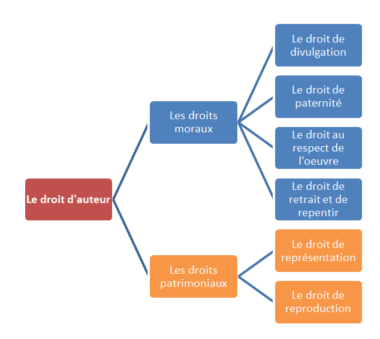
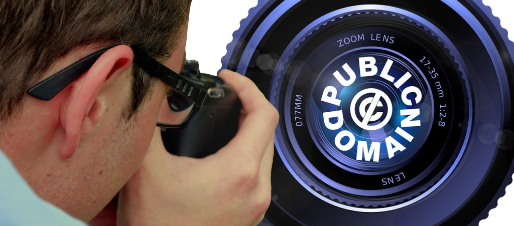

## Œuvres protégées :

La protection par droit d’auteur s’applique à toutes les œuvres de l’esprit quels qu’en soient le genre, la forme d’expression, le mérite ou la destination : œuvres littéraires, musicales, audiovisuelles, publicitaires, photographiques, mais aussi bases de données, sites Internet (=site web), blogs.

## Condition de la protection du droit d’auteur :

Une œuvre est un bien immatériel qu’aucune loi ne définit. La jurisprudence dégage 3 critères principaux pour qu’une œuvre soit protégée. Oeuvre :

- **de création** : ce qui suppose une intervention humaine consciente qui a pour intention de créer quelque chose qui n’existait pas.
- **originale** : l’œuvre doit être nouvelle et exprimer la personnalité de son auteur.
- œuvre se manifestant par une expression ou une forme tangible

Ces critères sont une condition nécessaire et suffisante pour bénéficier de la protection du droit d’auteur : Le bénéfice de la protection n’est pas subordonné à l’accomplissement de formalités (à la différence des DPI tels que brevets, marques, dessins et modèles). L’existence d’un dépôt (ex. : notaire) peut cependant faciliter la preuve de la paternité et de la date de la création de l’œuvre.

## Bénéficiaires de la protection :

L’auteur : la qualité d’auteur appartient à la ou aux personnes qui ont réalisé la création intellectuelle de l’œuvre et les co-auteurs éventuels. Les ayants-droit (héritiers par ex.) également.

## Droits exclusifs conférés à l’auteur d’une œuvre de l’esprit :

–\> **moraux** servent à protéger la personnalité de l’auteur à travers son œuvre (art L 121-1 du CPI)

–\> **patrimoniaux** : autoriser l’exploitation de son œuvre et en tirer un profit pécuniaire (art LI 23-1 du CPI)

## Durée de la protection

–\> Le droit moral est perpétuel.

–\> Les droits patrimoniaux : L’auteur jouit, sa vie durant, du droit exclusif d’exploiter son œuvre sous quelque forme que ce soit et d’en tirer un profit pécuniaire. La protection persiste au profit de ses héritiers pendant les70 ans qui suivent son décès, puis l’œuvre tombe dans le domaine public sous réserve du respect du droit moral.

Ces droits peuvent être cédés à la condition que cette autorisation soit expresse.

# Une nécessaire adaptation au monde numérique

- #### **Dans l’univers numérique, le droit d’auteur s’applique : droit moral et droits patrimoniaux**
    

Toutes les œuvres sont protégées, quels que soient leur genre, leur forme d’expression, leur mérite ou leur destination (article L. 112-1 CPI). Les supports numériques n’ont rien changé à cette disposition. Les droits d’auteur contèrent des droits moraux (art. L 121.1 du CPI) et des droits patrimoniaux (art. L 122.1 du CPI) à leur auteur. La protection d’une production immatérielle au titre du droit d’auteur s’applique sur le contenu, l’architecture (le fond et la forme) à condition que cette création soit originale.

- #### Cependant il existe quelques dérogations légales aux droits exclusifs de l’auteur : art. L 122.5 du CPI) :
    

Ces exceptions sont à appliquer strictement car elles ne doivent pas porter préjudice aux intérêts de l’auteur.

Sont tolérées :

- Les copies ou reproductions réservées à l’usage privé du copiste et non destinées à un usage collectif. La copie ne doit pas porter préjudice économique à l’auteur (de quoi vivra-t-il ?) ni porter atteinte à l’exploitation normale de l’œuvre (toute copie illicite de DVD supprime des ventes et empêche l’amortissement des coûts de production).
    
- Les courtes citations, revues de presse quand sont indiqués clairement le nom de l’auteur et la source
    
- La reproduction d’un logiciel à des fins de conservation (copie de sauvegarde)
    
- La reproduction et la représentation d’extraits d’œuvre dans le cadre de l’enseignement et de la recherche (sauf partitions musicales et ouvrages conçus à des fins pédagogiques)
    

# Cependant ces droits sont de plus en plus difficiles à protéger :

- développement des réseaux numériques à l’échelle mondiale
    
- facilité de reproduction, de conservation, de consultation des œuvres numériques – faible coût de la reproduction numérique
    
- facilité de modifier l’œuvre grâce à des logiciels appropriés
    
- possible anonymat des infractions
    
- avancées technologiques qui permettent de contourner les lois nationales, etc.
    

### La protection juridique des droits d’auteurs en univers numérique

2 types de protection : l’une technique, l’autre légale.

#### La défense technique et ses limites juridiques

L’OMPI (organisation mondiale de la propriété intellectuelle), la directive européenne sur les droits d’auteur (2001), la loi DADVSI (droits d’auteurs et droits voisins dans la société de l’information) autorisent les mesures techniques de protection.

Les DRM (Digital Rights Management Systems) sont un système de protection technique des œuvres diffusées en numérique. Ils permettent d’identifier l’utilisateur de l’œuvre, d’établir des statistiques sur les utilisations d’œuvres protégées et de s’assurer du respect des licences d’utilisation. Des DRM sont ainsi intégrés dans les DVD et dans les fichiers numériques, qu’ils soient diffusés en streaming (flux vidéo) ou téléchargeables. En quelque sorte, ce sont des « tatouages » ou « scellés numériques » qui permettent de tracer l’œuvre. Ils doivent être portés à la connaissance du public.

Le contournement et la suppression de ces mesures techniques de protection représentent une infraction (3750 €).

Cette protection technique est controversée. Elle peut être jugée comme présentant un danger pour la vie privée des utilisateurs, rendant difficilement compatible le droit d’auteur avec le droit du propriétaire du support. Pour certains tribunaux, elle est analysé comme un vice caché créant une restriction d’usage qui rend le produit impropre à l’usage auquel on peut légitimement s’attendre.

#### La défense légale des droits d’auteur

Le droit d’auteur naît de sa seule création. Puisqu’il n’y a pas de dépôt pour bénéficier de protection, c’est le fait juridique de la création qui permet la naissance du droit d’auteur. Le dépôt légal existe, mais il est sansinfluence sur le droit d’auteur. Il apporte la preuve de la date de création en cas de recours puisque la présomption de la qualité d’ auteur/créateur est une présomption simple.

Le droit d’auteur est légalement protégé par l’action en contrefaçon, l’action en concurrence déloyale et la loi Hadopi.

- #### La loi »HADOPI »
    

Les pouvoirs publies ont voulu protéger la propriété littéraire et artistique en créant un dispositif pour protéger les droits des auteurs dans l’univers numérique et lutter contre les téléchargements illégaux.

Comme le piratage est aujourd’hui un piratage de masse et domestique, qui n’a rien à voir avec la contrefaçon professionnelle et très lucrative, il a fallu adapter la loi sur le délit de contrefaçon en conséquence.

Au terme de péripéties juridiques, la loi dite HADOPI 2″ a été promulguée le 28.10.2009. C’est la loi relative la protection pénale de la propriété littéraire et artistique sur Internet. C’est une loi qui crée un dispositif qui se veut **pédagogique et gradué**.

Voici les principaux dispositifs :

- Création de la HADOPI (haute autorité pour la diffusion des œuvres et la protection des droits sur internet).

C’est une AAI qui veille à l’application des dispositions législatives. Elle promeut les offres légales d’œuvres numériques.

- \*\*Action contre l’abonné qui ne remplit pas son obligation de surveillance (ou de veille) : \*\*

Il commet une contravention de négligence caractérisée dans la sécurisation de l’accès à Internet. C’est une infraction pénale moins importante que le délit (l’abonné n’a pas veillé à ce que son accès ne soit pas utilisé pour commettre un acte de contrefaçon).

Le dispositif prévu contre lui est appelé « riposte graduée ». Il prévoit 2 avertissements successifs avant la sanction prononcée par le juge.

- #### L’action en contrefaçon = action contre le contrefacteur (le pirate)
    

La contrefaçon est une atteinte aux droits de l’auteur, et plus particulièrement à ses droits patrimoniaux. La contrefaçon est un délit civil qui se définit comme une atteinte aux droits de reproduction et de représentation ou d’exploitation d’une oeuvre sans l’accord de l’auteur, indépendamment de toute faute ou mauvaise foi. Les sanctions civiles encourues sont la réparation par versement de d&i et la cessation de l’acte de contrefaçon. Le tribunal compétent est un tribunal civil (TI Ou TGI) ou le Tribunal de commerce.

C’est aussi un délit pénal qui présente un caractère intentionnel. Le délit de contrefaçon suppose la volonté et la conscience de porter atteinte aux intérêts de l’auteur (volonté de nuire). Le pirate commet un « acte de contrefaçon au moyen d’un service de communication au public en ligne » (nouvel art. L 335-7 du CPI).Peu importe le moyen technique d’échange et de diffusion numérique; la technologie est neutre.

Le délinquant encourt comme sanction principale 3 ans de prison et 300 000 € d’amende (multipliée par 5 s’il s’agit d’une Personne Morale). Et comme sanction complémentaire une suspension à l’accès à Internet d’1 an maximum (nouvel art L335-7 du CPI). Le juge tiendra compte du profil du délinquant (gravité de l’infraction, personnalité, activité professionnelle). Cette peine ne sera pas inscrite au casier judiciaire.

## La protection des créations numériques

### La base de données

- #### Notion
    

Une base de données est un « recueil d’œuvres, de données ou d’autres éléments indépendants, disposés de manière systématique ou méthodique et individuellement accessible par des moyens électroniques ou par tout autre moyen » (art. L. 112-3 al. 2 CPI).

Un dictionnaire ou un annuaire sont des bases de données.

- #### Les informations qui y figurent sont de différents statuts :
    

La banque de données est une **Œuvre composite**.

- Certaines informations sont librement enregistrables : Données produites par le concepteur, œuvres tombées dans le domaine public (sous réserve de respecter le droit moral de leur auteur), données d’actualités.
    
- Les autres (données à caractère personnel, œuvres de l’esprit encore protégées) sont soumises à autorisation. Le créateur d’une base de données doit veiller à ne pas porter atteinte des droits juridiquement protégés.
    
- #### Protection juridique de la base de données
    

Les bases de données font l’objet d’une protection au titre du droit d’auteur et au titre d’un droit « sui generis » pour les producteurs de bases de données, indépendant du droit d’auteur.

–\> La protection par le droit d’auteur

Elle demeure la propriété de son auteur, sous réserve des droits de l’auteur de l’œuvre préexistante (article L. CPI).

Elle est accordée s’il y a une originalité car les bases de données constituent des créations intellectuelles notamment du fait des choix de disposition et d’organisation qui sont effectués par les auteurs ; une simple compilation ne peut donc pas bénéficier de la protection.

Cette protection confère à l’auteur de la base de données les droits moraux et patrimoniaux classiques sur une oeuvre de l’esprit : droit exclusif de divulgation, droit à l’intégrité de l’œuvre, droit de s’opposer notamment à toute représentation ou reproduction, intégrale ou partielle, sans son autorisation. Il en est de même pour la traduction, l’adaptation ou la transformation de la base de données.

### Le site Internet

- #### Notion
    

Un site Internet (site Web) est un ensemble de pages constituées de textes, d’images, de sons, de vidéos… ces pages sont consultables en suivant des liens hypertextes (hyperliens) ; ces pages sont mises en ligne à une adresse Web (Internet) correspondant à un nom de domaine qu’il faut réserver.

Chaque site Web a un propriétaire (entreprise, administration, association, particulier. …). Lorsque le site est créé par un particulier, on parle de blog.

- #### Protection
    

La protection du site Internet, dès lors qu’il présente un caractère d’originalité, est assurée globalement par le droit d’auteur car il constitue, en tant qu’œuvre multimédia, une œuvre de l’esprit. Cette protection confère les droits moraux et patrimoniaux classiques. Inversement, le titulaire d’un site Internet ne doit pas porter atteinte à des droits juridiquement protégés.

La protection d’un site Internet peut aussi être assurée en protégeant les différents éléments du site.

- Le nom de domaine peut être protégé par :

–\> le droit d’auteur si le nom du site a un caractère original,

–\> l’action en concurrence déloyale en tant que nom commercial si le nom de domaine est effectivement utilisé, et pas seulement réservé,

–\> par le droit des marques si le nom de domaine est déposé en tant que marque auprès de l’INPI. (Inversement, le créateur du site web doit s’assurer que le nom de domaine qu’il choisit n’est pas une marque protégée, ni la raison sociale d’une société, ni un patronyme connu).

–\> La présentation du site (c’est-à-dire page écran, graphisme, animation, arborescence d’un site) peut être protégée par le droit d’auteur (condition d’originalité) ; inversement, le créateur du site web doit veiller à ne pas porter atteinte à des droits juridiquement protégés. L’aspect graphique peut aussi être protégé par dépôt de dessin et modèle auprès de l’INPI.

–\> Les bases de données par le droit d’auteur et le droit du producteur.

- #### Responsabilité civile et pénale des différents acteurs de l’internet (fournisseurs de contenu, d’hébergement, d’accès et transporteur)
    

**Le régime de responsabilité des fournisseurs de contenus** (éditeurs de contenus). L’éditeur d’un site Internet est la personne physique ou morale qui met à la disposition du public, à titre professionnel ou non, des pages d’informations sur Internet. Il peut être assimilé à un responsable de publication, et est responsable de tous les contenus figurant sur son site. Il est présumé responsable non seulement de ce qu’il écrit personnellement mais aussi des commentaires édités sur son site.

Attention : *L’éditeur d’un blog à caractère personnel a une obligation de surveillance des contenus figurant sur son site. Le Forum des droits sur l’Internet recommande aux blogueurs « qui laissent la possibilité de poster des commentaires de prendre soin de consulter très régulièrement leur blog ».*

** Le régime de responsabilité des fournisseurs d’hébergement** (hébergeurs de contenus).

L’hébergeur assure le stockage direct et permanent d’images, d’écrits, de sons ou de messages pour le mettre à la disposition du public. Il permet donc aux auteurs de mettre en ligne des contenus dont il n’est pas l’éditeur. Il fournit les logiciels pour créer des pages Web et l’hébergement de ces pages sur des serveurs connectés à Internet (article 6-1-2 de la loi du 21 juin 2004).

L’hébergeur n’est pas soumis à une obligation générale de surveillance des contenus qu’il héberge, selon l’article 6-1-2 et 6-1-3 de la loi du 21 juin 2014 (LCEN). Sa responsabilité civile et pénale ne peut être engagée du fait des contenus qu’il stocke, sauf s’il avait effectivement une connaissance de leur caractère illicite ou de faits et circonstances faisant apparaître ce caractère illicite, ou si, dès le moment ou il en a eu connaissance, il n’a pas agi avec promptitude pour retirer ces données ou en rendre l’accès impossible.

**Attention**: on peut être à la fois hébergeur et éditeur pour un forum de discussion.