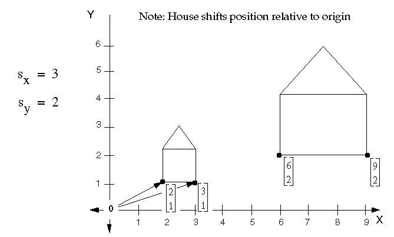
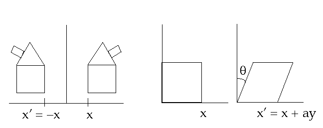
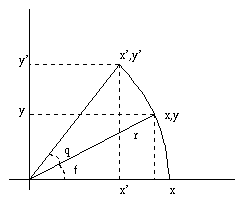
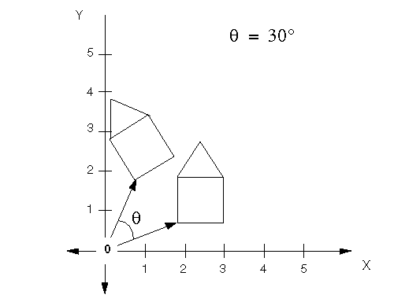
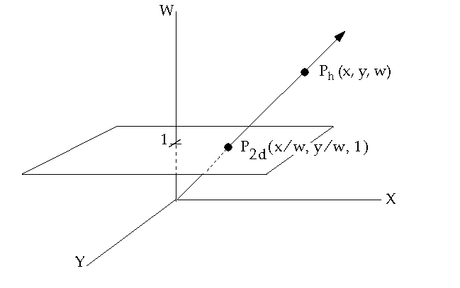
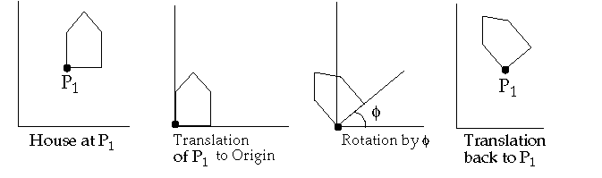
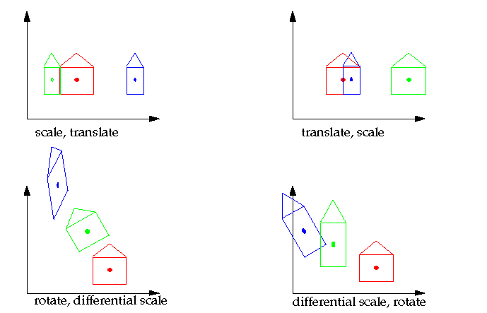
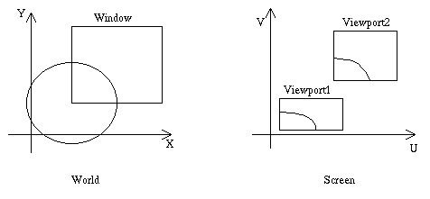

# Special cases of 2D Transformations:

## Scale matrix

|     |     |     |
| --- | --- | --- |
| sx  | 0   | 0   |
| 0   | sy  | 0   |
| 0   | 0   | 1   |

What if sx and/ or sy < 0 ? *get reflections through an axis or plane*



* * *

## Off diagonal terms: Shearing

|     |     |     |
| --- | --- | --- |
| 1   | x   | 0   |
| 0   | 1   | 0   |
| 0   | 0   | 1   |



* * *

## ROTATION



|     |     |     |
| --- | --- | --- |
| cos(q) | sin(q) | 0   |
| sin(q) | cos(q) | 0   |
| 0   | 0   | 1   |

- Positive Rotations: **counter clockwise** about the origin
- For rotations, det|T| = 1 and |T|<sup>T</sup> = |T|<sup>-1</sup>



* * *

## Translations

|     |     |     |
| --- | --- | --- |
| 1   | 0   | dx  |
| 0   | 1   | dy  |
| 0   | 0   | 1   |

* * *

# HOMOGENEOUS COORDINATES

- Use a 3 x 3 matrix:

```
                |x'| | a c tx|  |x|
                |y'| = | b d ty|*|y|
                |z'| | 0 0 1 |  |1|
```

- - W=0, are the points at infinity.



* * *

# COMPOSITION OF TRANSFORMATIONS

## Translations

Translate the points by tx1, ty1, then by tx2, ty2:

```
        | 1 0 (tx1+tx2) |
        | 0 1 (tx1+tx2) |
        | 0 0 1 |
```

- Scaling: Similar to translations

* * *

## Rotations



```
  = | 1  0  Px | | cos(q)  -sin( q) 0 | | 1  0  -Px |
    | 0  1  Py | * | sin(q)   cos( q) 0 | * | 0  1  -Py |
    | 0  0  1 | | 0        0       1 | | 0  0   1 |
                
                        
    | cosq      -sinq   Px*(1-cosq)+Py*sinq |
  = | sinq       cosq   Py*(1-cosq)-Px*sinq |
    | 0           0        1 |
```

* * *

## Scaling about an arbitrary point in Space

- Translate P to the origin
    
- Scale
    
- Translate P back
    
- **T = T1(Px,Py)* T2(sx, sy)*T3(-Px, -Py)**
    
- T =
    

```
    | sx  0   Px*(1-sx) |
    | 0   sy  Py*(1-sy) |
    | 0   0   1 |
```

* * *

## Commutivity of Transformations

- If we scale , then translate to the origin, then translate back, is that equivalent to translate to origin, scale, translate back?
- When is the order of matrix multiplications unimportant?
- When does T1\*T2 = T2\*T1?
- Cases where T1\*T2 = T2\*T1:

```
        T1      T2         
        translation     translation
        scale           scale         rotation        rotation
        scale(uniform)  rotation
```



* * *

# COORDINATE SYSTEMS

Screen Coordinates: The coordinate system used to address the screen ( device coordinates)

World Coordinates: A user-defined application specific coordinate system

having its own units of measure, axis,origin, etc.

Window: The rectangular region of the world that is visible.

Viewport: The rectangular region of the screen space that is used to display the

window.

> 

* * *

# WINDOW TO VIEWPORT TRANSFORMATION

- Want to find the transformation matrix that maps the window in world coordinates to the viewport in screen coordinates.
- Viewport: (u, v space) denoted by u<sub>min</sub>, v<sub>min</sub> ,u<sub>max</sub>, v<sub>max</sub>
- Window: ( x, y space) denoted by x<sub>min</sub>, y<sub>min</sub>,x<sub>max</sub>, y<sub>max</sub>
- The transformation:

1.  1.  Translate the window to the origin
    2.  Scale it to the size of the viewport
    3.  Translate it to the viewport location

```
 M<sub>WV</sub> =  T(u<sub>min</sub>, v<sub>min</sub>)*S(S<sub>x</sub>, S<sub>y</sub>)*T(-x<sub>min</sub>, -y<sub>min</sub>)

     S<sub>x</sub> = (u<sub>max</sub> -u<sub>min</sub>)/(x<sub>max</sub>-x<sub>min</sub>)
     S<sub>y</sub> = (v<sub>max</sub> -v<sub>min</sub>)/(y<sub>max</sub>-y<sub>min</sub>)

 M<sub>WV</sub> = 

          | S<sub>x </sub> 0       -x<sub>min</sub>*S<sub>x</sub>+ u<sub>min</sub> |
          | 0   S<sub>y</sub>      -y<sub>min</sub>*S<sub>y</sub>+ v<sub>min</sub> |
          | 0   0              1       |
```

