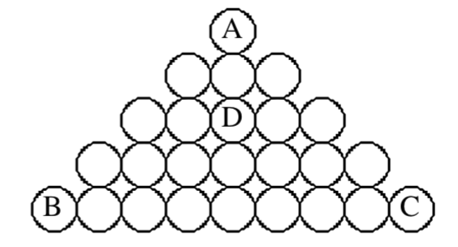
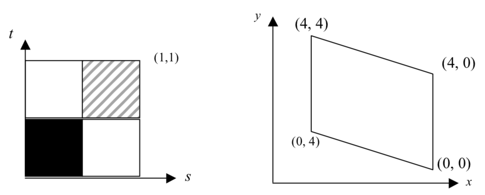

# Concepts you should understand and be able to explain

## Chapitre 0 - Introduction

- Computer graphics
- Animation
- Modeling
- Rendering
- Graphics system
- Primitives
- Object/local coordinates
- World coordinates
- Screen coordinates
- Hierarchical scene modeling
- Scenegraph

## Chapitre 1 - Drawing 2D Primitives

- Rasterization
- Scan conversion
- Clipping (Cohen-Sutherland)
- Aliasing
- Parametric equations of a line
- Cosmetic pattern
- Geometric pattern

## Chapitre 2 - Geometrical Transformations

- Vector, unit vector
- Vector dot product
- Vector cross product
- Matrix multiplication
- Matrix inversion
- 2D and 3D Homogeneous coordinates
- (Affine) Transformations
- Translation/Rotation/Scale/Shear
- Composite transformations
- Fixed-point transformations
- Transformation of points
- Transformation of coordinate systems
- Rotation about an arbitrary axis

## Chapitre 3 - Viewing in 3D

- Modeling transformation
- Viewing transformation
- Projection transformation
- Window-to-viewport transformation
- Aspect ratio
- Parallel vs. perspective projections
- Oblique vs. orthographic parallel views
- Vanishing point

## Chapitre 4 - Surface Models

- Polygonal surfaces
- Voxels
- Parametric surfaces / Patches
- Spline / parametric curve: interpolating, approximating
- Spline properties: normality, positivity, regularity, locality, continuity (C and G)
- Convex hull
- Bezier, NURBS, B-Splines, Hermite
- Subdivision surfaces
- Subdivision mask
- Implicit surfaces
- The blob tree
- Skeletal implicit surface
- Marching cubes / triangles / quads
- Polygon soup

## Chapitre 5 - Rendering

- Local illumination
- Global illumination
- Rendering pipeline
- Depth test
- Directional light
- Point light
- Spot light
- Ambient material / light coefficient
- Diffuse material / light coefficient
- Specular material / light coefficient
- Emissive material
- Shininess
- Lighting (ambient, diffuse reflexion / Lambert, specular reflexion / Phong)
- Shading (flat, smooth / per vertex / Gouraud, per pixel / Phong)
- BRDF
- Texture
- Vertex shader
- Fragment shader
- Varying variable
- Uniform variable
- Attribute variable

# Short answer questions

1.  1.  What are homogeneous coordinates, and why are they used in computer graphics?
        
    2.  Define “primitive” as it relates to graphics programming. Why might a graphics package provide only low-level primitives? Give an example of a higher-level primitive not available in most packages, and when such a primitive might be useful.
        
    3.  What is a shear transformation? Give a matrix for a general 2D y-shear, and explain why that matrix produces the desired result.
        
    4.  Explain the concept of looking at transformations as a change in coordinate system, rather than as a change in the object. Give an example of a situation where looking at transformations as a change in coordinate system might be useful.
        
    5.  What is an application model? How is it distinguished from the graphics that are rendered on the screen? What is the name of the process that implements a mapping between the application model space and screen space? How does this process work?
        
    6.  Suppose we have a GLUT interface window that is 400x300 pixels, and that we make the following function calls: gluOrtho2D(-4,4,-3,3) and glViewport(0,0,200,150). Draw a picture and use it to explain how these function calls set up the window-viewport transformation.
        
    7.  In the z-buffer algorithm, is the order of rendering for polygons important? Why or why not?
        
    8.  Define linear interpolation. In the z-buffer algorithm, is linear interpolation an exact reflection of reality or an approximation? Why?
        
    9.  Define back-face culling. Why is this not a general-purpose solution to the hidden surface problem?
        
    10. What is ambient illumination? What does it approximate from physical reality?
        
    11. Which term in the Phong illumination model does NOT use the material (color) properties of the object being illuminated? Why?
        
    12. Why is texture mapping so important for real-time rendering?
        
    13. Describe the process of determining a pixel’s color when rendering a polygon with a texture map.
        
    14. Define the following terms from ray-tracing: primary ray, shadow ray, reflection ray.
        
    15. Describe the algorithm used to determine whether a ray intersects a polygon.
        
    16. Why are parametric equations often used to represent curves?
        
    17. How are Bézier and Hermite curves related? What property do Bézier curves have due to the use of the constant 3 in this relationship?
        
    18. Describe a basic algorithm for rendering parametric cubic curves.
        
    19. Explain the concept of a blending function. How does one obtain the blending functions for a family of curves?
        
    20. Why is it possible to build a 3D polygonal model without using the process of 3D polygonal modeling?
        
    21. Describe one method to manage the speed-realism tradeoff using level of detail (LOD).
        
    22. What are programmable shaders? How does the shader concept differ from traditional graphics processing techniques?
        
    23. What is the difference between a vertex shader and a fragment shader?
        
    24. Give an example of a situation where you might use a vertex shader. What computations would the vertex shader program do in this case?
        
    25. Give an example of a situation where you might use a fragment shader. What computations would the fragment shader program do in this case?
        

# Problems

Work each problem, showing intermediate steps and explaining when necessary.

**Exercice 1** Two endpoints A(13, 11) and B(4,15) describe the line segment AB.

1.  Give the equation of the line in parametric form.
2.  Assume that AB is a polygon edge. Find the intersection of this edge with the scanline y=13.

**Exercice 2** A line segment is given by its two endpoints (10,10) and (32,15).

1.  What is the point-slope formula for this line?
2.  What is the parametric equation for this line?
3.  Suppose we have a window with lower left corner (8,12), width of 20 pixels and height of 20 pixels. Find the intersections of this line with the edges of the window, and specify the new clipped vertices.

**Exercice 3** Quadrilateral ABCD has vertices at (0,0), (0,75), (30,60), and (20,-10). What are the vertices after ABCD has been clipped to a window 50 units wide and 140 units high, centered at the origin?

**Exercice 4** Derive the equation of the plane for the plane containing the points (0,0,0), (5,0,0) and (10,10,10).

**Exercice 5**

Give the 2D homogeneous matrix for each of the transformations in parts 1-3. Leave composite transformations in factored form:

1.  Scale in the x-dimension by 2 and the y-dimension by 3 with fixed point (4,2)
    
2.  Rotate by –30 degrees about the point (-2, 3)
    
3.  Reflect about the line y = -5
    
4.  Check your work on question 3 by applying the resulting matrix to the line segment from (1,3) to (6,2). What are the new endpoints?
    

**Exercice 6**

Triangle ABC has vertices at (1,1), (2,3), and (3,1). Find the matrix that performs a scale of this triangle by 2 in the x direction while keeping vertex (2,3) fixed. Apply this matrix to the vertices and find the new vertices of ABC.

**Exercice 7**

Give the 3D homogeneous coordinate transformation that rotates a point about the line:

```
     x(t) = 0
     y(t) = t
     z(t) = t

```

by d degrees. Leave matrices in factored form. (Hint: draw a picture of the line)

**Exercice 8**

Give a matrix transformation for a rotation about the line through the points (0,10,0) and (0,10,10). (The transformation may be written out as a product of simple matrix transformations.)

**Exercice 9**

The following questions refer to the projection of 3D points onto the viewplane given by x = -10. Assume that the up vector is (0, 1, 0).

1.  Given an arbitrary point (x,y,z) what is the corresponding 2D projected point on the viewplane using a parallel projection (the direction of projection is (1,0,0))?
    
2.  Given an arbitrary point (x,y,z), what is the corresponding 2D projected point on the viewplane using a perspective projection with the center of projection (CoP) at (a,b,c)?
    

**Exercice 10** Given a View Plane Normal, VPN = \[4, 0, -7\] and a View Up Vector, Vup = \[2, 0, 0\], calculate the u, v, and n vectors that define the x, y, and z axes of the Viewing Reference Coordinate System relative to the World Reference Coordinate System.

**Exercice** 11 Given the BSP-tree shown below and an eyepoint at (0, 10, -5), in what order would the polygons A, B, C, D, E, F, G be rendered? Note that the equation for the plane that each polygon lies in is given and that the front side of each node is marked with a +.

> **Exercice 12** Two triangles, A and B, have been projected onto a window centered at the origin that is 3 units wide and 2 units high. The projected vertices for A are: (0,0), (1.4, 1.4), and (1.4, 0). The projected vertices for B are: (0.2, 0.9), (0.2, -0.9), and (-2, 0).
> 
> a. Find the locations of these vertices after mapping them to a viewport whose origin is at the lower-left corner, and which is 60 pixels wide by 60 pixels high. b. What are the new screen coordinate vertices for triangle B after clipping? c. The 2 triangles overlap at pixel (30,30). Given depth values for triangle A of –1, –1, and –1 for each of its vertices, respectively, and depth for triangle B of –1.5, 0, and –0.5 for each of its vertices, respectively, which triangle’s color should be drawn for pixel (30,30)?
> 
> **Exercice 13** Assume a Gouraud shading model for the triangle below. Pixel A has been assigned the color (100,100,100), pixel B is color (80, 50, 50) and pixel C is (70, 90, 70). What color should be assigned to pixel D?
> 
> 

**Exercice 14**

Sketch the result of texture mapping the image shown on the left to the quadrilateral shown on the right, with texture coordinates as shown next to the quadrilateral’s vertices. Assume that texture coordinates wrap if they exceed 1.



> **Exercice 15** You want to join two Bézier curves. The first curve must start at (0,0,0) with a tangent vector of (1,1,1). The second curve must end at (5,0,-5) with a tangent vector of (-1,-1,-1). The two curves should be joined at (2,5,0) and have C1 continuity. Give the geometry matrices for each curve.
> 
> **Exercice 16** Find the parametric equations of the Hermite curve with P1=(-1,0,-1), P4=(1,0,1), R1=\[0,-1,0\], R4=\[0,1,0\]. What is the velocity along this curve at t=0, t=0.5, and t=1?

**Exercice 17** **Given an eyepoint at (0,0,0), a pixel at (-3, 2, -4), and a sphere of radius 5 with its center at (-5, 10, -10), does the ray from the eyepoint through the pixel intersect the sphere? If so, what is the intersection point?**

**Exercice 18** Given a ray beginning at the point Ro=(4,0,0) with direction Rd=\[1,1,0\], and a polygon with vertices (5,2,2), (5,3,-2), and (5,-1,0), does the ray intersect the polygon? If so, what is the intersection point?