# Les shaders en GLSL

Bonjour à tous ! :)

Vous êtes-vous jamais demandé comment étaient faits les superbes effets 3D à la mode comme on en voit dans les jeux vidéos récents, comme par exemple l’eau, l’HDR ou l’effet de flou de vitesse dans les jeux de voiture ? Une bonne partie de la réponse se trouve dans l’utilisation de [**shaders**](http://fr.wikipedia.org/wiki/Shader_Model) au sein d’un rendu 3D.

Vous en avez sans doute déjà entendu parler (*Shader Model 2.0*, *Shader Model 3.0*, …), mais savez-vous vraiment ce qu’est un shader ? Savez-vous ce que permet de faire un shader ? Non ? Et bien c’est justement ce que je vais essayer de vous apprendre à travers ce tutoriel.

Ici, je vous apprendrai à programmer dans un langage de programmation de shaders appelé le GLSL. Nous allons tout d’abord voir en quoi cela consiste, comment on s’y prend, et enfin je vous apprendrai à créer quelques effets graphiques sympathiques :) Allons-y !

Ce tutoriel nécessite la lecture du [tutoriel sur OpenGL](http://www.siteduzero.com/tuto-3-5616-0-creez-des-programmes-en-3d-avec-opengl.html) de Kayl, [annexe sur la trigonométrie](http://www.siteduzero.com/tuto-3-23980-1-la-trigonometrie.html) comprise. Les exemples de code seront écrits en langage C, et la connaissance de ce langage en général (ou d’un langage qui lui ressemble syntaxiquement comme le C++ ou le Java) est conseillée car le GLSL est basé dessus. Je ne vous détaillerai donc aucune base de la programmation avec GLSL puisqu’elles sont quasiment identiques à celles du C (if, else, for, etc…).

# Introduction au GLSL

Vous vous demandez probablement qui peut bien être ce GLSL, et à quoi il peut servir ? o_O

Je vais, dans ce premier chapitre, essayer de vous expliquer à quoi il peut amener. Nous verrons ce qu’il représente exactement et comment il intervient dans un rendu 3D avec OpenGL.

**Que saurais-je faire à la fin de ce tutoriel ?**

Je ne peux pas être affirmatif sur ce point, mais je pense pouvoir vous apprendre :

- à faire de la lumière. Nous apprendrons à gérer des lumières avec le GLSL;
    
- cel-shading, ou rendu cartoon. Cet effet est très simple à réaliser, je pense que c’est l’un des premiers que nous étudierons;
    
- manipulation de textures. Nous verrons comment déformer simplement nos textures pour donner des effets de distorsion, mais aussi des effets de flou (comme le flou de vitesse de certains jeux de voiture);
    
- pseudo-HDR. La gestion de la lumière alliée à la manipulation des textures nous permettra de réaliser “facilement” un effet de pseudo-HDR.
    

Mais avant de voir toutes ces jolies choses, il nous faut tout d’abord connaître l’essentiel : qu’est-ce que le GLSL, et comment on l’utilise.

## C’est quoi ?

A l’origine pensé par [Pixar](http://www.pixar.com/) pour ses animations vidéos, les shaders ont fait leur apparition dans le domaine du jeu vidéo assez récemment et sont aujourd’hui indispensables pour qui veut réaliser des effets graphiques un tant soit peu évolués.

GLSL ([Def. GLSL (en)](http://en.wikipedia.org/wiki/GLSL)) est l’abréviation de Open**GL****S**hading **L**anguage, traduisez : langage de programmation de shaders OpenGL. Effectivement, le GLSL est un langage de programmation de shaders.

## La programmation GPU

Le GPU est le processeur de votre carte graphique, c’est lui qui calcule vos rendus 3D. La programmation GPU revient donc à… programmer nos calculs de rendus 3D o_O Ah bah tiens, c’est la meilleure du siècle celle-là :p

Les shaders servent à programmer le [pipeline](http://jeux.developpez.com/faq/3d/?page=definitions#DEFINITIONS_pipeline) de rendu par défaut de votre carte graphique, appelé le FFP. Les shaders ne sont donc rien de plus que des programmes, donc :

- un code source;
    
- une compilation;
    
- une exécution.
    

Ils se différencient toutefois des programmes écrits en C, C++ ou autre langage réservé à une exécution CPU, de par leur compilation et leur exécution. La compilation d’un shader est effectuée lors du lancement de votre application, et l’exécution se passe au niveau du GPU, contrairement à vos programmes habituels (C, C++, C#, Java, …) qui eux sont traités par le CPU, et c’est ce qui fait la puissance et la flexibilité des shaders dans le rendu 3D en général :)

### En assembleur ?

Quand on parle de la programmation d’un processeur, on pense généralement à l’assembleur. Il existe effectivement des langages assembleur pour programmer un GPU, mais nous ne les traiterons pas dans ce tutoriel. Ici, nous ne parlerons que d’un langage de programmation GPU dit de haut niveau, le GLSL. Le GLSL a été développé par l’ARB pour l’API graphique OpenGL afin d’offrir une plus grande souplesse dans la programmation de shaders. DirectX a également développé son propre langage haut niveau pour la programmation de shaders, il s’agit du HLSL, mais il est plutôt hors-sujet, je ne vous en parle qu’à titre de comparaison.

Le GLSL est donc un langage de programmation de shaders de haut niveau, mais à quoi ça ressemble au juste ? Voici le code source d’un shader écrit en GLSL :) :

```
void main(void)

{

    gl_TexCoord[0] = gl_MultiTexCoord0;

    gl_Position = gl_Vertex * gl_ModelViewMatrix;

}
```

Il s’agit là d’un simple vertex shader.

Vertex shader ??

Oui. Il est important de distinguer deux types de shaders différents, remplissant chacun des fonctions bien définies et aucunement identiques :

- les **vertex shaders** : ce sont des shaders qui interviennent lors du traitement de chaque sommet. Dans les vertex shaders vous pourrez modifier le calcul des différents attributs de vos sommets;
    
- les **pixel shaders** : aussi appelés fragment shaders, ils permettent de traiter le rendu de chaque pixel qui s’affichera à l’écran. Ces derniers offrent une grande flexibilité dans le domaine du rendu 3D.
    

J’espère que vous y voyez à présent un peu plus clair ;) Les shaders vous permettent de programmer le traitement de chaque sommet ainsi que de chaque pixel.

Une nouvelle génération de shaders vient de faire son apparition avec le nouveau GPU (GeForce8) de nVidia, les *geometry shaders*. Cette technologie étant assez nouvelle je n’en parlerai pas. Aussi je n’ai pas les moyens de me procurer ce genre de carte, et beaucoup de gens étant dans mon cas, l’explication d’une fonctionnalité que personne ne pourrait exploiter serait plutôt inutile à l’heure actuelle ;)

* * *

## Pourquoi faire ?

Les shaders permettent donc de programmer la fonction de traitement d’un vertex ainsi que d’un pixel. Mais à quoi cela rime-t-il ? Quel utilité cela peut-il bien avoir ?

## Le traitement d’un vertex et d’un pixel, c’est quoi ?

Voilà une bien bonne question :) Quand vous envoyez des données de sommet à OpenGL via les commandes *glVertex*()*, *glColor*()*, *glTexCoord*()*, *glNormal*()*, … (ou par des tableaux via *gl*Pointer()* ) OpenGL les stocke et les associe à un ou plusieurs triangles bien définis.

Je rappelle que le triangle est la seule primitive supportée nativement par toutes les cartes graphiques, les GL_QUADS et autres ne sont que des émulations via des constructions de plusieurs triangles, d’où leur coût de traitement plus élevé.

Le traitement de ce triangle se décompose par le traitement de ses 3 sommets, puis par une interpolation des données de ses sommets pour obtenir un triangle plein. Ce sont ces deux dernières étapes qui sont traitées respectivement par le vertex et le pixel shader.

Le traitement d’un vertex consiste à lui appliquer des transformations matricielle (GL\_MODELVIEW, GL\_TEXTURE, …) pour obtenir les données des sommets définitives qui seront ensuite interpolées. Le pixel shader reçoit des données interpolées de couleur et autres attributs traités dans le vertex shader.

Quel est l’intérêt des shaders ?

Pensez bien qu’il y en a un ;) En réalité, il y a deux grands avantages à utiliser les shaders. Le premier est qu’ils permettent une énorme flexibilité de rendu. En gérant le rendu de chaque pixel vous avez un contrôle quasi absolu sur vos rendus 3D et vous pouvez ainsi réaliser beaucoup d’effets chouettes sans trop vous compliquer la vie. Le second intérêt réside dans leur principe même. Étant exécutés par la carte graphique, les shaders ne consomment **pas** de processeur (CPU), ce dernier peut alors souffler un peu et se concentrer sur la gestion de l’IA ou du réseau par exemple. Dans cette optique de décharger le processeur, les shaders ont également un énorme intérêt si l’on utilise un langage assez “gourmand” comme le C# ou le Java, qui sont moins rapides que le C.

## Un exemple concret ?

Mais concrètement, qu’est-ce qu’on peut faire avec des shaders ?

Il est temps de vous montrer à quoi cela ressemble. Voici deux captures d’écran de la même scène, l’une utilisant le FFP standard, l’autre, des shaders.

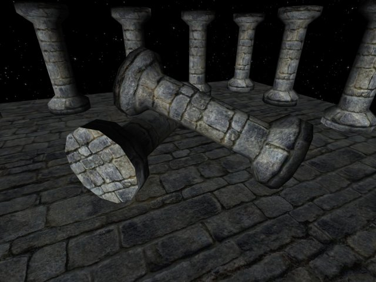

Rendu standard

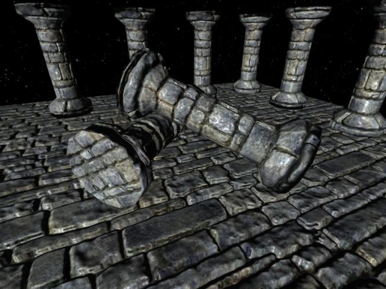

Rendu avec shaders

*(source du modèle 3D et des textures : [http://mdeverdelhan.developpez.com/tut \[…\] ht/tutoriel6/](http://mdeverdelhan.developpez.com/tutoriel/dynamiclight/tutoriel6/))*

Les shaders permettent d’ajouter des effets qui peuvent être réalistes, beaux ou encore rigolos, comme le cel-shading (aussi appelé rendu cartoon).

Hey je veux savoir faire ça !

Pas de problème :) Toutefois soyez prévenus, pour aboutir à un résultat tel que vous venez d’en voir, les shaders ne suffisent pas, mais ils constituent une partie importante de la réalisation d’un tel effet. Et oui, les shaders ça ne fait pas tout, il faudra souvent les associer à des techniques de rendu (rendu offscreen notamment).


:’(

Ne pleurez pas, je tâcherai de vous enseigner ces techniques au fur et à mesure à travers d’autres tutoriels ;) Et puis sachez qu’il existe aussi des techniques de rendu qui ne se contentent que des shaders.

* * *

## Comment faire ?

Malgré quelques explications en début de chapitre, il est important que vous sachiez avec un peu plus de précision comment fonctionne l’implémentation théorique des shaders au sein d’un programme OpenGL.

## Programmer un shader, c’est dur ?

Pour peu que vous sachiez raisonner logiquement, la programmation d’un shader ne devrait pas vous poser de problème ;) Cela n’a en réalité rien de sorcier, et si vous maîtrisez un temps soit peu la programmation d’un langage procédural tel que le C, vous vous apercevrez que le GLSL y ressemble beaucoup ;)

En effet, le GLSL est un langage ressemblant fortement au langage C.

Cependant, il est important**impératif** de distinguer deux choses :

- la programmation d’un shader en GLSL;
    
- son utilisation au sein d’une application OpenGL.
    

Ces deux choses sont totalement différentes, il est primordial de bien faire leur distinction. Nous avons d’une part la programmation du shader lui-même, c’est-à-dire le codage de la fonction qu’il remplira, l’effet graphique qu’il produira, d’autre part la définition de son utilisation, quand et comment l’utiliser dans notre application.

Nous pouvons comparer cela à l’utilisation des textures, nous avons d’une part la création de la texture, soit la création de l’image via un logiciel de dessin 2D, et d’autre part le chargement et l’utilisation de cette texture dans notre programme.

L’idée est la même pour les shaders, nous allons tout d’abord programmer un shader, nous placerons son code source dans un fichier, puis nous programmerons notre application OpenGL et nous chargerons via celle-ci le code source de notre shader afin de l’utiliser à notre convenance au sein de notre programme.

## Programmer un shader, avec quel IDE ?

Il n’existe pas beaucoup d’éditeurs de texte qui colorent le langage GLSL.

On peut toutefois citer [Kate](http://kate-editor.org/), qui bénéficie du support de la coloration syntaxique du GLSL, il active automatiquement celle-ci pour tout fichier ayant pour extension .vert pour les vertex shader, ou .frag pour les fragment shader (ou pixel shader).

Il existe également [QShaderEdit](http://castano.ludicon.com/page.php?page_id=118), un éditeur qui semble assez pratique ainsi que portable (bien qu’il utilise QT), mais que je n’ai jamais testé (merci à [XT95](http://www.siteduzero.com/membres-294-22249.html) pour l’info).

## Programmer un shader, avec quel compilateur ?

Aucun ! :p

Vous avez bien lu, il ne vous faut télécharger aucun compilateur. Comme je l’ai déjà dit, les shaders GLSL sont compilés lors de l’exécution de votre application, c’est OpenGL qui s’en charge ;) Donc rien à faire de particulier ici.

Vous savez à présent qui sont ces fameux shaders, et ce qu’ils permettent de réaliser. Mais vous ne savez pas encore *comment* le réaliser. Pour l’instant le plus important est que vous ayez compris leur fonctionnement global, il faut pour cela retenir une chose importante : **les shaders sont des programmes exécutés par la carte graphique.**

À partir de cette bonne base, nous allons étudier leur fonctionnement plus en profondeur afin de comprendre comment ils marchent réellement :)

### Les spécifications du langage

Pour les adeptes des specs, voici [les spécifications](http://www.opengl.org/registry/doc/GLSLangSpec.Full.1.20.8.pdf) du langage GLSL.

* * *

# Implémentation du GLSL côté API

Vous savez normalement comment fonctionne un shader et quel est son rôle, mais vous ne savez pas encore comment **l’intégrer** dans un programme avec OpenGL. Comment diable va-t-on réussir à utiliser une telle chose dans nos programmes OpenGL ? Comment ça marche ? C’est ce que nous allons étudier dans ce chapitre, nous apprendrons à manier les shaders avec OpenGL.

L’implémentation des shaders se décompose en plusieurs parties :

- premièrement, la **création** d’un shader. Nous verrons comment créer un shader en OpenGL;
    
- nous verrons ensuite comment attribuer un contenu à ce shader. Souvenez-vous : un shader est un programme, il possède donc un code source. Nous verrons comment **envoyer un code source** à notre shader précédemment créé;
    
- une fois le code source spécifié, il nous faudra le **compiler**. Il faudra également gérer les erreurs, car comme toute compilation, la compilation d’un shader peut échouer;
    
- notre shader est fin prêt, mais il n’est pas encore utilisable. Il nous faudra pour cela créer un **program**, car celui-ci peut être exécuté directement par la carte graphique.
    

Ici nous allons uniquement programmer en C avec l’API OpenGL, ne confondez pas ce que nous allons écrire maintenant avec le langage GLSL, celui-ci ne sera étudié qu’à partir du prochain chapitre.

## Création d’un shader

Nous y voilà :)

Vous vous demandez probablement comment fonctionnent ces tant convoités shaders ? En réalité, ils ne sont pas difficiles à manier rassurez-vous ;)

Nous allons voir ici la simple opération qu’est la création d’un shader, mais avant cela, il est important de savoir si votre implémentation supporte les shaders GLSL.

Comment ça ?

## Les extensions des shaders

Si vous possédez une ancienne carte graphique, vous risquez de ne pas pouvoir utiliser les shaders ou alors leur utilisation conduirait à une erreur indéterminée (erreur de segmentation la plupart du temps :-° ), il est donc important de tester si l’extension correspondante aux shaders GLSL est disponible.

C’est quoi les extensions ?

Je vous invite à lire [mon tutoriel sur les extensions d’OpenGL](http://www.siteduzero.com/tuto-3-17911-1-opengl-les-extensions.html). Il vous expliquera dans le détail ce que sont les extensions, et comment on les utilise.

Bon OK, et c’est quoi le nom de l’extension des shaders GLSL ?

Il y en a en fait 4 :D

Voici la liste des noms des extensions nécessaires à l’utilisation de shaders GLSL dans un programme OpenGL :

- **GL\_ARB\_shading\_language\_100** : support du langage GLSL;
    
- **GL\_ARB\_shader_objects** : support des objets de shader (cf plus bas);
    
- **GL\_ARB\_vertex_shader** : support des vertex shaders;
    
- **GL\_ARB\_fragment_shader** : support des pixel shaders.
    

Globalement, on peut dire que les shaders GLSL sont supportés à partir des GeForceFX chez nVidia, et à partir du Radeon 9500 chez ATI.

## Création d’un shader

Vous vous souvenez de ce que je vous ai dit dans l’introduction ? Le maniement des shaders ressemble à celui des textures ;) Et c’est quoi une texture ? … (réflexion intense…) un **GLuint** !

```
GLuint shader;
```

Bon, et bien voilà, ça c’est fait… :-°

Hep hep hep, une minute ! J’ai rien compris moi…

Eh bien un shader est un objet qui ne se manie qu’à partir de son identifiant, tout comme les textures. Cependant, les shaders ne se manipulent pas avec les habituelles fonctions glGen*, glIs*, glBind* et compagnie, il va donc falloir que je vous fasse découvrir dans un premier temps la fonction qui va venir remplacer glGen*, autrement dit : la fonction qui va créer un shader et nous renvoyer son identifiant. Il s’agit de la fonction glCreateShader, dont voici le prototype :

```
GLuint glCreateShader(GLenum type);
```

- ***type*** : attend une constante qui peut être GL\_VERTEX\_SHADER ou GL\_FRAGMENT\_SHADER. Chacune de ces constantes représente respectivement un shader de sommet et un shader de pixel. Souvenez-vous lors de l’introduction je vous avait dit qu’il existait deux types de shader, et bien c’est ici que vous allez spécifier ce type ;)

Cette fonction renvoie l’identifiant de l’objet de shader créé.

Allez, un exemple complet :

```
GLuint shader;
shader = glCreateShader(GL_VERTEX_SHADER);
```

Et voilà, nous avons à présent un shader de sommet prêt à être utilisé :)

Et quand on ne voudra plus l’utiliser ?

Alors il faudra le supprimer. Voici le prototype de la fonction qui permet de supprimer un shader :

```
void glDeleteShader(GLuint shader);
```

Nous l’utiliserons comme ceci au sein de notre programme :

```
GLuint shader;

/* creation */
shader = glCreateShader(GL_VERTEX_SHADER);
if(shader == 0)
{
    /* erreur de creation :( */
    return;
}

/* utilisation ... */

/* suppression */
glDeleteShader(shader);
shader = 0;
```

Notez l’ajout de la dernière ligne de code, ainsi que de la vérification de la valeur de l’identifiant. Tout comme tout autre identifiant d’objet OpenGL, 0 n’est pas un identifiant de shader valide. Bien que cela soit rare, il n’est pas impossible qu’à priori OpenGL vous renvoie 0, il est donc conseillé de tester la valeur de retour de glCreateShader, mais ce n’est pas obligatoire comme avec malloc.

Pour finir, je vais vous présenter une fonction dont la syntaxe devrait vous être familière : glIsShader. A l’instar des autres fonctions glIs* d’OpenGL, cette fonction permet de savoir si l’identifiant qu’elle reçoit en paramètre est un identifiant de shader valide. Voici le prototype de cette fonction :

```
GLboolean glIsShader(GLuint shader);
```

Bien, nous avons réussi à créer un shader… mais quelles sont les fonctions permettant de le manipuler afin de l’utiliser à notre guise ? Eh bien suivez-moi, c’est par là :)

* * *

## Envoi d’un code source à un shader

Nous voici parvenus à la seconde étape de la création d’un shader fonctionnel.

Nous allons voir ici comment charger notre code source afin de le donner à manger à OpenGL.

Comment ça ?

Je vous l’ai déjà dit lors de l’introduction, les shaders sont compilés lors de l’exécution de votre application, il va donc falloir charger leur code source dynamiquement, à partir d’un fichier par exemple ;)

Pourquoi un shader doit se compiler à l’exécution ? Ça doit être lent non ?

Ce n’est pas lent du tout rassurez-vous ;) Sans être affirmatif, je pense que les principales raisons à cela sont :

- plus simple à gérer, s’il fallait procéder à la compilation séparée des shaders on ne s’en sortirait plus;
    
- je pense qu’une compilation à l’exécution permet à OpenGL d’optimiser le shader en fonction du matériel de la machine qui exécute le programme OpenGL.
    

## Charger un code source à partir d’un fichier

Voilà une étape des plus enfantines, pour peu que vous sachiez utiliser les fichiers dans le langage que vous utilisez pour faire vos programmes OpenGL.

Je vais ici vous présenter un exemple de code en langage C (langage qui est et sera d’ailleurs utilisé pour tous les exemples). Le but est donc d’obtenir un code source, et qu’est-ce qu’un code source ? Une chaîne de caractères ! Bingo ;) Voyons voir… :

```
char* LoadSource(const char *filename);
```

Ceci pourrait être un bon prototype pour une fonction ayant pour but de charger le code source de nos shaders :) C’est une fonction simple et générique, je l’adopte ! Il faut à présent la programmer, rien de très sorcier :

```
char* LoadSource(const char *filename)
{
    char *src = NULL;   /* code source de notre shader */
    FILE *fp = NULL;    /* fichier */
    long size;          /* taille du fichier */
    long i;             /* compteur */
    
    
    /* on ouvre le fichier */
    fp = fopen(filename, "r");
    /* on verifie si l'ouverture a echoue */
    if(fp == NULL)
    {
        fprintf(stderr, "impossible d'ouvrir le fichier '%s'\n", filename);
        return NULL;
    }
    
    /* on recupere la longueur du fichier */
    fseek(fp, 0, SEEK_END);
    size = ftell(fp);
    
    /* on se replace au debut du fichier */
    rewind(fp);
    
    /* on alloue de la memoire pour y placer notre code source */
    src = malloc(size+1); /* +1 pour le caractere de fin de chaine '\0' */
    if(src == NULL)
    {
        fclose(fp);
        fprintf(stderr, "erreur d'allocation de memoire!\n");
        return NULL;
    }
    
    /* lecture du fichier */
    for(i=0; i<size; i++)
        src[i] = fgetc(fp);
    
    /* on place le dernier caractere a '\0' */
    src[size] = '\0';
    
    fclose(fp);
    
    return src;
}
```

Ceci étant fait, nous devons voir à présent comment envoyer notre code source à notre objet *shader*. Effectivement, OpenGL nous propose de spécifier le code source de notre shader via un **char***. Ça tombe bien, nous l’avons celui-ci :p

Voici la fonction qui permet d’envoyer le code source d’un shader :

```
void glShaderSource(GLuint shader, GLsizei nombre, const GLchar **sources, const GLint *longueur);
```

- ***shader*** : c’est l’identifiant de notre shader, afin que la fonction adresse notre code source à ce shader et pas un autre.
    
- ***nombre*** : c’est le nombre de chaînes contenues dans *sources*.
    
- ***sources*** : c’est notre code source, décomposé en plusieurs chaînes.
    
- ***longueur*** : un paramètre bizarre autant que compliqué :-° nous le laisserons à NULL, c’est tout à fait autorisé ;)
    

Hé mais cette fonction attend plusieurs chaînes, mais nous on en a qu’une seule !

Ce fut également la réaction que j’ai eu lorsque j’ai vu le prototype de la fonction pour la première fois :-° J’ai vite compris que ça n’avait aucune importance, nous avons une seule chaîne, donc nous allons positionner *nombre* à 1 et nous enverrons l’adresse de notre pointeur sur notre code source.

Un exemple ? Ok :

```
char *src = LoadSource(...);
glShaderSource(shader, 1, &src, NULL);
```

Voilà, notre shader est à présent prêt à être compilé :)

C’est quoi l’intérêt d’envoyer un code source à OpenGL si ce n’est pas pour qu’il le compile ? Pourquoi ne l’a-t-il pas déjà compilé ?

Vous restez ainsi maître de votre application et c’est réellement vous qui choisissez quand il doit se passer telle ou telle chose.

Notez qu’il n’est pas possible de procéder à plusieurs appels de la fonction *glShaderSource()* afin “d’entasser” les codes sources, seul le dernier code envoyé sera pris en compte !

Bien, passons à présent à la compilation. Elle a droit à toute une sous-partie et ce n’est pas pour rien, comme nous allons le voir :p

* * *

## Compilation d’un shader

Vous avez sans doute l’habitude de compiler vos programmes en C ou dans un autre langage, et en général la procédure se déroule ainsi :

- vous enregistrez votre code source dans un fichier;
    
- vous demandez la compilation de ce code source;
    
- vous tombez sur une erreur de compilation :-°
    

C’est la dernière étape la plus intéressante :D En effet, imaginez que vous ayez fait une faute dans l’écriture du code de votre shader, OpenGL va alors refuser la compilation et générera une erreur accompagnée d’un message, vous indiquant où vous vous êtes plantés :-° Il est très important de récupérer les messages d’erreur de compilation des shaders, vous ferez probablement des erreurs parfois en programmant vos shaders, ou bien des fautes de frappe. Récupérer une erreur de compilation c’est aussi et surtout récupérer une ligne de code, c’est grâce à elle que vous pourrez localiser votre erreur.

Nous allons dans un premier temps voir comment compiler un shader, puis nous verrons comment vérifier le succès de cette compilation en récupérant un code d’erreur, en l’analysant, et en agissant en fonction de celui-ci.

## Compiler un shader

Pour compiler un shader GLSL, rien de compliqué, il existe une fonction dédiée à cela. La fonction permettant de compiler un shader est glCompileShader, tout simplement. Voici son prototype :

```
void glCompileShader(GLuint shader);
```

- ***shader*** : c’est l’identifiant de notre shader à compiler.

Voici un exemple de code complet, reprenant les exemples précédents (le contenu de la fonction *LoadSource()* a été enlevé afin d’alléger le code) :

```
GLuint shader;
    char *src = NULL;
    
    /* creation d'un shader de sommet */
    shader = glCreateShader(GL_VERTEX_SHADER);
    if(shader == 0)
    {
        fprintf(stderr, "impossible de creer le shader\n");
        return -1;
    }
    
    /* chargement du code source */
    src = LoadSource("test.vert");
    if(src == NULL)
    {
        /* theoriquement, la fonction LoadSource a deja affiche un message
           d'erreur, nous nous contenterons de supprimer notre shader
           et de retourner 0 */
        
        glDeleteShader(shader);
        return 0;
    }
    
    /* assignation du code source */
    glShaderSource(shader, 1, (const GLchar**)&src, NULL);
    
    /* compilation du shader */
    glCompileShader(shader);
    
    /* liberation de la memoire du code source */
    free(src);
    
    /* verification du succes de la compilation ... */
    
    ...
    
    /* utilisation ... */
    
    ...
    
    /* suppression */
    glDeleteShader(shader);
```

Ne pas oublier de libérer le pointeur src après la compilation, même si celle-ci a échoué, le code source ne nous sera de toute façon d’aucune utilité.

## Vérifier le succès d’une compilation

Comme pour toute compilation, des erreurs sont possibles et leur nature doit être connue. Pour cela, il nous faut savoir si il y a eu une erreur, et s’il y en a une, on récupère le message qu’elle contient et on affiche ce dernier à l’écran.

Il existe une fonction pour récupérer l’état de la compilation. Plus globalement, il s’agit d’une fonction permettant de récupérer un entier relatif à une information spécifique d’un shader.

```
void glGetShaderiv(GLuint shader, GLenum type, GLint *result);
```

- ***shader*** : nous placerons ici l’identifiant de notre shader.
    
- ***type*** : il s’agit du type d’état demandé. Nous recherchons l’état de la compilation du shader, nous placerons donc ici la constante GL\_COMPILE\_STATUS.
    
- ***result*** : il s’agit d’un pointeur sur un entier dans lequel OpenGL écrira la valeur de l’état demandé.
    

Cette fonction va donc placer dans *result* la valeur de l’état demandé, en l’occurrence, l’état de la compilation du shader. Nous allons procéder ainsi :

```
GLint compile_status = GL_TRUE;

/* verification du succes de la compilation */
glGetShaderiv(shader, GL_COMPILE_STATUS, &compile_status);
if(compile_status != GL_TRUE)
{
    /* erreur a la compilation
       recuperation du log d'erreur */
    ...
}
```

Si *compile_status* est différent de la constante GL_TRUE, une erreur est survenue et il nous faut donc récupérer le message qu’elle contient. Attention, cette procédure n’est à effectuer que si la compilation a échoué, sinon elle est inutile et ne ferait que ralentir l’application. C’est pour cela que nous allons à présent remplir de quelques lignes de code le bloc de ce **if**.

## Récupérer les messages d’erreur de la compilation

Bien, supposons qu’une erreur soit intervenue, nous nous trouvons à présent dans le bloc du **if** du code précédent, et il nous faut agir.

Le message d’erreur se trouve sous la forme d’une chaîne de caractères, mais attention, OpenGL n’allouera aucune mémoire pour nous, il va donc falloir lui demander quelle est la taille du message d’erreur, allouer une chaîne de cette taille puis demander à OpenGL d’écrire le message d’erreur dans notre mémoire fraîchement allouée.

Nous allons reprendre notre fonction glGetShaderiv, mais cette fois-ci en lui envoyant comme second paramètre (*type*) la constante GL\_INFO\_LOG_LENGTH, afin d’obtenir la longueur du message d’erreur :

```
GLint logsize;

...

glGetShaderiv(shader, GL_INFO_LOG_LENGTH, &logsize);
```

A présent, il nous faut allouer un espace mémoire de la taille de *logsize* :

```
char *log = NULL;

...

log = malloc(logsize+1); /* +1 pour le caractere de fin de chaine '\0' */
if(log == NULL)
{
    fprintf(stderr, "erreur d'allocation memoire !\n");
    return -1; /* ou autre code approprie */
}
```

Et pour finir, nous allons récupérer le message d’erreur en envoyant notre pointeur *log* à une fonction d’OpenGL appelée glGetShaderInfoLog. Voici le prototype de cette fonction :

```
void glGetShaderInfoLog(GLuint shader, GLsizei max_size, Glsizei *longueur, char *info_log);
```

- ***shader*** : c’est l’identifiant de notre shader.
    
- ***max_size*** : c’est le nombre maximal de bytes qu’OpenGL écrira dans notre mémoire. OpenGL ne dépassera pas cette valeur.
    
- ***longueur*** : c’est la longueur de notre chaîne. C’est un paramètre un peu bizarre je vous l’accorde, nous placerons ici l’adresse de notre variable *logsize*.
    
- ***info_log*** : c’est l’adresse mémoire dans laquelle OpenGL écrira le message d’erreur.
    

Il ne faudra évidemment pas oublier de libérer notre mémoire *log* après avoir affiché son contenu.

Voyons à présent si vous le voulez bien, un exemple de code complet :) :

```
GLuint LoadShader(GLenum type, const char *filename)
{
    GLuint shader = 0;
    GLsizei logsize = 0;
    GLint compile_status = GL_TRUE;
    char *log = NULL;
    char *src = NULL;
    
    /* creation d'un shader de sommet */
    shader = glCreateShader(type);
    if(shader == 0)
    {
        fprintf(stderr, "impossible de creer le shader\n");
        return 0;
    }
    
    /* chargement du code source */
    src = LoadSource(filename);
    if(src == NULL)
    {
        /* theoriquement, la fonction LoadSource a deja affiche un message
           d'erreur, nous nous contenterons de supprimer notre shader
           et de retourner 0 */
        
        glDeleteShader(shader);
        return 0;
    }
    
    /* assignation du code source */
    glShaderSource(shader, 1, (const GLchar**)&src, NULL);
    
    /* compilation du shader */
    glCompileShader(shader);
    
    /* liberation de la memoire du code source */
    free(src);
    src = NULL;
    
    /* verification du succes de la compilation */
    glGetShaderiv(shader, GL_COMPILE_STATUS, &compile_status);
    if(compile_status != GL_TRUE)
    {
        /* erreur a la compilation recuperation du log d'erreur */
        
        /* on recupere la taille du message d'erreur */
        glGetShaderiv(shader, GL_INFO_LOG_LENGTH, &logsize);
        
        /* on alloue un espace memoire dans lequel OpenGL ecrira le message */
        log = malloc(logsize + 1);
        if(log == NULL)
        {
            fprintf(stderr, "impossible d'allouer de la memoire !\n");
            return 0;
        }
        /* initialisation du contenu */
        memset(log, '\0', logsize + 1);
        
        glGetShaderInfoLog(shader, logsize, &logsize, log);
        fprintf(stderr, "impossible de compiler le shader '%s' :\n%s",
                filename, log);
        
        /* ne pas oublier de liberer la memoire et notre shader */
        free(log);
        glDeleteShader(shader);
        
        return 0;
    }
    
    return shader;
}
```

Et voilà, nous avons une fonction opérationnelle capable de charger un shader à partir d’un fichier :) La fonction renvoie 0 en cas d’erreur, ou bien l’identifiant du shader créé si elle a réussi.

* * *

## Création et utilisation d’un program

“program” ? C’est quoi ce nouveau mot ?

C’est comme cela que l’on appelle les program de shader en OpenGL. Un peu flou ? :D Nous venons de voir comment créer un shader, mais ce shader n’est hélas pas exécutable, la seule chose qui soit exécutable est un program.

Un program recueille un ou deux shaders, et il est exécutable par la carte graphique.

## Créer un objet de program

Et oui, nous revoilà à nouveau avec des objets OpenGL, eux aussi différents de tous ceux que vous aurez pu manipuler jusqu’à maintenant.

Rassurez-vous toutefois, leur fonctionnement est très simple :) La base des objets OpenGL est d’ailleurs reprise, un objet de program est un GLuint (entier non signé) :

```
GLuint program;
```

La création d’un program est simple, il suffit d’appeler la fonction *glCreateProgram()* qui ne prend aucun paramètre, et retourne simplement l’identifiant du program créé :

```
program = glCreateProgram();
```

Jusque là, pas de difficulté majeure :-°

Idem pour la suppression d’un program, cela se fait en toute simplicité avec la fonction *glDeleteProgram()*. Un exemple ? :

```
glDeleteProgram(program);
```

Pour l’instant, notre program ne fait rien, il va donc falloir lui donner des shaders à exécuter.

## Association d’un ou plusieurs shaders à un program

Oui, vous avez bien lu.

Comme je l’ai déjà dit, un program est un recueil de un ou deux shaders. On peut y mettre soit un vertex shader, soit un pixel shader, soit les deux.

Pour clarifier vos idées dès à présent, je vous ai préparé un petit schéma :) Voici la procédure à suivre pour créer un program exécutable :

1.  créer un vertex shader, nous allons l’appeler *VS*;
    
2.  créer un pixel shader, nous allons l’appeler *PS*;
    
3.  créer un program, nous l’appellerons *Program*;
    
4.  incorporer (je fais de la cuisine là :-° ) le vertex et le pixel shader dans le program;
    
5.  rendre le program exécutable en le liant (nous verrons plus bas en quoi cela consiste);
    
6.  le program étant lié, nous pouvons supprimer nos shaders VS et PS si nous en avons plus besoin;
    
7.  utiliser le program à notre guise :)
    
8.  détruire les shaders (si ce n’est pas déjà fait) et le program.
    

Et voici le schéma correspondant :) :

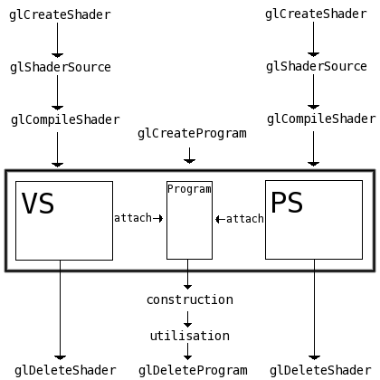

Ici, trois notions qui vous sont encore inconnues ont été introduites, il s’agit de “attach”, “construction” et “utilisation”. Nous allons sans plus tarder nous intéresser à “attach”.

Bon, nous voulons donc associer un ou plusieurs shaders à un program. Il existe pour cela une fonction très simple, *glAttachShader()* :

```
void glAttachShader(GLuint program, GLuint shader);
```

- ***program*** : il s’agit là du program qui recevra le shader.
    
- ***shader*** : c’est le shader à associer à *program*.
    

Son utilisation est tellement simple qu’on en pleurerait :’( Je vous épargne l’exemple de code pour cette fonction, je pense que ça serait inutile.

A l’inverse de *glAttachShader()*, il existe une fonction qui a l’effet contraire. Supposez que vous vouliez mettre à jour un shader, il faudra d’abord que vous le détachiez du program auquel il a été attaché via *glAttachShader()*, utilisez pour cela *glDetachShader()* :

```
void glDetachShader(GLuint program, GLuint shader);
```

Je pense qu’elle se passe de commentaire ;)

Bien, nous savons à présent comment créer un program exécutable, comment lui assigner des shaders, mais nous ne savons toujours pas comment l’utiliser. Toutefois avant de pouvoir utiliser un program, il est important de le rendre opérationnel en le liant.

## Liage d’un program de shader

Le liage (ou linking) d’un program peut se comparer à la compilation des shaders car il se décompose également en deux étapes :

- le liage en lui même;
    
- la vérification du succès de ce liage.
    

Oui mais qu’est-ce que le liage d’un program ? Et bien en fait lorsqu’on lie un program de shader on demande à OpenGL de lier le vertex shader avec le pixel shader. Cette liaison peut échouer dans la mesure où les deux shaders peuvent être incompatibles entre eux.

Nous verrons dans une autre partie de ce tutoriel en quoi consiste réellement le linking et ce qu’il apporte.

Bien, passons à présent au vif du sujet : nous voulons lier un program de shaders. Pour ce faire, il existe une simple fonction appelée *glLinkProgram()* :

```
void glLinkProgram(GLuint program);
```

- ***program*** : c’est le program que l’on souhaite lier.

Comme je l’ai dit plus haut, l’étape suivante consiste à vérifier que le liage a bien fonctionné. La méthode employée est très similaire à celle des shaders :

- on vérifie si une erreur est présente;
    
- s’il y en a une, on récupère la taille de la chaîne contenant le message d’erreur;
    
- on alloue un espace mémoire de cette taille;
    
- on indique l’adresse de cette mémoire à OpenGL pour qu’il puisse y écrire le message d’erreur.
    

Voici la fonction permettant (entre autres) de savoir si une erreur a été levée :

```
void glGetProgramiv(GLuint program, GLenum type, GLint *result);
```

Son fonctionnement est identique à glGetShaderiv pour les shaders, je vais donc passer les descriptions minutieuses. Tout ce que vous devez savoir ici, c’est la constante à passer à *type* pour obtenir ce que l’on cherche. Nous cherchons l’état du précédent liage du program, pour cela nous allons passer la constante GL\_LINK\_STATUS. La vérification de la valeur de *result* fonctionne de la même façon que pour les shaders, si elle est différente de GL_TRUE, alors une erreur a été levée.

Etape suivante, nous voulons récupérer la longueur du message d’erreur, nous allons utiliser pour cela glGetProgramiv avec comme paramètre *type* la constante GL\_INFO\_LOG_LENGTH (comme pour les shaders).

Enfin, pour récupérer le message d’erreur, nous avons à notre disposition la fonction glGetProgramInfoLog :

```
void glGetProgramInfoLog(GLuint program, GLsizei max_size, GLsizei *longueur, char *log);
```

Son fonctionnement est lui aussi identique à la fonction glGetShaderInfoLog pour les shaders.

Un exemple de code complet sera disponible à la fin du chapitre.

## Utiliser un program de shader

Ah ! Nous voici arrivés à la partie la plus intéressante :)

Résumons une fois de plus si vous le voulez bien :

- nous savons créer un shader;
    
- nous savons créer un program exécutable;
    
- nous savons attribuer à ce program des shaders à exécuter;
    
- nous ne savons pas comment rendre ce program actif :-°
    

Utiliser un program, c’est le rendre actif pour tous les prochains rendus jusqu’à ce que l’on demande explicitement l’arrêt de l’utilisation d’un quelconque program de shader, ou jusqu’à ce que l’on active un autre program de shader.

Comme toujours, je vais reprendre mon exemple sur la similitude avec les textures. Vous savez certainement comment on rend une texture active ?

```
glBindTexture(GL_TEXTURE_2D, tex_id);
```

Ce code rend la texture *tex_id* active pour tous les prochains rendus jusqu’à ce qu’un appel de glBindTexture avec un identifiant de 0 soit effectué :

```
/* desactive la precedente texture active */
glBindTexture(GL_TEXTURE_2D, 0);
```

Vous noterez que pour les textures, l’emploi de glDisable(GL\_TEXTURE\_2D) est préférable, mais pour utiliser un program de shader, aucun état OpenGL n’est à activer.

Bien, il est temps de vous présenter la fonction qui permet de rendre un program actif pour le rendu :) :

```
void glUseProgram(GLuint program);
```

- ***program*** : il s’agit là de l’identifiant du program que l’on souhaite activer, si cet identifiant est de 0, OpenGL désactivera l’utilisation des programs de shaders.

Allez, un exemple pour le fun :-° :

```
glUseProgram(program);

/* super rendus avec des effets de la mort qui tue */

/* desactive l'utilisation des shaders, OpenGL retourne en mode normal (passe par le FFP) */
glUseProgram(0);
```

Tout comme les textures, vous pouvez charger plusieurs shaders en début de programme et ensuite les utiliser simultanément, comme ceci :

```
glUseProgram(prog1);

/* rendus utilisant le program prog1 */

glUseProgram(prog2);

/* rendus utilisant le program prog2 */

glUseProgram(prog3);

/* rendus utilisant le program prog3 */

glUseProgram(0);

/* fin des rendus utilisant les shaders */
```

Attention toutefois, comme avec les textures, il est impossible d’utiliser deux programs à la fois. Ici, le second appel à glUseProgram défini prog2 comme étant actif **à la place** de prog1.

* * *

# Un exemple complet

Voilà, je crois que nous avons abordé toutes les facettes de la gestion des shaders GLSL du côté de l’API :) Bien sûr, il reste encore quelques détails, mais je vous les ferai connaître plus tard, pour l’instant ils ne feraient que vous embrouiller croyez-moi ;)

Afin que vous vous fassiez une meilleure idée de la façon dont tout ce bazar s’assemble, je vous ai préparé un programme complet chargeant un simple vertex shader qui a pour effet de transformer l’image affichée en couleurs négatives. Pour activer le shader, vous devez appuyer sur une touche du clavier.

[Télécharger l’exemple de code et le Makefile Unix](http://yno.goldzoneweb.info/sdz/ch2.zip)

J’utilise [Glew](http://glew.sourceforge.net/) pour charger les extensions d’OpenGL, vous devez le posséder si vous voulez pouvoir compiler/recompiler le code source. L’exécutable fourni utilise la glibc2.4

Que les utilisateurs de MacOS et Windows m’excusent, je n’utilise pas ces OS et par conséquent je n’ai pas pu vous mijoter quelque chose, il va falloir que vous vous débrouilliez pour compiler les sources :euh: Toutefois je vous recommande fortement de télécharger ces sources pour les étudier afin de bien comprendre comment fonctionne le chargement et l’utilisation des shaders. N’hésitez pas à relire les parties du chapitre que vous n’avez pas comprises, avec l’exemple de code sous les yeux afin de bien faire la relation entre ce que j’explique et la mise en pratique ;)

Un peu à l’instar de Kayl avec son sdlglutils, je vous propose de télécharger cet ensemble de deux fichiers qui proposent quelques fonctions bien pratiques pour charger un shader simplement sans trop se fatiguer :

[Télécharger loadprogram.zip](http://yno.goldzoneweb.info/sdz/loadprogram.zip)

Ce sont en réalité les fonctions que nous avons construites ensembles, avec quelques petits ajouts toutefois ;) Dorénavant j’utiliserai ces fonctions pour le chargement des shaders afin d’alléger les exemples de code.

Ces deux exemples de code sont distribués sous licence GPL ;)

Ouf, nous voici enfin arrivés au terme de ce long chapitre ! :)

Vous savez à présent comment utiliser les shaders dans vos programmes OpenGL, les activer, les désactiver, etc… Mais (parce qu’il y a un mais :-° ), vous ne savez pas programmer un shader.

Et d’ailleurs, ça vous dirait de savoir les programmer, ces fameux shaders ? Oui ? Pas de problème, c’est par ici :)

* * *

## Les bases du langage

Nous y voilà enfin, nous allons ici commencer à apprendre le langage GLSL qui est un langage de programmation de shaders conçu pour OpenGL.

Nous étudierons d’abord les bases du langage :

- les variables et leur types ;
    
- la surcharge des opérateurs ;
    
- le cast (très important et très employé en GLSL).
    

Nous programmerons ensuite de simples vertex et pixel shaders, afin de voir comment ils fonctionnent :) Vous verrez qu’ils utilisent tout deux des variables d’entrée et des variables de sortie, qui nous permettent de recevoir et de renvoyer des données. Les données reçues seront traitées par les instructions contenues dans le code source du shader, pour obtenir un résultat qui sera ensuite renvoyé. Ces résultats représentent généralement des informations de **position à l’écran** pour les vertex shaders, et de **couleur** pour les pixel shaders.

## Une forte ressemblance avec le C

Le langage GLSL a beaucoup de points communs avec le langage C. Syntaxiquement, les deux langages sont quasiment identiques.

## Les variables

Tout comme en C, il est possible de créer des variables en GLSL. Il existe une multitude de types de variables, chacun ayant une utilité bien précise. Par exemple, si vous souhaitez créer une variable capable de stocker des nombres flottants, faites ceci :

```
float variable;
```

Et oui, comme en C :) Notez également la présence d’un point-virgule, qui se place aux mêmes endroits qu’en C. La création de deux variables à la fois est également autorisée, avec l’ajout d’une virgule entre les deux noms de variable :

```
float a, b;
```

Les variables préfixées **gl_** sont réservées au langage lui-même, il est donc interdit de créer une variable dont le nom commence par gl_ !

Il est possible de créer des variables des types suivants :

- **int** : entier ;
    
- **float** : flottant ;
    
- **bool** : booléen, peut valoir **true** ou **false** ;
    
- **vec2** : vecteur à 2 composantes flottantes ;
    
- **vec3** : vecteur à 3 composantes flottantes ;
    
- **vec4** : vecteur à 4 composantes flottantes ;
    
- **mat2** : matrice 2 * 2 de flottants ;
    
- **mat3** : matrice 3 * 3 de flottants ;
    
- **mat4** : matrice 4 * 4 de flottants ;
    
- **ivec2** : vecteur à 2 composantes entières ;
    
- **ivec3** : vecteur à 3 composantes entières ;
    
- **ivec4** : vecteur à 4 composantes entières ;
    
- **bvec2** : vecteur à 2 composantes booléennes ;
    
- **bvec3** : vecteur à 3 composantes booléennes ;
    
- **bvec4** : vecteur à 4 composantes booléennes.
    

Soudainement, les ressemblances avec le C s’arrêtent :-° Effectivement, le GLSL possède beaucoup de types de variables… qui ne sont finalement plus des variables mais des ensembles de variables. Nous pouvons toutefois les comparer à des structures, et nous allons voir pourquoi. Lorsque vous créez un vecteur à 3 composantes par exemple (**vec3**), GLSL vous permet d’accéder à une seule de ses composante de cette façon :

```
vec3 direction;
direction.x = 0.2;
```

La seconde instruction place la valeur 0.2 dans la composante X du vecteur *direction* grâce à l’opérateur d’affectation =, qui fonctionne de la même façon qu’en C… ou presque.

## Les opérateurs

Il est bien sûr possible de multiplier une variable par une autre, ou bien encore de soustraire une valeur à une variable. Les opérateurs en GLSL s’utilisent comme en C, voici un exemple :

```
float var1 = 0.2, var2 = 3.0;
float resultat = (var1 - 0.1) * var2;
```

Ici, *resultat* vaudra (0.2 - 0.1) * 3.0 soit 0.3.

Et si je vous apprenais qu’on peut multiplier un vecteur par un vecteur, vous me répondriez quoi ?

### La surcharge des opérateurs

Premier point commun avec le langage C++ : les opérateurs en GLSL sont surchargés.

Euh, et ça veut dire quoi ?

Je ne vais pas vous faire une description avancée de ce qu’est la surcharge des opérateurs, mais pour vous expliquer en deux mots, ça veut dire qu’on peut additionner, soustraire, multiplier et diviser tous les types de variable par tous les types de variable !

J’y comprend rien o_O

Vous connaissez probablement la multiplication matricielle ? Et bien effectuer ce genre de multiplication en GLSL est un jeu d’enfant :

```
mat4 a = ..., b = ...;
mat4 resultat = a * b;
```

*resultat* vaut maintenant le résultat de la multiplication matricielle de *a* par *b*. Et ça marche aussi pour les vecteurs ! :) :

```
vec4 position = ...;
mat4 m = ...;
 
vec4 resultat = m * position;
```

*resultat* vaut à présent la position que représente le vecteur *position* transformé par la matrice *m*.

Notez qu’ici l’ordre de la multiplication est important ! C’est d’abord la matrice, puis le vecteur. Si cela vous semble flou, n’hésitez pas à aller lire [le tutoriel de Kayl sur les matrices](http://www.siteduzero.com/tuto-3-23978-1-les-matrices.html).

Allez, encore un exemple :

```
vec3 vecteur = ...;
vecteur *= 2.0;
```

La seconde ligne de ce code a pour effet de multiplier chaque composante du vecteur *vecteur* par 2.

### Les limites de la surcharge

Hé oui malheureusement cette surcharge a des limites, on ne peut pas réellement tout faire comme je l’ai dit avant, il existe des exceptions. Ces exceptions sont toutefois logiques et n’ont rien de mystérieux comme nous allons le voir. Par exemple, il est impossible de multiplier une matrice 3\*3 par une matrice 4\*4, si vous vous y risquez, OpenGL lèvera une erreur lors de la compilation de votre shader. Autre cas typique : les vecteurs, il est impossible d’effectuer une quelconque opération entre deux vecteurs de type différents. Enfin, il est également impossible de multiplier un vecteur à 2 composantes (**vec2**) par une matrice autre qu’une 2*2 (**mat2**), et il en va de même pour tous les autres types, **vec3** avec **mat3** et **vec4** avec **mat4**.

Maintenant que je vous ai exposé pleins d’inconvénients dûs à la surcharge, je vais vous proposer des une solution :)

## Le cast

Tout comme en C, il est possible de forcer la conversion d’un type vers un autre. Ici, la syntaxe est différente que celle du C où l’on fait comme ceci :

```
float flottant = (float)entier;
```

En GLSL, le cast d’une variable se fait ainsi :

```
float flottant = float(entier);
```

La conversion explicite de int vers float ou de float vers int n’est pas obligatoire, en revanche, si vous souhaitez convertir un **vec3** en **vec2**, là il va falloir le demander explicitement.

Comment on peut convertir un vecteur à trois dimensions en un vecteur à deux dimensions ?

Je ne vais rien vous cacher, et une conversion de ce type amène forcément à une perte de donnée(s), nous allons uniquement conserver dans le vecteur à 2 dimensions deux composantes du vecteur à 3 dimensions. Mais avec le cast, c’est vous qui allez choisir quelles données vous souhaiterez supprimer et quelles données vous souhaiterez garder. (par donnée je sous-entend *composante* d’un vecteur)

Étant donné qu’il existe un trop grand nombre de conversions possible (chaque type peut être converti en chaque type), je ne vais pas vous faire une démonstration pour chacune d’entre elles, je vais juste vous fournir la technique à utiliser, elle est logique et fonctionne de la même façon (ou presque) pour tous les types de conversion.

Nous allons prendre l’exemple de la conversion d’un **vec3** vers un **vec2**, puis nous prendrons ensuite l’exemple inverse, à savoir **vec2** -\> **vec3**.

Pour convertir un vec3 en vec2, une méthode simple existe :

```
vec3 v = ...;
 
vec2 v2 = vec2(v);
```

Ce code est simple et pourrait se traduire de la façon suivante :

```
vec3 v = ...;
vec2 v2;
 
v2.x = v.x;
v2.y = v.y;
```

En réalité, le cast du premier code prend les *n* premières composantes de la variable à caster et les places dans la variable finale, où *n* représente le nombre maximal de variables stockables dans le type de la variable finale, dans notre exemple, *n* vaut 2.

Vous pouvez également prendre d’autres composantes de *v* pour les placer dans *v2* sans avoir à spécifier manuellement les composantes de *v* qui recevrons la valeur. L’instruction suivante place les composantes de *v* demandées et les places respectivement dans *v2.x* et *v2.y* :

```
vec2 v2 = vec2(v.z, v.x);
```

Voyons à présent comment convertir un **vec2** en **vec3**, nous verrons cette voici qu’à l’inverse d’une conversion **vec3** -\> **vec2**, il y a un manque de données. À priori, on pourrait se dire qu’une conversion comme ceci est correct :

```
vec2 v2 = ...;
vec3 v3 = vec3(v2);
```

Mais…

```
impossible de compiler le shader 'test.vert' :
(5) : error C1033: cast not allowed
(5) : error C1056: invalid initialization
```

En effet, c’est une instruction non valide, refusée par OpenGL à la compilation du shader.

Ce que vous avez sous les yeux est le résultat d’une compilation d’un shader ayant échouée, c’est le message d’erreur que nous a retourné OpenGL. La première phrase est de moi, je l’ai placée dans le code source C du programme. Les deux autres lignes contiennent un message mais avant cela, entre parenthèses, la ligne de code de notre shader qui a été refusée (5). C’est très important, retenez cela ;)

Afin de pouvoir effectuer un cast sans encombre, il va falloir donner à notre shader ce qu’il attend : la composante manquante. (en l’occurrence il s’agit de la composante z) Il nous faut donc la spécifier explicitement, comme dans l’exemple qui suit :

```
vec2 v2 = ...;
vec3 v3 = vec3(v2, 0.0);
```

Ce code est équivalent à :

```
vec2 v2 = ...;
vec3 v3;
 
v3.x = v2.x;
v3.y = v2.y;
v3.z = 0.0;
```

Si vous le souhaitez, vous pouvez aussi faire ceci :

```
vec2 v2 = ...;
vec3 v3 = vec3(0.0, v2);
```

Mais ce code n’aura pas le même effet que le précédent, voici ce que l’on obtient en l’appelant :

```
vec2 v2 = ...;
vec3 v3;
 
v3.x = 0.0;
v3.y = v2.x;
v3.z = v2.y;
```

### Initialiser le contenu d’un vecteur

Maintenant que vous savez comment fonctionne l’opérateur de cast, vous devriez comprendre facilement ce que fait ce bout de code :

```
vec3 v = vec3(0.0, 1.0, 0.5);
```

Allez cherchez un peu :-°

…

Alors vous trouvez ? :D

…

Bon, je sens que vous avez fait bouillonner votre cerveau, c’est l’heure de votre récompense :

```
vec3 v;
 
v.x = 0.0;
v.y = 1.0;
v.z = 0.5;
```

Et voilà l’travail :)

Il est également possible d’initialiser toutes les composantes d’un vecteur d’un seul coup :

```
vec3 v = vec3(0.0);
```

Ce code place toutes les composantes du vecteur *v* à 0.

### Et les matrices… ?

Vous savez quoi ? On peut mettre des vecteurs dans des matrices :D Si si je vous assure :) Ainsi, ce code est tout à fait correct :

```
vec4 a, b, c, d;
 
a = vec4(1.0, 0.0, 0.0, 0.0);
b = vec4(0.0, 1.0, 0.0, 0.0);
c = vec4(0.0, 0.0, 1.0, 0.0);
d = vec4(0.0, 0.0, 0.0, 1.0);
 
mat4 m = mat4(a, b, c, d);
```

Ce code a pour effet de charger dans *m* la matrice d’identité. Bien évidemment, il est inutilement lourd à cause de la création de 4 vecteurs, il n’est là qu’à titre indicatif ;)

Il est important de noter ici que chaque vecteur représente une ligne de la matrice, c’est-à-dire que le premier vecteur ira se loger de *m*1,1 à *m*1,4

Tout comme pour les vecteurs, il est possible d’initialiser une matrice ainsi :

```
mat3 m = mat3(1.0);
```

Toutefois il y a une différence ici avec les vecteurs. L’initialisation d’une matrice comme nous l’avons fait place toutes les composantes de **la diagonale** de la matrice à 1, et toutes les autres à 0. Avec 1, la matrice chargée est celle d’identité, avec une autre valeur, la matrice est une matrice de mise à l’échelle de la valeur envoyée.

## Les commentaires

Tout comme en C, il est possible d’intégrer des commentaires en GLSL. Ils ont la même forme ainsi que le même comportement :

```
/* commentaire sur
   plusieurs lignes */
```

Le GLSL accepte également les commentaires commençant par // comme en C99 :

```
// ceci est un commentaire sur une seule ligne
```

## Les tableaux

Encore une similitude avec le C : les tableaux. Ils se définissent et s’utilisent comme en C. Il est interdit de fournir une variable comme taille de tableau lors de sa déclaration, seules les constantes sont acceptées :

```
float tab[3] = {0.0, 0.5, 1.0};
```

En revanche l’accès aux valeurs contenues dans un tableau est des plus simples, cette fois-ci les variables sont bien sûr acceptées :

```
int case = 2;
float val = tab[case]; // val = 1
```

Les tableaux en GLSL commencent également à 0 : tab\[0\]

Vous souvenez-vous de la manière dont on accède à une composante d’un vecteur ? Nous faisions comme ceci :

```
vec2 v = vec2(1.0, 0.0);
float vx = v.x;
```

Et bien sachez qu’il est possible de considérer un vecteur comme un tableau ! Ainsi, ce code est strictement identique :

```
vec2 v = vec2(1.0, 0.0);
float vx = v[0];
```

Notez que l’on préfèrera la première méthode car elle est beaucoup plus légère et beaucoup plus lisible ;) .

Et pour les matrices ? Il existe aussi un tour de passe-passe ?

### Les tableaux à deux dimensions

Rien qu’à la vue de ce titre, j’imagine que vous prévoyez déjà ce que je vais vous dire :D Allons-y franchement : les matrices sont des tableaux à deux dimensions !

Si vous connaîssez les tableaux à deux dimensions en C, alors vous ne devriez pas avoir de problèmes. Allez, un exemple de code vaudra sûrement mieux qu’un long discours :

```
mat4 m = mat4(
    1.0, 0.0, 0.0, 0.0,
    0.0, 1.0, 0.0, 0.0,
    0.0, 5.0, 1.0, 0.0,
    0.0, 0.0, 0.0, 1.0);
 
float var = m[2][1];
 
// ici, var = 5.0
```

Dans *m\[i\]\[j\]* on a :

- ***i*** : la ligne (position en hauteur)
    
- ***j*** : la colonne (position en largeur)
    

Et voilà, rien de très compliqué, encore faut-il le savoir ;) .

Et comment on crée un tableau à deux dimensions ?

Comme en C :

```
float tab[3][3] =
{
    {0.0, 0.0, 0.0},
    {0.0, 0.0, 2.0},
    {0.0, 0.0, 0.0}
};
 
float var = tab[1][2];
 
// var = 2.0
```

Notez qu’il est impératif de définir la taille d’un tableau lors de sa déclaration en GLSL, contrairement au langage C qui est capable de déduire tout seul de la taille d’un tableau rien que par son contenu. Cette règle s’applique aussi bien aux tableaux 1D que 2D.

* * *

# Un vertex shader

Maintenant que vous avez acquis les bases du langage, ça vous dirait de programmer votre premier vertex shader ? Oui ? Pas de problème, allons-y :p

## Un vertex shader : ça fait quoi ?

Un shader est donc un code source qui, une fois compilé, est exécutable par la carte graphique. Quand vous écrivez ce code source en OpenGL :

```
glBegin(GL_TRIANGLES);
    glColor3f(1.0, 0.0, 0.0); glVertex2f(0.9, -0.9);
    glColor3f(0.0, 1.0, 0.0); glVertex2f(-0.9, -0.9);
    glColor3f(0.0, 0.0, 1.0); glVertex2f(0.0, 0.9);
glEnd();
```

vous envoyez exactement 3 sommets (ou vertices, nom au choix) à la carte graphique. Avant d’être affichés à l’écran ils sont tout d’abord traités; ils subissent de nombreuses transformations, puis les données sont interpolées afin de donner naissance à un triangle plein.

Et qu’est-ce qu’il fait le vertex shader là dedans ?

Le vertex shader effectue entre autres la première opération : il fait subir des transformations (matricielles) aux sommets. Il vous permet en fait de toucher à toutes les composantes (coordonnées de texture, normale, couleur, etc…) d’un sommet et de les modifier à votre guise :) Nous allons voir qu’il y a des règles pour le codage d’un vertex shader, mais passé celles-ci vous êtes libres de faire tout ce dont vous avez envie.

Avec l’exemple ci-dessus, le vertex shader sera invoqué exactement 3 fois, ce qui est très peu. Le nombre d’appel au vertex shader dépend donc du nombre de sommet que comporte votre scène, plus elle en comporte, et plus il y aura d’appels au vertex shader, et donc plus le traitement sera lourd et consommateur de ressources.

**Il est important de savoir :** qu’un vertex shader activé sera actif sur tous les futurs sommets qui seront envoyés à la carte graphique, jusqu’à ce que les shaders de sommet soient désactivés. Quand vous activez un vertex shader, il vient remplacer une partie du FFP, donc tous les sommets envoyés après l’activation du shader seront traités par le vertex shader que vous avez activé.

Ça a l’air d’être un vrai chantier…

C’est une réflexion normale :-° Vous vous apercevrez vite que ça n’a rien de sorcier et que le langage a été bien pensé, ce n’est pas si difficile que ça en a l’air rassurez-vous, et puis, je suis là pour vous guider :D

## Quelques règles de programmation

Tout comme en C, la programmation d’un shader ne se fait pas à “l’arrache”, il y a des règles à respecter.

### La fonction main

En GLSL une fonction principale appelée *main()* est nécessaire. Cette dernière se différencie des habituelles formes du *main()* du langage C par sa valeur de retour et ses arguments : la fonction main en GLSL ne renvoie rien et ne prend aucun paramètre.

Nous l’invoquerons comme ceci :

```
void main(void)

{

    // notre code ici

}
```

Comme en C, la fonction main représente la première fonction qui sera exécutée.

Contrairement au C, les codes sources GLSL ne réclament pas de retour chariot en fin de fichier.

C’est quoi un retour chariot ?

C’est un retour à la ligne (entrée) tout à la fin du fichier.

Enfin, une dernière chose à retenir : un vertex shader doit **toujours** placer une valeur dans la variable de sortie gl_Position.

Hein ? C’est quoi ce truc ?

## Les variables d’entrée/sortie

Il est ici important de se rappeler ce qu’est en gros un vertex shader : son objectif est d’agir sur le traitement de chaque vertex qu’on lui enverra. Nous allons à présent voir quel est le rôle précis d’un vertex shader, et ce qu’il permet de faire.

### Les variables d’entrée

Les variables d’entrée sont généralement destinées à être lues puis traitées. Lorsque vous programmerez un vertex shader (et uniquement un vertex shader), OpenGL aura créé pour vous quelques variables utiles, dont voici justement la liste :

| Nom de la variable GLSL | Type | Fonction OpenGL appropriée | Description |
| --- | --- | --- | --- |
| gl_Vertex | **vec4** | *glVertex*()* | Position du sommet |
| gl_Color | **vec4** | *glColor*()* | Couleur du sommet |
| gl_Normal | **vec3** | *glNormal*()* | Normale du sommet. |
| gl_MultiTexCoord*n* | **vec4** | *glMultiTexCoord*()\* ou *glTexCoord*()* | Coordonnées de l’unité de texture *n* |
| gl_SecondaryColor | **vec4** | *glSecondaryColor*()* | Couleur secondaire du sommet |
| gl_FogCoord | **float** | *glFogCoord*()* | Coordonnées de brouillard |

J’espère qu’à la vue de cette liste vous y voyez déjà plus clair sur la tâche que remplie un vertex shader. Mais je pense que vous y verrez d’autant plus clair lorsque vous aurez vu la liste des variables de sortie ;)

### Les variables de sortie

Après avoir traité les variables d’entrées à notre guise, nous pourrons écrire dans les variables de sortie. Les variables de sortie d’un vertex shader (uniquement) représentent la position finale du sommet (position écran, ou presque) sa couleur finale, etc… Voici la liste des variables de sortie disponibles :

| Nom de la variable GLSL | Type | Description |
| --- | --- | --- |
| gl_Position | **vec4** | Position en coordonnées écran du sommet |
| gl_FrontColor | **vec4** | Couleur du côté “avant” de la face à laquelle<br>est rattaché le sommet |
| gl_BackColor | **vec4** | Couleur du côté “arrière” de la face à laquelle<br>est rattaché le sommet |
| gl_FrontSecondaryColor | **vec4** | Couleur secondaire du côté “avant” de la face<br>à laquelle est rattaché le sommet |
| gl_BackSecondaryColor | **vec4** | Couleur secondaire du côté “arrière” de la face<br>à laquelle est rattaché le sommet |
| gl_TexCoord\[n\] | tableau de **vec4** | Coordonnées de l’unité de texture *n* |
| gl_FogFragCoord | **float** | Coordonnée de fog |
| gl_PointSize | **float** | Taille du point du sommet |
| gl_ClipVertex | **vec4** | Vecteur utilisé pour les plans de clipping |

On y voit tout de suite plus clair n’est-ce pas ? :D Vous pouvez déjà vous faire une petite idée de la fonction d’un vertex shader à la vue de ces deux tableaux.

Vous vous souvenez de la règle de base pour un vertex shader ? C’est que la variable gl_Positiondoit être affectée à une valeur à la fin du vertex shader, sinon le vertex shader est invalide. Nous pouvons donc construire un vertex shader de base, tout simple, comme ceci :

```
void main(void)

{

    gl_Position = gl_Vertex;

}
```

Ce vertex shader est tout à fait correct, mais sa fonctionnalité laisse à désirer :-° Je vous propose tout de même de l’étudier, afin de mettre les choses au clair pour la gestion des vertex shaders.

Si vous appliquez ce vertex shader à vos rendus, les données envoyées à la fonction *glVertex*()\* seront les coordonnées **écran** de vos sommets, même si vous utilisez une transformation quelconque (*glTranslate*()\* et compagnie) **elle ne sera pas appliquée au sommet** ! Idem pour la matrice de projection, elle n’affectera pas la position que vous aurez envoyé à la fonction *glVertex*()*.

C’est un peu débile non ?

Non ! C’est ce qui fait la flexibilité des shaders, c’est vous qui décidez exactement comment vos sommets seront rendus, vous êtes le maître absolu de votre machine :)

Et alors comment on fait pour que notre vertex soit au bon endroit en subissant les transformations de nos matrices modelview et de projection ?

## Les matrices, quelques variables d’entrée supplémentaires

Si vous avez à peu près compris ce que sont les variables d’entrée, vous devriez sauter au plafond à la vue de ce titre :D

Ah bon ? Moi ça ne fait que m’embrouiller encore plus… Qu’est-ce qu’elles peuvent nous faire ces matrices ?

Chers Zér0s, vous devriez savoir comment fonctionne le rendu d’un sommet et quelles sont les transformations qui lui sont appliquées, sinon c’est que vous n’êtes pas totalement prêts à lire ce tutoriel. Bien sûr je pourrais vous faire gober des principes tout cuits, mais ça ne serait pas très pédagogique en plus du fait que vous risqueriez d’être un peu bloqué par la suite. Sur ce, je vous renvoie sur [cet excellent lien](http://jeux.developpez.com/faq/3d/?page=definitions#DEFINITIONS_3d_to_2d) qui vous expliquera comment on passe des coordonnées 3D aux coordonnées écran.

### Vous avez dit “variable d’entrée” ?

Parfaitement :) Ces variables ne sont rien d’autre que des matrices, et ô combien utiles. Je vous propose de voir sans plus tarder la listes des matrices disponibles au sein d’un vertex shader uniquement :

| Nom de la variable | Type | Description |
| --- | --- | --- |
| gl_ModelViewMatrix | **mat4** | C’est la matrice de modélisation/visualisation,<br>celle que l’on manipule avec GL_MODELVIEW en C |
| gl_ModelViewMatrixInverse | **mat4** | C’est l’inverse de la matrice gl_ModelViewMatrix |
| gl_ModelViewMatrixTranspose | **mat4** | C’est la transposée de la matrice gl_ModelViewMatrix |
| gl_ModelViewMatrixInverseTranspose | **mat4** | C’est la transposée de la matrice gl_ModelViewMatrixInverse |
| \-\-\- | \-\-\- | \-\-\- |
| gl_ProjectionMatrix | **mat4** | C’est la matrice de projection GL_PROJECTION, maniable<br>entre autres avec gluPerspective() dans le code C |
| gl_ProjectionMatrixInverse | **mat4** | C’est l’inverse de la matrice gl_ProjectionMatrix |
| gl_ProjectionMatrixTranspose | **mat4** | C’est la transposée de la matrice gl_ProjectionMatrix |
| gl_ProjectionMatrixInverseTranspose | **mat4** | C’est la transposée de la matrice gl_ProjectionMatrixInverse |
| \-\-\- | \-\-\- | \-\-\- |
| gl_ModelViewProjectionMatrix | **mat4** | C’est la matrice gl_ModelViewMatrix multipliée<br>par la matrice gl_ProjectionMatrix |
| gl_ModelViewProjectionMatrixInverse | **mat4** | C’est l’inverse de la matrice gl_ModelViewProjectionMatrix |
| gl_ModelViewProjectionMatrixTranspose | **mat4** | C’est la transposée de la matrice gl_ModelViewProjectionMatrix |
| gl_ModelViewProjectionMatrixInverseTranspose | **mat4** | C’est la transposée de la matrice gl_ModelViewProjectionMatrixInverse |
| \-\-\- | \-\-\- | \-\-\- |
| gl_TextureMatrix\[n\] | tableau de **mat4** | C’est la matrice de l’unité de texturage *n*,<br>maniable en C avec GL_TEXTURE |
| gl_TextureMatrixInverse\[n\] | tableau de **mat4** | C’est l’inverse de la matrice gl_TextureMatrix\[n\] |
| gl_TextureMatrixTranspose\[n\] | tableau de **mat4** | C’est la transposée de la matrice gl_TextureMatrix\[n\] |
| gl_TextureMatrixInverseTranspose\[n\] | tableau de **mat4** | C’est la transposée de la matrice gl_TextureMatrixInverse\[n\] |
| \-\-\- | \-\-\- | \-\-\- |
| gl_NormalMatrix | **mat3** | C’est la transposée inverse de la partie 3*3 de la matrice gl_ModelViewMatrix<br>(matrice généralement appliquée à la variable gl_Normal<br>pour les transformations de normales) |

Pffiouuu, ça fait du monde hein ? :D Allez, que diriez-vous d’un petit…

### Exercice

Fini d’rire ! :diable:

Bien, voici le vertex shader que nous avons précédemment écrit :

```
void main(void)

{

    gl_Position = gl_Vertex;

}
```

J’aimerai que vous le modifiez afin que la position finale du sommet (gl_Position) soit affectée par la matrice de modélisation **et** la matrice de projection, comme ça notre sommet aura la bonne position à l’écran si par exemple nous avons configuré une projection 3D :) Un indice ? Rappelez-vous la première partie du tutoriel, à l’endroit où je parle des opérateurs, et plus précisément de leur surcharge ;)

Allez-y !

…

### Correction

Voici la réponse :

```
void main(void)

{

    gl_Position = gl_ModelViewProjectionMatrix * gl_Vertex;

}
```

Allez, avouez que c’était pas trop difficile :-°

Voilà, vous savez à présent théoriquement comment faire un vertex shader, évidemment celui-ci est extrêmement simple et n’a que peu d’intérêt, mais vous pouvez déjà essayer de vous amuser à modifier les variables de sortie pour voir le résultat que cela donnera et aussi pour vous familiariser avec le langage GLSL ;)

* * *

## Un pixel shader

Nous avons vu en gros quel était la tâche d’un vertex shader, son rôle au sein du rendu 3D. Que diriez-vous de savoir ce que fait un pixel shader à présent ? Vous vous demandez probablement à quoi ils peuvent bien servir, mais croyez-moi : ils servent énormément ;)

## Traiter le rendu d’un pixel ?

Un pixel shader agit au niveau du rendu du pixel à l’écran. C’est petit, très petit, et pourtant chaque pixel est traité indépendamment et nécessite des calculs, parfois nombreux, pour obtenir sa couleur exacte à l’écran.

Le code source d’un pixel shader peut être plus ou moins gros, mais une chose est sûre : plus il est conséquent et demande beaucoup de calculs et plus les performances chutent vite. Effectivement, alors que les vertex shaders agissent au niveau de chaque sommet, si vous n’affichez qu’un triangle, le code de votre vertex shader ne sera exécuté qu’une seule fois. Les pixel shaders quant à eux sont exécutés autant de fois qu’il y a de pixels dans ce triangle à l’écran ! Si votre triangle rempli tout l’écran et que votre fenêtre de rendu fait 1024\*768 pixels, alors votre pixel shader sera appelé 1024 \* 768 = 786432 fois ! C’est beaucoup, très beaucoup ! :D

### Une limite en puissance assez restreinte ?

Et pourtant non ! Il est aujourd’hui possible de programmer des pixels shaders très complexes sur des résolutions d’écran de 1600*1024 sans que le frame rate en soit très affecté. Prenez un exemple simple : les jeux vidéo. Les jeux vidéo récents utilisent énormément les shaders, vertex et pixel. Les joueurs s’achètent des écrans toujours plus larges et arrivent tout de même à jouer à des jeux gourmands tels que F.E.A.R ou SplinterCell DA en haute résolution et sans lags (saccades).

### Pourquoi ?

Pourquoi, avec des résolutions énormes, des shaders complexes et des scènes rendues en plusieurs passes les jeux ne mettent pas à genoux les PC modernes ? (bien que certains se plaignent de jouer à 40 FPS :-° ) Comment est-il possible de traiter plusieurs millions, et parfois même milliard(s), d’appels à un pixel shader par seconde ? La réponse est relativement simple : les pixels shaders sont des shaders, et par conséquent ils sont traités par la **carte graphique**.

Ouah je suis super impressionné… En plus je le savais déjà.

Croyez-moi, il y a de quoi être impressionné, si vous demandiez à votre processeur de modifier une image pixel par pixel (vous comprendrez mieux cela lorsque nous parlerons des textures, plus loin dans le tutoriel), cela prendrait un temps énorme. Un exemple simple : les logiciels de dessin 2D (The GIMP, Photoshop, …) sont très lourds et parfois aussi très lents à rendre un effet sur vos images, essayez pour voir de regarder quelle est la consommation CPU rien que quand vous dessinez un trait avec un effet de flou ;)

Les cartes graphiques sont **conçues pour** traiter des pixels, enfin tout du moins les cartes graphiques un minimum récentes. Si vous avez une GeForce 6 ou supérieur, ou une Radeon 9800pro ou supérieur, vous pouvez êtres sûrs que les shaders de sommet tout comme de pixel sont parfaitement supportés ;)

## Bon, qu’est-ce qu’on attend pour programmer ça ?

Que vous soyez psychologiquement prêts :D

### Le code source de base

Tout comme le vertex shader, le pixel shader requiert une fonction main. En revanche contrairement aux vertex shaders, les pixel shaders GLSL n’exigent aucun code source de base au sein de la fonction main, ce qui veut dire qu’un pixel shader écrit comme suit :

```
void main(void)

{

    // rien

}
```

est tout à fait acceptable et compilera sans broncher. Par contre, son effet est plus que maigre : il ne fait **rien**. Et ici, rien signifie rien de rien, autrement dit, rien ne s’affichera à l’écran.

Avant de pouvoir faire afficher quelque chose à notre pixel shader, il est important de connaître ses variables d’entrée ainsi que celles de sortie, car il en possède, tout comme les vertex shaders.

### Les variables d’entrée

Comme pour les variables d’entrée de nos vertex shaders, un joli tableau fera l’affaire. Il n’est bien sûr pas important que vous le reteniez par coeur pour l’instant, mais au moins, le jour où vous voudrez une info, vous n’aurez qu’à venir ici ;) :

| Nom de la variable GLSL | Type | Description |
| --- | --- | --- |
| gl_Color | **vec4** | Couleur du pixel |
| gl_FragCoord | **vec2** | Coordonnées écran du pixel |
| gl_SecondaryColor | **bool** | Couleur secondaire |
| gl_TexCoord\[n\] | tableau de **vec4** | Coordonnées de l’unité de texturage *n* |
| gl_FogFragCoord | **float** | Coordonnée de fog |

Comme vous le voyez, certaines variables correspondent à des variables de sortie du vertex shader. Cela prouve bien que les vertex et les pixel shaders GLSL sont très liés entre eux.

Nous avons maintenant une couleur récupérable dans la variable gl\_Color, chouette, on va pouvoir attribuer une couleur à notre pixel. Mais… il nous manque quelque chose… Comment dire à GLSL qu’on souhaite voir notre pixel avec la couleur contenue dans gl\_Color ? Hé bien l’expérience des vertex shaders devrait vous le dire, il nous faut une variable de sortie à laquelle attribuer cette couleur :) .

### Les variables de sortie

C’est bon, c’est fini les gros tableaux de la mort ?

Et non, pourtant avec un simple pixel shader on peut se demander ce qu’il peut bien faire à part affecter la couleur finale du pixel. Pourtant, il existe deux autres variables de sortie que celle qui permet de renvoyer la couleur du pixel :

| Nom de la variable | Type | Description |
| --- | --- | --- |
| gl_FragColor | **vec4** | Couleur finale du pixel |
| gl_FragDepth | **float** | Profondeur du pixel dans le depth buffer |
| gl_FragData\[n\] | tableau de **vec4** | En rapport avec *glDrawBuffers()* |

Il n’existe malheureusement encore aucune variable permettant de modifier la position finale du pixel à l’écran.

L’intérêt général des pixel shaders est plutôt mince non ?

Pas du tout ! Bon évidemment pour l’instant il est normal que vous soyez sceptiques, mais vous découvrirez au fur et à mesure l’utilité des pixel shaders, et à la fin vous verrez ; on ne s’en passe plus ;)

### Programmer un simple pixel shader

Vous vous souvenez de la façon dont on s’y prend, dans les vertex shaders, pour affecter la variable de sortie gl_Position afin que notre vertex soit positionné au bon endroit ? Et bien le principe est le même dans les pixel shaders lorsqu’on veut affecter la couleur du pixel sortant par la couleur d’entrée de base. Contrairement au vertex shader où il faut appliquer des transformations matricielle pour obtenir la position finale, ici rien de particulier n’est à faire, il suffit de transmettre directement la couleur, comme ceci :

```
void main(void)

{

    gl_FragColor = gl_Color; // c'est aussi simple que cela

}
```

Ce pixel shader n’est pas très évolué et n’a pour effet que d’affecter à la couleur finale du pixel la couleur interpolée des trois sommets formant le triangle auquel appartient ce pixel. (phrase compliquée je vous l’accorde :-° ) Il n’y a aucun traitement des textures ou autres attributs du vertex, seules les données de couleur (*glColor*()*) sont traitées.

**Attention** : Comme je l’ai déjà dit, le vertex shader est très lié au pixel shader, ainsi donc, si vous n’affectez pas la variable de sortie gl\_FrontColor de votre vertex shader, la variable d’entrée gl\_Color du pixel shader ne contiendra aucune valeur ! La valeur par défaut des variables est 0 généralement, vous aurez donc un écran noir si vous ne faites pas un vertex shader conçu comme ceci :

```
void main(void)

{

    gl_FrontColor = gl_Color;

    gl_Position = gl_ModelViewProjectionMatrix * gl_Vertex;

}
```

Et voilà, c’est déjà enfin la fin de ce chapitre, peut-être un peu rebutant, mais très important ;) .

Maintenant la compréhension de la suite du tutoriel vous sera plus aisée, et nous pourrons donc avancer plus vite dans l’apprentissage du langage, et c’est tant mieux, parce que le GLSL c’est bien joli, mais notre but de base c’est d’apprendre des techniques de rendu pour réaliser de chouettes effets graphiques :)

*Les tableaux énumératifs de variables de ce chapitre sont inspirés du livre [OpenGL 2.0 Guide Officiel](http://www.amazon.fr/Open-GL-2-0-Guide-officiel/dp/2744020869), mais certains sont également disponibles dans les [spécifications du langage](http://www.opengl.org/registry/doc/GLSLangSpec.Full.1.20.8.pdf).*

* * *

# Notions supplémentaires

Au terme de ce chapitre, vous serez fin prêts pour apprendre toutes les fonctionnalités avancées que propose le GLSL, et cela vous permettra de trouver une réelle utilité aux shaders.

Nous allons tout d’abord passer en revue toutes les notions du langage GLSL qui sont communes à celles du C, puis dans un second temps je vais vous montrer les quelques différences entre les deux langages, afin de mettre les choses au clair. Ensuite, nous apprendrons à créer des fonctions, mais surtout à les surcharger. Vous ne connaissez peut-être pas la notion de surcharge des fonctions, il est donc important que vous l’appreniez, vous verrez que cela ressemble à la surcharge des opérateurs. Puis je finirai par vous présenter quelques fonctions natives du langage GLSL bien pratiques, qui sont très souvent utilisées.

## Notions communes et incompatibilités avec le C

Bien, commençons. Je voudrais tout d’abord vous présenter tout ce qui existe dans le langage GLSL qui se rapporte au C, afin de gagner du temps.

Le GLSL n’est pas un langage aussi rigoureux que le C, je le considérerais plutôt comme un langage “jouet”, il suffit d’enchaîner quelques instructions dans un `main()` et le tour est joué. À partir du moment où votre shader fonctionne correctement, il y a peu de chances que vous ayez à le réviser pour une raison autre que sa performance.

## Notions communes

Je vous propose de commencer par les instructions de contrôle.

### Les instructions if…else

En C, il est possible de créer une condition de la façon suivante :

```
if(condition)
{
    instructions;
}
else
{
    autres instructions;
}
```

Eh bien sachez que ce code fonctionne aussi en GLSL. Par exemple, ceci est tout à fait correct :

```
int a, b;
 
...
 
if(a == b)
{
    instructions;
}
else
{
    autres instructions;
}
```

L’omission des accolades est également autorisée si les instructions se résument à une seule instruction :

```
int a, b;
 
...
 
if(a == b)
    instruction;
else
    autre instruction;
```

Les opérateurs de comparaison sont les mêmes qu’en C.

### Instructions break et continue

Idem qu’en C là encore, les instructions **break** et **continue** existent et ont le même effet qu’en langage C ; à savoir :

- **break** : sortir de la boucle d’instructions courante ;
    
- **continue** : poursuivre le déroulement de la boucle d’instructions à partir du “haut” du bloc.
    

### La boucle do…while

Comme en C, le mot clé **do** est suivi d’un bloc d’instructions, puis d’une condition entre parenthèses après un **while**, comme dans l’exemple ci-dessous :

```
do
{
    instructions;
}
while(condition);
```

Ce code veut dire :

```
exécuter
{
    tout ceci
}
tant que (condition) est vraie
```

Ne pas oublier le point-virgule à la fin du while. Les accolades peuvent là aussi êtres omisent si il n’y a qu’une seule instruction dans le bloc.

### La boucle while

S’utilise de la même façon qu’en C, et a le même effet, à savoir ; exécuter un bloc d’instructions en boucle tant que la condition contenue entre les parenthèses suivants le mot clé **while** est vraie, avec une vérification de celle-ci avant le premier lancement de la boucle (contrairement à do…while).

```
while(condition)
{
    instructions;
}
```

Comme d’habitude, les accolades peuvent êtres enlevées si il n’y a qu’une instruction à exécuter.

### La boucle for

Celle-ci permet, comme en C, d’intégrer facilement un compteur à une boucle. Voici un pseudo-code pour présenter l’instruction **for** :

```
for( instructions1 ; conditions ; instructions2 )
{
    autres instructions;
}
```

Son effet est le même qu’en C :

1.  exécuter *instructions1* ;
    
2.  tant que *conditions* est vrai, exécuter :
    
    1.  *autre instructions* ;
        
    2.  *instructions2*.
        

### Les structures

Les structures sont également possibles en GLSL. Elles se définissent bien sûr de la même façon, en utilisant le mot clé **struct** :

```
struct MaStructure
{
    int a, b;
};
```

Vous pouvez bien sûr créer toutes sortes de variables dans votre structure (des vecteurs, des matrices, etc…). Une structure se crée et s’utilise ainsi :

```
MaStructure str; // declaration
 
str.a = 0; // acces aux variables
str.b = str.a;
```

Vous noterez qu’il n’est pas nécessaire de préfixer la déclaration des variables de type structure avec le mot clé `struct`. Eh oui, le mot clé **typedef** n’existe pas en GLSL, plus besoin de vous embêter avec.

### Le préprocesseur

Il fonctionne comme en langage C : toutes les commandes de préprocesseur doivent être préfixées par « # ». Parmi ces commandes, on retrouvera entre autre le fameux **"#define"**, qui permet de définir des macros, **"#undef"** qui les “dé-défini”, mais aussi les instructions **"#if"**, **"#ifdef"**, **"#ifndef"**, **"#else"**, **"#elif"** et **"#endif"**, qui ont toutes le même effet qu’en C.

Par exemple, vous pourriez changer l’intégrité de votre shader juste avec une macro, comme ceci :

```
#ifdef SUPERSHADER
 
// code source du super shader
 
#else
 
// code source d'un shader un peu moins bien
 
#endif
```

Ainsi, si SUPERSHADER est définie, seules les instructions contenues entre **"#ifdef"** et **"#else"** seront compilées, sinon ça sera celles qui sont entre **"#else"** et **"#endif"**.

## Incompatibilités et différences

### Les déclarations de variables

Contrairement au C89 qui exige que les variables soient définies au début de votre code, le GLSL autorise quant à lui la création de variables n’importe où dans votre shader (autorisé également en C99). Avec cette liberté de création de variables, il est possible de créer une variable dans une instruction for, comme ceci par exemple :

```
for(int i = 0; i < 5; i++)
{
    ...
}
```

### Les pointeurs et l’instruction switch

Les pointeurs de même que l’instruction switch n’existent pas en GLSL.

* * *

## Créer et surcharger des fonctions

## Déclarer une simple fonction

Tout est quasiment identique au C, mais je préfère tout de même mettre les choses au clair. Comme en C, une fonction possède :

- une valeur de retour d’un certain type ;
    
- un nom ;
    
- des paramètres ;
    
- un contenu, entre accolades {}.
    

La déclaration d’une fonction se fait comme en C, on commence par mettre son type de retour, son nom, puis ses paramètres entre parenthèses. Pour finir, on ouvre une accolade puis on place le contenu de notre fonction à l’intérieur :

```
void my_func(void)
{
    // contenu
}
```

Vous voyez ici l’emploi du type **void**, qui signifie comme en C : vide. Donc notre fonction ne retourne rien et ne prend aucun paramètre. De même qu’en C, la notion de prototype existe. Déclarez vos prototypes tout en haut du code source, ainsi vous n’aurez aucun problème :

```
float my_func(void);

void main(void)
{
    ...
}

float my_func(void)
{
    ...
}
```

Notez que d’une façon générale, si votre fonction n’a pas été déclarée, vous ne pourrez pas l’utiliser. Ainsi, soit vous déclarez son prototype tout en haut de votre code et vous vous épargnez tout problème, soit vous triez vos fonctions de façon sélective afin que les dépendances soient satisfaites.

### Paramètres et valeur de retour

Nous pouvons également écrire une fonction qui prend un ou plusieurs paramètres, et renvoie une variable. Pour renvoyer une variable, vous devez mettre son type avant le nom de la fonction. Vous pouvez renvoyer n’importe quel type de variable en GLSL :

```
vec3 my_func(void)
{
    vec3 result;
    
    ... // calculs horriblement complexes

    return result; // on renvoie le resultat
}
```

Notez ici le mot clé **return**, il existe également en GLSL et a le même effet qu’en C : renvoyer une valeur de retour en terminant l’exécution de la fonction.

Pour donner un paramètre à une fonction, il suffit de rajouter son type suivi du nom de la variable qui contiendra la valeur du paramètre, entre les parenthèses qui suivent le nom de la fonction, comme ceci :

```
vec3 my_func(vec3 v)
{
    vec3 result;

    result = v * 2; // calculs horriblement complexes

    return result; // on renvoie le resultat
}
```

Comme en C, on accède à un paramètre en écrivant son nom. Ici, la super fonction que j’ai écrit relève réellement du génie : elle renvoie un vecteur qui est celui envoyé en paramètre multiplié par 2.

## La surcharge des fonctions

### Notion de surcharge

Nous avons déjà vu la surcharge des opérateurs dans le précédent chapitre. La notion de surcharge existe également pour les fonctions. Surcharger une fonction signifie, en gros, qu’on va attribuer un seul nom de fonction à plusieurs fonctions.

Par exemple, supposez que vous vouliez écrire une fonction qui renvoie le [produit scalaire](http://www.siteduzero.com/tuto-3-18391-1-les-vecteurs.html#ss_part_3) de deux vecteurs. En C, vous auriez écrit une fonction pour chaque type de vecteur : une pour les vecteurs à 2 dimensions et une autre pour les vecteurs en 3 dimensions, et elles auraient chacune un nom différent. Pas très pratique à utiliser.

Pour remédier à cela, la surcharge permet de ne créer qu’un seul nom de fonction pour deux fonctions différentes. Ainsi, vous pourrez appeler votre fonction de produit scalaire indifféremment avec des vecteurs 2D ou 3D :

```
vec2 a, b;
vec3 x, y;

float resultat1 = produitScalaire(a, b);
float resultat2 = produitScalaire(x, y);
```

Cela évite de créer 36 noms de fonctions juste parce que le nombre et/ou le type de leur(s) paramètre(s) change. Nous pouvons aussi imaginer une fonction qui pourrait travailler aussi bien sur des entiers (**int**) que sur des flottants (**float**), dans ce cas la surcharge serait également utile.

### Surcharger une fonction

Nous allons prendre l’exemple du produit scalaire, qui est un très bon exemple. Voici une fonction qui calcule le produit scalaire de deux vecteurs 3D :

```
float produitScalaire(vec3 a, vec3 b)
{
    float resultat;

    // on calcul le produit scalaire (3D)
    resultat = (a.x * b.x) + (a.y * b.y) + (a.z * b.z);

    // on retourne le resultat
    return resultat;
}
```

Notez que les parenthèses dans le calcul du produit scalaire sont facultatives dans la mesure où * a la priorité sur +, elles ne sont présentes que pour une meilleure lisibilité.

Maintenant, nous voudrions que cette fonction marche aussi pour les vecteurs à 2 dimensions. En fait, il n’y a pas de secret : il faut re-écrire la fonction en entier. Ce qu’accepte le GLSL, contrairement au C, c’est d’avoir plusieurs fonctions du même nom, qui ne se différencient que par leurs paramètres et/ou leur type respectif.

Ainsi, pour surcharger notre fonction produitScalaire(), il nous suffit de rajouter une version de notre fonction qui calculera le produit scalaire de deux vecteurs 2D, comme ceci :

```
float produitScalaire(vec2 a, vec2 b)
{
    float resultat;

    // on calcul le produit scalaire (2D)
    resultat = (a.x * b.x) + (a.y * b.y);

    // on retourne le resultat
    return resultat;
}
```

On n’oubliera pas de rajouter un prototype en haut de notre code pour chaque version de notre fonction.

```
float produitScalaire(vec3, vec3);
float produitScalaire(vec2, vec2);
```

### Exemple complet

Je vous propose un petit vertex shader tout simple pour illustrer tout ce que nous venons de voir, afin que vous sachiez comment emballer tout ça dans un joli code tout propre tout fini :

```
// prototypes de nos fonctions
float produitScalaire(vec4, vec4);
float produitScalaire(vec3, vec3);
float produitScalaire(vec2, vec2);

void main(void)
{
    // il est aussi possible d'acceder aux composantes d'un vecteur en utilisant
    // les noms r, g ou b, pour red, green et blue respectivement
    
    // calculs au hasard, pour donner un effet rigolo
    gl_FrontColor.b = produitScalaire(gl_Color, gl_Vertex);
    gl_FrontColor.g = produitScalaire(gl_Color, gl_Vertex * 2.0);

    gl_Position = gl_Vertex;
}

// version 4D
float produitScalaire(vec4 a, vec4 b)
{
    float resultat;

    // on calcul le produit scalaire (3D)
    resultat = (a.x * b.x) + (a.y * b.y) + (a.z * b.z);

    // on retourne le resultat
    return resultat;
}

// version 3D
float produitScalaire(vec3 a, vec3 b)
{
    float resultat;

    // on calcul le produit scalaire (3D)
    resultat = (a.x * b.x) + (a.y * b.y) + (a.z * b.z);

    // on retourne le resultat
    return resultat;
}

// version 2D
float produitScalaire(vec2 a, vec2 b)

{
    float resultat;

    // on calcul le produit scalaire (2D)
    resultat = (a.x * b.x) + (a.y * b.y);

    // on retourne le resultat
    return resultat;
}
```

Je vous avoue cependant que ce vertex shader ne fait rien de génial, il ne sert qu’à vous montrer l’implémentation complète d’une fonction en GLSL.

* * *

# Quelques fonctions natives du GLSL

Le langage GLSL offre par défaut de nombreuses fonctions. Parmi ces fonctions, on retrouve beaucoup de fonctions mathématiques qui permettent de calculer à peu près tout et n’importe quoi, mais on retrouve aussi des fonctions indispensables effectuant des tâches bien précises propres aux shaders.

Tout d’abord, vous devez savoir que la plupart des fonctions du GLSL sont surchargées, ce qui facilite leur utilisation, qui devient alors intuitive et un vrai jeu d’enfant. Pour faire simple, je vous préviens d’avance : toutes les fonctions que je vais vous présenter sont surchargées, donc utilisez-les à volonté et dans toutes les circonstances. De plus, l’usage des fonctions prédéfinies du GLSL est **fortement recommandé** dans la mesure où la plupart de celles-ci sont directement implantées dans les cartes graphique, ce qui vous permet de tirer parti de toute la puissance de vos cartes et ainsi gagner en performance.

## Fonctions de manipulation de vecteurs

Pour comprendre la plupart des fonctions que nous allons étudier ici, je vous recommande la lecture du [chapitre annexe sur les vecteurs](http://www.siteduzero.com/tuto-3-18391-1-les-vecteurs.html).

### Normalisation de vecteurs

Le langage GLSL offre une fonction permettant de normaliser un vecteur. Cette fonction s’appelle *normalize()*. Elle prend un paramètre (un vecteur) et renvoie ce même vecteur, mais normalisé. Voici un code pour illustrer la normalisation d’un vecteur *v* :

```
vec3 v = vec3(0.2, 0.4, 0.6);

v = normalize(v);
```

### Produit scalaire

Pour calculer le produit scalaire de deux vecteurs en GLSL, rien de plus simple : appelez la fonction *dot()*. Cette fonction prend deux paramètres. Ces paramètres sont les deux vecteurs dont on veut connaître le produit scalaire. *dot()* renvoie un flottant qui n’est autre que le résultat du produit :

```
vec3 v1 = ..., v2 = ...;
...
float res = dot(v1, v2);
```

### Produit vectoriel

Là encore, une fonction existe, il s’agit de *cross()*. Elle prend deux vecteurs en paramètres, et renvoie un vecteur qui est le résultat du produit vectoriel de ses deux paramètres :

```
vec3 v1 = ..., v2 = ...;
...
vec3 res = cross(v1, v2);
```

### Longueur d’un vecteur

Pour connaître la longueur d’un vecteur simplement, utilisez la fonction *length()* :

```
float longueur = length( vec3(2.0, 0.8, 1.6) );
```

### Distance entre deux vecteurs

Bien que cette solution soit envisageable :

```
vec3 a, b;
...
float d = length( a - b );
```

Il en existe une plus explicite : utiliser la fonction *distance()* :

```
vec3 a, b;
...
float d = distance( a, b );
```

Et voilà, ça sera tout pour les fonctions de manipulation de vecteurs :)

En ce qui concerne les additions/soustractions de vecteurs, rappelez-vous le précédent chapitre : les opérateurs en GLSL sont surchargés, par conséquent, vous n’aurez qu’à placer l’opérateur de votre choix entre deux vecteurs, ou entre un vecteur et une valeur.

```
vec3 v1 = ..., v2 = ...;

vec3 add = v1 + v2;  // add = le resultat de l'addition des vecteurs v1 et v2
vec3 mul = v1 * 2.0; // chaque composante de mul = chaque composante de v1 * 2
```

## La fonction *ftransform()*

Voici une fonction qui est souvent utilisée par les programmeurs pour… se faciliter la vie. Notez bien qu’elle n’est utilisable qu’au sein d’un vertex shader. Souvenez-vous lorsque vous avez créé votre premier vertex shader lors du précédent chapitre. Vous aviez attribué à la variable de sortie *gl_Position* le résultat de la multiplication de la position du sommet par les matrices modelview et projection combinées. Voici quel était le code final du vertex shader :

```
void main(void)
{
    gl_Position = gl_ModelViewProjectionMatrix * gl_Vertex;
}
```

Ce code est plutôt lourd et long à coder. Il est cependant remplaçable par celui-ci, qui a l’avantage d’être beaucoup plus léger :

```
void main(void)
{
    gl_Position = ftransform();
}
```

Vous me demanderez sans doute quel est l’intérêt de la première méthode, ce à quoi je vous répondrai : quel est l’intérêt de la seconde vous voulez dire ? En fait la fonction *ftransform()* a pour effet de vous rendre la position finale du sommet comme si il avait été traité par le FFP.

## Encore quelques fonctions

Je vous montre encore quelques fonctions, et après c’est bon, je vous aurai montré le principal (fonctions les plus utilisées).

Nous allons voir trois fonctions très simples, mais très pratiques :

- *min()* ;
    
- *max()* ;
    
- *clamp()*.
    

### min()

Cette fonction renvoie la plus petite valeur entre deux valeurs fournises :

```
float a = 0.2, b = 0.5;

float res = min(a, b);
```

Ici, *res* = **0.2**

Notez que cette fonction peut être remplacée par l’instruction suivante (comme en C) :

```
(a < b) ? a : b;
```

Tout comme de nombreuses fonctions, *min()* est surchargée, vous pouvez donc lui envoyer des vecteurs, elle vous renverra le plus court.

### max()

Exactement l’inverse de *min()*, *max()* vous renvoie son plus grand paramètre :

```
int res = max(2, 4); // res = 4
```

Elle est bien évidemment elle aussi surchargée.

### clamp()

La fonction *clamp()* est un mélange des deux fonctions vues ci-dessus, elle prend trois paramètres :

```
T clamp(T var, T minimum, T maximum);
```

L’emploi de ‘T’ représente juste un type quelconque.

et renvoie ceci :

```
min(max(var, minimum), maximum);
```

Euh, j’ai rien compris, c’est normal ?

Oui, rassurez-vous :D

En fait, la fonction *clamp()* vous renvoie une valeur qui se situe forcément entre *minimum* et *maximum*. *clamp()* renvoie *var* si sa valeur est située entre *minimum* et *maximum*, sinon elle renvoie la valeur la plus proche de *var* (*minimum* ou *maximum*).

Nous pouvons programmer *clamp()* comme ceci :

```
if(minimum > var)
    return minimum;
else if(up < var)
    return maximum;
else
    return var;
```

## Spécifications du GLSL

La version du langage étudié dans ce tutoriel possède [des spécifications](http://www.opengl.org/registry/doc/GLSLangSpec.Full.1.20.8.pdf) que vous trouverez sur le site d’OpenGL. Ceci est la documentation de référence et votre meilleur guide dans l’avenir pour l’apprentissage du GLSL.

Je reconnais que ce chapitre avait un aspect “bourrage de crâne”, mais il vous sera sûrement plus utile que vous ne le pensez. En effet, mine de rien nous avons appris beaucoup de choses très pratiques :

- les instructions de contrôle, et les incompatibilités avec le C ;
    
- les fonctions et la surcharge des fonctions ;
    
- quelques fonctions du GLSL, que nous utiliserons fréquemment.
    

Maintenant que vous connaissez le langage GLSL, vous devriez être aptes à comprendre un code source quelconque, sauf bien sûr si celui-ci comporte des fonctions du GLSL qui vous sont inconnues.

* * *

# Communiquer avec l’application : attributs et « uniforms »

Bienvenue dans la seconde partie de ce tutoriel consacré aux shaders en GLSL ! :)

Nous allons la commencer sans plus tarder en abordant deux façons de **transmettre** des informations au shader, à partir de l’application. Ces deux façons sont relativement simples à mettre en œuvre, et puisqu’elles font intervenir toutes les deux des exemples en langage C (langage utilisé pour notre application), j’ai décidé de les fusionner dans un seul chapitre.

- Nous allons tout d’abord étudier les variables de type **uniform**. Ce type de variable du GLSL vous permettra de recevoir des variables provenant de l’application. Vous pourrez ainsi changer dynamiquement la valeur d’une variable au sein du shader, lorsque votre application sera en cours.
    
- Nous apprendrons ensuite à utiliser les **attributs** de sommet. Ce sont en fait des informations qui sont différentes pour chaque sommet, un peu comme la couleur ou la position ;) Cela nous permettra de rajouter des données à nos sommets.
    

## Les variables de type uniform

## Principe

L’idée est simple : envoyer une variable de l’application au shader. En réalité ce n’est pas un véritable envoi, mais plutôt une copie de valeur. Nous allons pour cela créer une variable dans notre shader, en lui assignant un type particulier, puis, à partir de notre application, localiser cette variable dans notre shader pour y demander la copie d’une valeur.

Vous pouvez bien sûr transmettre différents types de variables, comme des entiers, des flottants, des booléens, des vecteurs et même des matrices.

# Le type « uniform »

Dans un shader, pour créer des variables capables de recevoir leur valeur à partir de l’application appelante, il faut les rendre **globales** et leur assigner le préfixe **uniform**.

Rendre une variable globale ? o_O

Cela veut dire, comme en C, rendre une variable accessible par tout le programme. Créer une variable globale en GLSL revient à faire ceci :

```
int variable; // 'variable' est globale


void main(void)

{

    ...

}


...
```

Et le type « uniform » dans tout ça ?

Il vient se placer devant le type de la variable, comme ceci :

```
uniform int variable;
```

Déclarer une variable avec **uniform** revient à dire : “je veux que la valeur de cette variable soit indiquée par mon application”. Et voilà, c’est tout ce qu’on aura à faire dans notre shader pour indiquer à OpenGL les variables dont la valeur proviendra de l’application :)

## Implémentation côté API

### Une affaire d’identifiants

Dites donc, on dirait qu’ils aiment bien les identifiants chez OpenGL :D Avant de pouvoir transmettre une valeur à une variable de notre shader, il est important de préciser à OpenGL quelle variable recevra la valeur.

Ben, c’est celle qu’on a créée avant avec uniform non ?

Eh bien non, pas forcément, car il est possible de créer plusieurs variables uniform dans un même shader. Si par exemple vous en créez deux, comment OpenGL saura à quelle variable il doit transmettre la valeur ? Il est donc important de récupérer l’ID de notre variable avant de lui envoyer une valeur.

### Récupérer un ID

Il n’existe pas 36 façons de localiser une variable dans un shader (et n’importe où d’ailleurs…), il va falloir donner à OpenGL le nom de notre variable, pour qu’il nous retourne son identifiant, nous nous servirons ensuite de celui-ci pour envoyer une valeur à notre variable.

Voici la fonction OpenGL permettant de récupérer l’ID d’une variable dans un shader :

```
GLint glGetUniformLocation(GLuint program, const char *nom);
```

- ***program*** : c’est l’identifiant du program tout entier dans lequel on voudra rechercher la variable.
    
- ***nom*** : le nom de la variable dont on veut récupérer l’identifiant.
    

Attention : si vous créez une variable uniform qui a le même nom dans le vertex et le pixel shader, les deux variables seront affectées par la valeur que vous spécifierez.

La valeur retournée par cette fonction est l’identifiant de votre variable de shader nommée *“nom”*, si la fonction n’a pas trouvé votre variable, ou qu’elle a échoué pour une raison x ou y, elle renvoie -1.

Dans quelle mesure cette fonction peut “échouer” ?

Si votre program n’a pas été lié par exemple, rappelez-vous dans le second chapitre de la fonction *glLinkProgram()*.

### Assigner une valeur

Nous voici enfin parvenus à l’étape finale : l’envoi d’une valeur à la variable de notre shader :)

Pour cela, nous avons besoin de 3 choses :

1.  l’identifiant de notre variable, récupéré avec *glGetUniformLocation()* ;
    
2.  une valeur à attribuer à cette variable ;
    
3.  et surtout, que notre program ait été défini comme actif pour le rendu, c’est-à-dire activé via *glUseProgram()* !
    

La dernière condition est très importante, si votre program n’a pas été activé, une erreur OpenGL de type GL\_INVALID\_OPERATION sera levée.

Les erreurs OpenGL sont récupérables via la fonction *glGetError()*, et peuvent être transformées en chaînes de caractères avec *gluErrorString()* comme ceci :

```
const char *err = gluErrorString(glGetError());
```

Allez, il est temps que je vous présente la fonction permettant d’envoyer une valeur à une variable de notre shader :) :

```
void glUniform*(GLint id, TYPE val);
```

- ***id*** : c’est l’ID de notre variable, récupéré via *glGetUniformLocation()*.
    
- ***val*** : la valeur que l’on souhaite envoyer à notre variable.
    

Cette fonction agit directement sur le program actif, d’où la nécessité de l’avoir activé au préalable avec *glUseProgram()*.

Lorsque *glUniform*()\* est appelée, la variable désignée par l’identifiant prend alors la valeur demandée, et garde cette valeur jusqu’à ce que le program soit à nouveau lié ou supprimé. Par conséquent, si vous souhaitez envoyer une valeur constante (un paramètre de démarrage par exemple), n’invoquez *glUniform*()*qu’une seule fois.

## Les différentes formes de *glUniform*()*

Comme vous l’aurez remarqué, j’ai mis une petite étoile « * » au nom de la fonction, c’est pour dire qu’elle a été définie sous plusieurs formes, comme pour les fonctions *glVertex*()*, *glTexCoord*()*, etc… Cela permet d’envoyer différents types de variables, comme je l’ai dit plus haut ; des vecteurs, des matrices, etc…

### Envoi d’une simple variable

La fonction *glUniform*()\* a été définie sous de nombreuses formes. Toutefois, le nombre de types de variable qu’elle supporte est toujours limité à deux :

- les entiers (**int**) ;
    
- les flottants (**float**).
    

Du côté du GLSL, nous remarquons la présence d’un type supplémentaire : le type **bool**. Rassurez-vous cependant, vous pourrez affecter une variable **bool** en passant par la forme entière de *glUniform*()*.

Voici un premier exemple de code illustrant le simple envoi d’une variable à notre program nommé *prog* :

```
uniform int var; // n'oublions pas de declarer 'var' globale
```

```
/* on recupere l'ID */
int id = glGetUniformLocation(prog, "var");

/* on defini notre program actif */
glUseProgram(prog);

/* on envoie notre variable (ici nous envoyons la valeur 2) */
glUniform1i(id, 2);
```

Notez qu’il n’est pas obligatoire de récupérer l’identifiant à chaque fois que vous voudrez envoyer une valeur à une variable de votre shader, l’ID est invariable, sauf si vous liez à nouveau votre program. Donc, dans la mesure où la recherche d’un identifiant est plutôt lourde (analyse d’une chaîne de caractères), on essayera si possible de stocker au préalable tous les identifiants dans des variables.

### Envoi d’un simple vecteur

Si vous voulez envoyer un vecteur à 3 dimensions (par exemple) à votre shader, vous pouvez faire comme ceci :

```
uniform vec3 vecteur;
```

```
/* on recupere l'ID */
int id = glGetUniformLocation(program, "vecteur");

/* on defini notre program actif */
glUseProgram(program);

/* on envoie notre vecteur */
glUniform3f(id, 1.7, 5.2, 3.6);
```

Cette méthode peut poser un petit problème ; elle est plutôt “lourde” et peut flexible, il faut spécifier chaque composante du vecteur une par une, et si l’on souhaite subitement envoyer un vecteur à deux dimensions à la place, il faudra non seulement changer le nom de la fonction, mais aussi le nombre de ses paramètres. Pour remédier à ce problème, vous pouvez utiliser la version vectorielle de *glUniform*()*.

### Étude de la version vectorielle de glUniform*()

Afin d’envoyer un groupe de données (comme un vecteur), la fonction *glUniform*v()* vous propose de lui spécifier un pointeur vers ces données. De plus, elle bénéficie d’un nouveau paramètre :

```
void glUniform*v(GLint id, GLsizei count, TYPE *val);
```

- ***id*** : …
    
- ***count*** : nombre de groupes de données.
    
- ***val*** : …
    

Voyons tout d’abord comment modifier le code précédent pour spécifier la valeur de notre vecteur par le biais d’un tableau :

```
uniform vec3 vecteur;
```

```
/* le vecteur que l'on veut envoyer en parametre */
float vec[3] = {1.7, 5.2, 3.6};

/* on recupere l'ID */
int id = glGetUniformLocation(program, "vecteur");

/* on defini notre program actif */
glUseProgram(program);

/* on envoie notre vecteur */
glUniform3fv(id, 1, vec);
```

Vous pouvez voir ici que j’ai spécifié le paramètre *count* de *glUniform*v()* à la valeur 1. Cela veut dire que j’ai souhaité envoyer **un** vecteur, un vecteur à **3** composantes ( *glUniform**3**fv()* ). En effet, le chiffre contenu dans le nom de la fonction *glUniform*()\* (qui peut varier de 1 à 4 inclus) nous informe du type de la variable GLSL (nombre de composantes du vecteur), et par conséquent du nombre de données que la fonction *glUniform*()\* va aller chercher dans notre pointeur.

Donc : faites bien attention aux débordements mémoire. Mais attendez, vous n’avez pas encore tout vu. Eh bien oui ; qu’advient-il de notre paramètre *count* ? Il ne faut pas l’oublier.

Le paramètre *count* vient complexifier la chose en vous permettant d’envoyer des tableaux de vecteurs. Avec ce paramètre, vous allez pouvoir spécifier le nombre de vecteurs que contient votre tableau. Prenons tout de suite un exemple :

```
uniform vec3 vecteurs[2]; // tableau de deux vecteurs
```

```
/* les vecteurs que l'on veut envoyer en parametre */
float vecs[2][3] =
{
    {0.8, 2.1, 1.3},
    {1.9, 3.2, 1.7}
};

/* on recupere l'ID */
int id = glGetUniformLocation(program, "vecteurs");

/* on defini notre program actif */
glUseProgram(program);

/* on envoie nos deux vecteurs */
glUniform3fv(id, 2, vecs);
```

Comme vous le voyez, côté GLSL vous pouvez remarquer que j’ai créé un tableau de vecteurs, tout comme je l’ai fait dans l’exemple en C. J’ai également placé le paramètre *count* à la valeur **2** dans *glUniform*v()*, pour indiquer que je souhaite envoyer **deux** vecteurs.

\*\*Prenez garde :\***glUniform*v()* attend une suite de données, donc un tableau ou un tableau de tableaux, mais en aucun cas un pointeur de pointeurs ! La solution suivante est envisageable et produira le même effet :

```
float vec[2*3] = {0.8, 2.1, 1.3, 1.9, 3.2, 1.7};
```

Au final, le nombre de variables qui seront lues dans votre tableau sera égal au chiffre du nom de la fonction *glUniform*v()* multiplié par *count* (dans notre cas, 2*3).

Et si je veux envoyer un simple tableau, je fais comment ?

Invoquez *glUniform1*v()*, elle ira prendre exactement *count* données dans votre tableau et ira les loger dans votre shader dans un tableau de type **bool**, **int** ou **float**. Eh oui, un vecteur à **une** composante ( *glUniform**1***v()* ) n’est rien d’autre qu’une simple variable ;)

### Et les matrices ?

À partir du moment où vous avez compris le fonctionnement de la version vectorielle de glUniform*(), les matrices vous paraîtront tout aussi simple ; en fait, le principe est identique, sauf qu’une matrice a plus de composantes qu’un vecteur ;)

Afin d’envoyer une matrice à votre shader, chose qui risque d’arriver assez rarement dans la mesure où les matrices de projection, de texturage et de visualisation sont déjà à votre disposition en GLSL, la fonction *glUniform*()\* prend une autre… forme :p :

```
void glUniformMatrix*fv(GLint id, GLsizei count, GLboolean transpose, const float *val);
```

- ***id*** : …
    
- ***count*** : …
    
- ***val*** : les valeurs doivent être contenues dans un pointeur sur des flottants de type **float** ;
    
- ***transpose*** : positionné à GL_TRUE, les matrices envoyées seront transposées avant d’arriver dans le shader.
    

Comme vous le voyez, cette version laisse moins de libertés au programmeur, le forçant à utiliser des matrices codées sur des flottants de type **float**. Toutefois, elle lui permet :

- de spécifier l’ordre de sa matrice, via le paramètre *transpose* ;
    
- d’indiquer la taille de sa matrice, via le nom de la fonction ( *glUniformMatrix**2**fv()* pour une matrice **2*2**, *glUniformMatrix**3**fv()* pour une matrice **3*3**, etc… ).
    

Pour plus d’informations sur la transposée d’une matrice, vous pouvez consulter [la FAQ de Developpez.com sur les matrices](http://jeux.developpez.com/faq/matquat/?page=arithmetique#Q8).

Voici un bref exemple pour illustrer une utilisation possible :

```
uniform mat3 matrix;
```

```
/* la matrice que l'on veut envoyer en parametre */
float mat[3][3] =
{
    {1.2, 0.0, 0.0},
    {0.0, 2.5, 0.0},
    {0.0, 0.0, 1.0}
};

/* on recupere l'ID */
int id = glGetUniformLocation(program, "matrix");

/* on defini notre program actif */
glUseProgram(program);

/* on envoie notre matrice */
glUniformMatrix3fv(id, 1, 0, mat);
```

Et voilà, vous savez tout sur les variables uniform des shaders :) Servez-vous en pour envoyer des informations supplémentaires, de couleur par exemple, ou bien des données envoyées par l’utilisateur ; eh oui, aucun dialogue direct n’est possible entre l’utilisateur et le shader, servez-vous donc de votre application comme un tiers.

Un exemple complet est disponible en téléchargement à la fin de ce chapitre.

* * *

## Les attributs de sommet

## Qu’est-ce qu’un attribut ?

Comme indiqué à l’introduction de ce chapitre, les **attributs de sommet** sont des données supplémentaires, différentes pour chaque sommet, à l’instar de la position, de la coordonnée de texture, etc…

Ainsi, les attributs de sommet ne sont accessibles que par les vertex shaders, là où les informations de sommets sont disponibles en lecture (et en lecture seulement).

Comment accéder aux attributs de sommet dans le vertex shader ?

Les données de position du sommet par exemple, sont disponible par défaut dans une variable du GLSL : *gl_Vertex*. Pour les attributs de sommet, il va falloir créer cette variable, mais pas n’importe comment.

# Le type « attribute »

À l’instar des variables uniform, que nous avons vue à l’instant, il va à nouveau falloir attribuer un type différents à nos attributs de sommet. Tout comme les uniform, les attributs doivent être des variables globales, mais préfixées cette fois-ci avec le mot clé **attribute** :

```
attribute vec3 donnee_supplementaire;
```

Ici, j’ai décidé de rajouter une variable de type **vec3**. En gros, ce bout de code peut se traduire : « *je rajoute une donnée à mes sommets qui seront dessinés avec ce vertex shader* ».

Supposons que nous voulions dessiner un triangle, nous allons donc spécifier trois sommets :

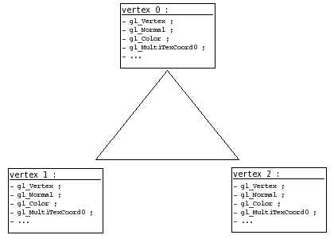

Chaque sommet possède son lot de données en tout genre : position, normale, couleur, etc… Eh bien imaginez que vous vouliez en rajouter ; vous pouvez !

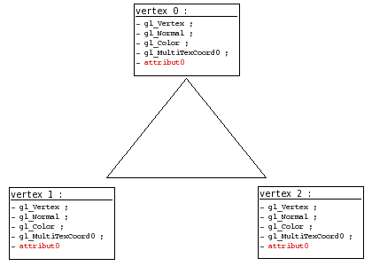

C’est ce qui se passe lorsque vous créez une variable avec le type **attribute** :)

## Côté API

Bien, voyons maintenant comment spécifier la valeur de ces données en plus que sont les attributs de sommet.

Globalement, le principe est le même que pour les variables uniform :

- on récupère l’ID (plus couramment appelé **index** dans le cas des attributs de sommet) de notre attribut ;
    
- on s’en sert pour localiser nos attributs et ainsi leur envoyer la valeur de notre choix.
    

### Récupérer l’index

Bon, comme vous avez déjà pris l’habitude avec les uniforms, je vais aller un peu plus vite dans la pratique. Pour récupérer l’index d’un attribut de sommet dans un shader GLSL, invoquez *glGetAttribLocation()* :

```
GLint glGetAttribLocation(GLuint program, const char *name);
```

- ***program*** : désigne le program dans lequel nous voulons rechercher l’index.
    
- ***name*** : c’est le nom de l’attribut dont on souhaite obtenir l’index.
    

Une fois que nous avons notre index, il nous suffira de le spécifier à la fonction qui permet de définir les valeurs des attributs de sommet, et ces valeurs étant différentes pour chaque sommet, il nous faudra appeler cette fonction pour chaque sommet que nous définirons.

### Spécifier la valeur d’un attribut

Prenons un exemple ; supposons un triangle, créé de la façon suivante avec OpenGL :

```
glBegin(GL_TRIANGLES);
    glVertex2f(0.9, -0.9);
    glVertex2f(-0.9, -0.9);
    glVertex2f(0.0, 0.9);
glEnd();
```

Avec ce code, nous demandons la création de trois sommets (pour former un triangle). Pour chaque sommet traité, le vertex shader actif sera invoqué et sa variable *gl_Vertex* sera affectée aux valeurs que nous avons spécifiées à la fonction *glVertex*()*. Il en va de même pour chaque variable d’entrée du vertex shader (couleur, normale, …), y compris son attribut. Ainsi, pour affecter un attribut d’un sommet, il suffit de spécifier sa valeur pour chaque création de sommet avec la fonction *glVertexAttrib*()*, en spécifiant bien quel attribut nous souhaitons affecter via son index :

```
glBegin(GL_TRIANGLES);
    glVertexAttrib3f(index, 0.0, 0.0, 0.0); glVertex2f(0.9, -0.9);
    glVertexAttrib3f(index, 0.0, 0.0, 0.0); glVertex2f(-0.9, -0.9);
    glVertexAttrib3f(index, 0.0, 0.0, 0.0); glVertex2f(0.0, 0.9);
glEnd();
```

Et voici son prototype :

```
void glVertexAttrib*(GLuint index, TYPE vals);
```

- ***index*** : il s’agit là de placer l’index que l’on a récupéré avec *glGetAttribLocation()*.
    
- ***vals*** : ce sont les valeurs auquels on souhaite positionner notre attribut, le nombre de valeurs peut varier de 1 à 4 inclus.
    

La fonction *glVertexAttrib*()\* permet de spécifier la valeur de l’attribut de chaque sommet, comme vous venez de le voir. Voici un exemple d’utilisation des attributs de sommet :

```
attribute float numero_sommet; // representera le numero du sommet
```

```
/* on recupere l'index de notre attribut de sommets */
int index = glGetAttribLocation(program, "numero_sommet");

...

/* on active notre program */
glUseProgram(program);

glBegin(GL_TRIANGLES);
    glVertexAttrib1f(index, 0.0); glVertex2f(0.9, -0.9);
    glVertexAttrib1f(index, 1.0); glVertex2f(-0.9, -0.9);
    glVertexAttrib1f(index, 2.0); glVertex2f(0.0, 0.9);
glEnd();

/* on desactive les shaders */
glUseProgram(0);
```

Vous noterez que la forme de *glVertexAttrib*()\* utilisée doit correspondre au type de l’attribut dans le shader, sinon vous risquez de vous retrouver avec une valeur d’attribut erronée dans votre shader (en gros ça fera comme si vous faisiez un cast GLSL : *Attrib = TypeDeAttrib(TypeDeLaFonction)* ).

Je vous conseille d’aller faire un petit tour sur la page de manuel de *[glVertexAttrib*()](http://www.opengl.org/sdk/docs/man/xhtml/glVertexAttrib.xml)*, vous risquez d’y trouver quelques informations complémentaires intéressantes ; cette fonction vous permet notamment de normaliser le vecteur que vous lui envoyez.

* * *

## Les tableaux d’attributs

Si vous connaissez les [vertex arrays](http://www.siteduzero.com/tuto-3-18395-1-les-vertex-arrays.html), et que vous êtes un flemmard (quelqu’un de normal quoi), vous vous êtes probablement demandé : mais existe-t-il une alternative pour envoyer mes attributs de sommets par le biais de tableaux ? Eh bien la réponse est oui :)

Cette section est bien sûr facultative, elle ne vous aidera pas à mieux comprendre le fonctionnement des attributs de sommet, elle est plutôt réservée aux connaisseurs des vertex arrays.

## Activation des tableaux d’attributs

À l’instar des vertex arrays simples, les tableaux d’attributs ont besoin d’une activation qui leur est propre. Chaque index d’attribut doit être activé indépendamment, car chaque index représente un type de données différent.

Que quoi ? Hein ??

Oui, chaque index d’attribut représente un type différent ; la différence qu’il y a entre l’index 0 et l’index 1 est la même qu’entre la position d’un sommet et sa normale : ce ne sont pas les mêmes données, elles sont identifiées différemment. Je vous conseille d’aller jeter un oeil à [ma petite définition de ce qu’est un sommet](http://www.siteduzero.com/tuto-3-18395-1-les-vertex-arrays.html#ss_part_1), dans mon tutoriel sur les vertex arrays.

Bien, revenons-en au sujet initial : l’activation. Étant donné que chaque type d’attribut est identifié différemment par OpenGL, il va falloir, comme pour chaque type de donnée d’un sommet, l’activer indépendamment des autres, et pour cela, il va nous falloir son **index**. Avec la fonction *glEnableClientState()*, c’était facile, il nous suffisait de lui donner une constante au nom trivial et facile à retenir, et hop, elle activait le type de vertex array demandé.

La fonction *glEnableVertexAttribArray()* quant à elle, demande l’index de l’attribut à activer.

```
void glEnableVertexAttribArray(GLuint index);
```

- ***index*** : c’est l’index du type de l’attribut que l’on souhaite activer.

Avec les shaders GLSL, l’index d’un attribut de sommet se récupère comme nous l’avons vu plus haut : avec la fonction *glGetAttribLocation()*. Après vous être muni de cet index, vous n’aurez qu’à le donner à *glEnableVertexAttribArray()* pour que nous puissions exploiter les attributs de sommet demandés :)

## Envoi d’un tableau

Allez, je ne vais pas passer par 36 chemins ; ici je considère que vous maîtrisez un minimum le concept des vertex arrays, je ne m’étalerai donc pas sur les détails.

Afin de spécifier un tableau d’attributs, utilisez la fonction *glVertexAttribPointer()* :

```
void glVertexAttribPointer(GLuint index, int size, GLenum type, GLboolean norm, GLsizei stride, const void *data);
```

- ***size***, ***type***, ***stride***, ***data*** : référez-vous à mon tutoriel sur les vertex arrays, ces paramètres ont la même incidence que ceux des autres fonctions *gl*Pointer()*.
    
- ***index*** : il s’agit d’indiquer ici le type de l’attribut, c’est-à-dire son index récupéré à l’aide de *glGetAttribLocation()*.
    
- ***norm*** : positionné à GL\_TRUE, les vecteurs contenus dans votre tableau de données seront normalisés. Je vous conseille personnellement de laisser ce paramètre à 0 (ou GL\_FALSE), ainsi OpenGL ne touchera pas à vos données.
    

Comme vous le voyez, cette fonction demande à ce qu’on lui fournisse le type d’attribut que représentera le tableau qu’on lui envoie.

Comment ça se fait ? Pourquoi elle a besoin de savoir ça, alors qu’on a déjà donné l’index lorsqu’on a activé les tableaux ?

Car vous pouvez avoir activé plusieurs tableaux d’attributs à la fois (c’est possible sachez-le), il est donc important de spécifier explicitement quel est le type d’attribut que vous lui envoyez.

Le reste du fonctionnement est le même que pour les vertex arrays (les tabeaux d’attributs sont en fait des vertex arrays un peu différents sur certains points) : après avoir appelé cette fonction, le tableau sera envoyé à la carte graphique pour traitement lorsque vous appelerez une fonction de dessin comme *glDrawArrays()* ou *glDrawElements()*.

### Et les VBOs ?

Ah ! J’allais les oublier ceux-là. Les tableaux t’attributs ayant un système de fonctionnement identique aux vertex arrays, vous pouvez également héberger vos tableaux dans un VBO, puis utiliser l’adresse 0 avec *glVertexAttribPointer()* pour spécifier l’emplacement de votre VBO actif, et utiliser les données directement à partir de la mémoire de la carte graphique.

« VBO » ? Avons-nous été présentés ?

Vous ne connaissez pas les VBOs ? Eh bien alors il est grand temps que vous fassiez leur connaissance ! Les VBOs sont un sujet assez vaste, c’est pourquoi je vous ai concocté [un petit tutoriel à leur sujet](http://www.siteduzero.com/tuto-3-18397-1-les-vertex-buffer-objects.html). Pour faire court ; les VBOs sont une sorte d’amélioration du système des vertex arrays, ils servent à augmenter considérablement leur performance (pour peu qu’ils soient bien utilisés) ;)

## Désactivation des tableaux d’attributs

Je vous l’avais dit que les tableaux d’attributs étaient des vertex arrays :p Un peu différents toutefois, la fonction pour désactiver les tableaux d’attributs est la suivante :

```
void glDisableVertexAttribArray(GLuint index);
```

- ***index*** : encore une fois, il est nécessaire d’indiquer quel type d’attribut on souhaite désactiver.

## Exemple d’utilisation

Un petit exemple ne fera pas de mal je pense. Vous vous rappelez de l’exemple qui présentait une utilisation possible des attributs de sommet, en spécifiant les attributs un à un ? Je vous en propose ici l’adaptation qui utilise les tableaux d’attributs :

```
attribute float numero_sommet;
```

```
/* notre index d'attribut */
int index;

/* tableau des positions */
float pos[6] =
{
    0.9, -0.9,
    -0.9, -0.9,
    0.0, 0.9
};
/* tableau t'attributs */
float attribs[3] =
{
    0.0, 1.0, 2.0
};

...

/* on recupere l'index de notre attribut de sommets */
index = glGetAttribLocation(program, "numero_sommet");

...

/* on active les tableaux */
glEnableClientState(GL_VERTEX_ARRAY);
glEnableVertexAttribArray(index);

/* on specifie nos donnees */
glVertexPointer(2, GL_FLOAT, 0, pos);
glVertexAttribPointer(index, 1, GL_FLOAT, 0, 0, attribs);

glUseProgram(program);

/* dessin */
glDrawArrays(GL_TRIANGLES, 0, 3);

glUseProgram(0);

/* on desactive les tableaux */
glDisableVertexAttribArray(index);
glDisableClientState(GL_VERTEX_ARRAY);
```

Ce chapitre touche à sa fin ; nous y avons vu deux méthodes pour transmettre des informations à nos shaders : l’une où l’on envoyait une “simple” variable, allant de l’entier à la matrice 4×4, et l’autre où l’on pouvait envoyer des données différentes à chacun de nos sommets.

## Téléchargement

Comme promis, voici un programme exemple, afin que vous voyez comment on peut mélanger efficacement tout ce qu’on vient de voir.

[Télécharger l’exemple de code et le makefile Linux.](http://yno.goldzoneweb.info/sdz/ch5.zip)

[Télécharger l’exemple utilisant les vertex arrays.](http://yno.goldzoneweb.info/sdz/ch5-2.zip)

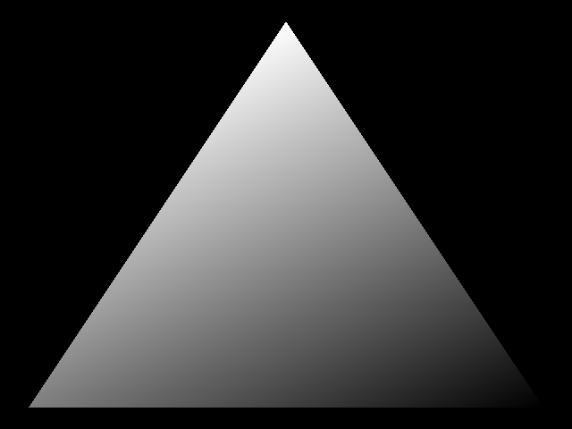

*Screenshot de l’application exemple.*

Comme d’habitude, l’exemple ne présente rien d’extraordinaire, toutefois ne vous inquiétez pas ; nous verrons dans la prochaine partie de ce tutoriel comment réaliser différents effets graphiques grâce aux shaders, afin d’embellir nos scènes 3D :)

Le tuto n’est pas fini, d’autres chapitres/parties sont en cours de rédaction ;)

* * *

## Les vecteurs

Cette annexe risque d’être votre plus grande alliée si vous voulez réellement comprendre le fonctionnement de la plupart des effets que nous étudierons dans la partie 3. Nous allons ici étudier ce qu’est un vecteur, ce qu’est la **normalisation** d’un vecteur, comment on fait le **produit scalaire** de deux vecteurs, comment on fait leur **produit vectoriel**, mais surtout, à quoi tout cela peut servir. Je me doute que vous avez probablement déjà appris ces concepts à l’école, mais vous a-t-on déjà donné une utilisation pratique de ces outils mathématiques forts pratiques que sont les vecteurs ? Non ? Et bien je vais vous en donner une :) Vous verrez, lorsqu’on a un objectif, l’apprentissage d’un concept est tout de suite plus simple.

## Les vecteurs, notions de base

Il est avant-tout important de savoir additionner et soustraire deux vecteurs, ces opérations très simples sont la base des vecteurs mais on les utilise tout le temps, il est donc important de les maîtriser.

Attention préparez-vous, car ce chapitre va pleuvoir de schémas. Je me baserai sur une illustration 2D, mais les calculs que je ferai sont tout à fait appliquables en 3D, et heuresement, car c’est notre objectif.

## Un vecteur, c’est quoi ?

Cette section est bien sûr réservée aux néophytes, si vous savez déjà ce qu’est un vecteur, passez tout de suite au gros titre suivant.

Vous pouvez comparer un vecteur avec une **direction**. Un vecteur marche aussi bien en 1D, qu’en 2D et qu’en 3D, les principes sont les mêmes.

Oui mais un vecteur, ça ressemble à quoi ?

Je vous propose de voir mon premier schéma, qui illustre un plan 2D et un vecteur dessiné dans ce plan :

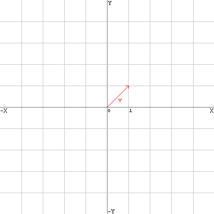

Cette barre rouge au milieu est un vecteur, comme vous le voyez, elle représente une direction. Ce vecteur v s’écrit comme ceci :

v(1; 1)

Le premier chiffre représente la composante x, et le second la composante y. Pour les vecteurs 3D, il y a une 3eme composate : la composante z. Ici notre vecteur peut être transformé en vecteur 3D, il aura donc une composante z nulle :

v(1; 1; 0)

Puisqu’un vecteur représente une direction, on part du principe qu’un vecteur commence toujours au point (0; 0).

## L’addition de vecteurs

L’addition de vecteurs sert à obtenir une coordonnée finale dans l’espace résultante de plusieurs vecteurs. Comme l’illustre le schéma ci-dessous, mes deux vecteurs additionnés donnent naissance à un 3eme point qui est le résultat de l’addition des vecteurs a et b :

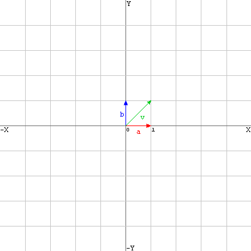

Vous pouvez toujours additionner un vecteur à un autre, et ainsi vous ballader librement dans l’espace, c’est un peu le principe qui est utilisé pour les **caméras** dans les jeux vidéos : la position de la caméra est représentée par un vecteur auquel on en additionne d’autres afin de **déplacer** la caméra.

Pour additionner deux vecteurs mathématiquement, on procède à l’addition de chaque composante du vecteur a par la même composante chez le vecteur b :

a(1; 0) + b(0; 1) = v(1; 1)

Soit :

v.x = a.x + b.x v.y = a.y + b.y

Essayons d’additionner plusieurs vecteurs entres eux. Nous allons additionner 3 vecteurs : a, b et c. Voici ces trois vecteurs :

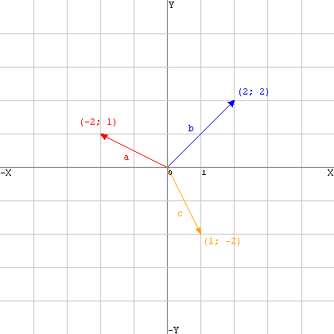

Euh, comment on additionne tout ça ?

Je vais vous représenter tout ces vecteurs autrement. On peut schématiser l’addition comme ceci :

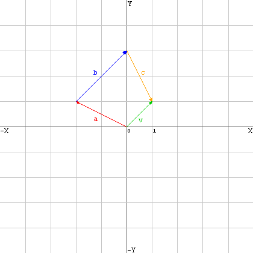

Ici, le vecteur résultant, v, se calcule ainsi :

v.x = a.x + b.x + c.x v.y = a.y + b.y + c.y

Ce qui donne :

v.x = -2 + 2 + 1 v.y = 1 + 2 + -2

Nous obtenons donc le vecteur v(1; 1).

Notez que l’ordre d’addition n’a pas d’importance : 2+1 = 1+2 Voyez ci-dessous l’illustration d’un autre ordre d’addition : on retombe exactement au même endroit qu’avant (1; 1) :

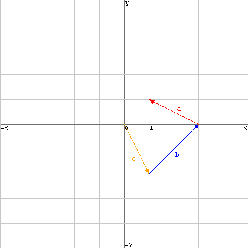

### L’addition de vecteurs pour trouver une moyenne

L’addition de vecteurs peut également servir à trouver un vecteur moyen entre plusieurs vecteurs, en fait c’est ce que nous avons fait jusqu’à maintenant, mais à présent si nous considérons la position résultante de l’addition de plusieurs vecteurs comme une **direction** et non une position, nous obtenons en fait la direction moyenne de tous les vecteurs additionnés.

Reprenons notre premier schéma sur l’addition des vecteurs :


Nous voyons ici que le vecteur résultant est positionné exactement entre a et b. Il est souvent utile de connaître une moyenne entre plusieurs directions, à présent vous savez comment faire, il suffit d’additionner toutes ces directions entres elles.

## La soustraction de vecteurs

La soustraction de vecteurs est utilisée pour connaître le vecteur qui va d’un point à un autre. Supposez que vous ayez les coordonnées dans l’espace de deux objets A et B, et que vous vouliez connaître le vecteur qui va de A vers B, ou de B vers A, il va vous falloir utiliser la soustraction de vecteurs.

Ca me servira à quoi de connaître le vecteur qui va de A vers B ?

Imaginez par exemple que vous vouliez programmer une animation fluide qui déplace l’objet A vers l’objet B, il vous faudra connaître la direction dans laquelle déplacer A, la soustraction de vecteurs est inévitable.

Voici un schéma de base pour illustrer ce que nous recherchons :

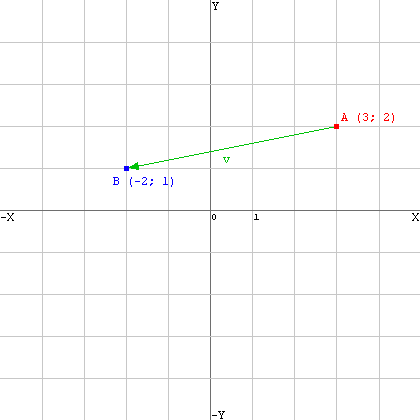

Nous allons calculer le vecteur v en soustrayant A à B. Cela fonctionne exactement de la même façon que l’addition, rien de plus simple :

v.x = B.x - A.x v.y = B.y - A.y

Ce qui revient à effectuer le calcul suivant :

v.x = -2 - 3 v.y = 1 - 2

Nous obtenons le vecteur v(-5; -1). Si nous le traçons dans le plan, nous obtenons… ceci :

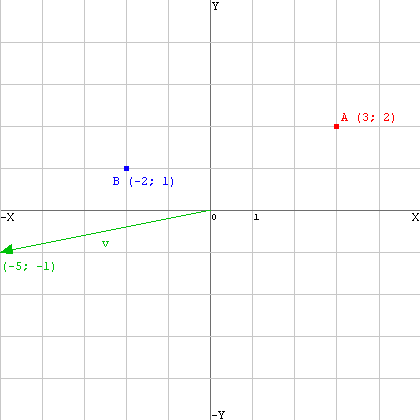

Héé, c’est pas du tout ça !

Mais si, il suffit de placer l’origine du vecteur sur le point A et nous obtenons ce que nous cherchions.

* * *

## Longueur et normalisation

## Une question de longueur

Avant de voir ce qu’est la **normalisation** d’un vecteur, il nous faut d’abord voir ce qu’est sa **longueur** et ce qu’elle représente.

### La longueur d’un vecteur, c’est quoi ?

La longueur d’un vecteur, c’est la distance qui sépare le point (0; 0) du point pointé par le vecteur dont on veut connaître la longueur. Lorsque nous dessinons ceci :

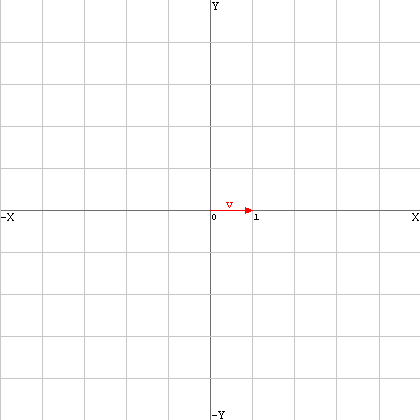

Il est aisé de s’appercevoir que la longueur du vecteur v est de **1**. En revanche, la longueur d’un vecteur comme nous en avons vu tout à l’heure :


est moins évidente, il nous faut la calculer.

### Calculer la longueur d’un vecteur

Vous connaîssez probablement Pythagore, ce Grec philosophe et mathématicien de l’antiquité ? Non ? Mais alors connaîssez-vous seulement son théorème ? Si vous ne le connaîssez pas, vous risquez d’avoir quelques difficultés à comprendre cette partie du chapitre.

La longueur d’un vecteur se calcule ainsi :

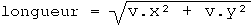

Dans le cas d’un vecteur à 3 dimensions, le calcul est le même, il suffit de rajouter la composante z comme ceci :

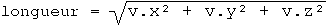

longueur est égal à la longueur du vecteur v. Il est possible d’illustrer le calcul de la longueur de notre vecteur à deux dimensions v :

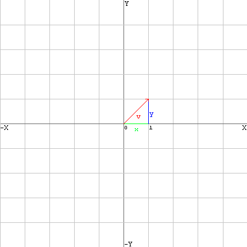

Nous remarquons ici la présence d’un triangle rectangle, sur lequel on a en fait tout simplement appliqué le théorème de Pythagore ;)

## La normalisation

La normalisation d’un vecteur revient à donner une **norme** de **1** à sa longueur. Ce qui veut dire que la longueur d’un vecteur normalisé est toujours de **1**.

### Représentation de la normalisation

Il est possible d’illustrer la normalisation d’un vecteur par un simple schéma :

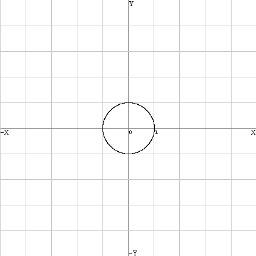

Soit 1 le rayon de ce cercle, tout vecteur partant du point (0; 0) et ayant une longueur de 1 touchera pile poil un endroit de la courbe de ce cercle.

Quel est l’utilité de la normalisation ?

L’utilité est difficile à démontrer pour l’instant, nous verrons cela plus bas lorsque nous parlerons du produit scalaire.

### Calcul de la normalisation

Effectuer une normalisation est très simple, surtout si l’on sait calculer la longueur d’un vecteur et qu’on a bien compris le principe de la normalisation.

Il suffit en fait de diviser chaque composante du vecteur (x, y, z (si 3D)) par la longueur du vecteur, et nous obtenons un vecteur normalisé. Rappelez-vous du calcul de la longueur d’un vecteur, vu plus haut. Nous avons donc une valeur appelée longueur qui est la longueur de notre vecteur v. Puisque la normalisation d’un vecteur signifie qu’il faut diviser chaque composante du vecteur par la longueur du vecteur, le calcul s’effectue ainsi :

v.x = v.x / longueur; v.y = v.y / longueur;

Il faut bien sûr rajouter ce calcul :

v.z = v.z / longueur;

si le vecteur est en 3D.

Notez que pour un vecteur 4D (c’est-à-dire avec une composante w), la normalisation de ce dernier revient à diviser chacune de ses trois premières composantes par w au lieu de longueur.

Si vous recalculez la longueur d’un vecteur normalisé, vous verrez que le résultat sera 1.

### Une application pratique

Je vous propose de voir une première utilisation pratique des vecteurs normalisés, car je suis sûr que vous vous demandez à quoi la normalisation peut servir.

Souvenez-vous de notre schéma avec nos objets A et B, nous avions réussi à créer un vecteur qui allait de A vers B :


*(notez qu’ici je n’ai pas dessiné le vecteur normalisé)*

Supposons que nous normalisons ce vecteur et que nous l’appelons v.

Avec la normalisation, on sait de combien on se déplace : on se déplace toujours de **1**. Supposons que vous ayez considéré en OpenGL que 1 = 1 mètre, alors vous êtes sûrs qu’en additionnant un vecteur normalisé à un point celui-ci se déplacera d’un mètre dans la direction indiquée par le vecteur.

Ainsi, en additionnant v à A, nous sommes sûrs et certains que A se déplacera d’un mètre dans la direction de B. Et si nous voulons qu’il se déplace d’un centimètre, comme nous avons un vecteur normalisé, nous n’aurons qu’à diviser celui-ci par 100 avant de l’additionner à A pour qu’il se déplace d’un centimètre.

Diviser un vecteur par un réel quelconque revient à diviser chaque composante du vecteur par le réel en question, comme pour la normalisation, mais en remplaçant longueur par ce réel. Il en va de même pour la multiplication d’un vecteur par un réel, sauf que cette fois au lieu de diviser on multiplie.

Et voilà, vous savez maintenant normaliser un vecteur et vous en servir pour une utilisation basique. Nous allons voir maintenant une technique de calcul qui nécessite obligatoirement des vecteurs normalisés : le produit scalaire.

* * *

## Le produit scalaire (dot product)

Le produit scalaire se dit *dot product* en anglais. Vous avez peut-être déjà entendu parler du produit scalaire, mais savez-vous comment le calculer et surtout, à quoi il peut servir ? Non ? Et bien nous allons voir ça :)

## Le produit scalaire comme calculateur d’angles

Effectuer le produit scalaire de deux vecteurs, c’est connaître l’angle qu’il y a entre deux vecteurs. Voici un schéma qui illustre assez bien ce que nous voulons calculer :

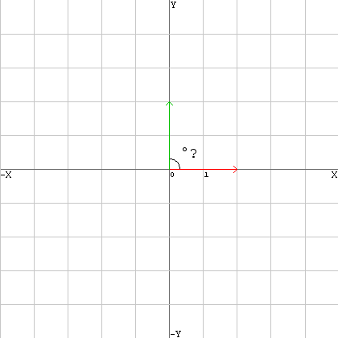

Bon, là je vous l’accorde, l’angle se devine facilement. Mais il se devine seulement, car en programmation 3D il ne s’agit pas de deviner, il s’agit de calculer.

Si nous prenons deux vecteurs, (3; 2; 5) et (0; 2; 1) par exemple, comment, à partir de ces données, pourriez-vous calculer l’angle qui sépare ces deux vecteurs ? Le produit scalaire sert à calculer cela.

Ça marche aussi en 3D ?

Bien sûr ! sinon cela n’aurait aucun intérêt.

Nous supposerons par la suite que tous nos vecteurs sont normalisés.

## Le calcul du produit scalaire

En supposant que vous ayez deux vecteurs, a et b, et que vous souhaitez connaître leur produit scalaire, le calcul est, pour des vecteurs 2D :

dot = (a.x * b.x) + (a.y * b.y)

Et en 3D, on rajoute la composante Z, aussi simplement que cela :

dot = (a.x * b.x) + (a.y * b.y) + (a.z * b.z)

Euh, c’est bien joli ce dot, mais c’est quoi ? C’est la valeur de l’angle ?

Non, mais c’est le cosinus de l’angle.

Si dot vaut **1**, les deux vecteurs pointent dans la même direction (0°). Si dot vaut **0**, alors les deux vecteurs pointent dans deux directions qui sont à angle droit (90°).

Et donc logiquement, quand dot est entre 0 et 1, l’angle est compris entre 90° et 0°.

Mais moi je veux un angle en degrès précis, ça va me servir à quoi sinon ? Et que vaut dot quand les vecteurs sont séparés par plus de 90° ? Et puis à quoi ça sert de calculer le produit scalaire ?

Tout d’abord, pour obtenir l’angle, il suffit d’utiliser la simple fonction mathématique arc cosinus (cos-1() sur les calculatrices) sur notre valeur dot. Mais attention, arc cosinus ne fonctionne pas sur des nombres négatifs, et lorsque l’angle qui sépare deux vecteurs est supérieur à 90°, dot prend alors une valeur négative, et on ne peut alors plus calculer l’angle qui sépare nos vecteurs.

Mais rassurez-vous, en 3D cela sera inutile, nous nous contenterons de vérifier si dot se situe entre 0 et 1, sinon on considèrera sa valeur comme étant de 0.

Ah ouais, mais alors il sert à quoi ce produit scalaire ?

Pour vous répondre en quelques mots : à calculer le taux de reception de lumière d’un plan. Nous étudierons cela plus en détail lorsque nous apprendrons à gérer la lumière dans la 3eme partie du tutoriel.

Pour clore, retenez que :

- Le produit scalaire sert à calculer l’angle entre deux vecteurs.
    
- Le produit scalaire ne fonctionne **que** sur des vecteurs normalisés !
    

* * *

## Le produit vectoriel (cross product)

Le produit vectoriel sert à calculer le vecteur perpendiculaire à deux autres vecteurs. Le produit vectoriel se dit *cross product* (produit croisé) en anglais, mais vous voudriez peut-être savoir à quoi cela sert avant d’apprendre à le calculer ? Pas de problème.

## Notion de “normale” d’une face

Nous allons commencer simplement.

Toute face (surface plane) possède une **normale**. Prenons par exemple votre table de bureau, c’est une surface plane. Sa normale pointe pile poil vers le plafond (vers le haut).

Voici comment schématiser la normale d’une face :

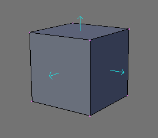

Voici un cube. J’ai dessiné (à l’aide de Blender) pour chaque face du cube, sa normale. Comme vous pouvez le voir, la normale d’une face plane est un vecteur qui est perpendiculaire à la face.

Quel est le rapport avec le produit vectoriel ?

Et bien le produit vectoriel permet de calculer cette normale, uniquement grâce aux positions des sommets qui la composent :)

## Calcul du produit vectoriel

Il est temps maintenant de représenter le produit vectoriel, ainsi que de montrer le calcul qu’il faut faire pour le trouver.

Le calcul du produit vectoriel se fait à partir de deux vecteurs et permet d’obtenir un autre vecteur. Ce vecteur obtenu est perpendiculaire aux deux autres vecteurs… tout comme la normale d’une face est perpendiculaire à la face elle même.

Nous pouvons faire l’analogie avec le produit vectoriel et la normale d’une face. En effet, voyez plutôt ce schéma :

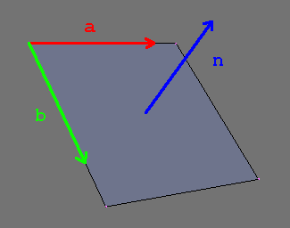

Cette illustration résume assez bien tout ce que nous venons de voir :) Nous pouvons voir d’une part les vecteurs a et b, d’autre part le vecteur n, qui n’est autre que le résultat du produit vectoriel de a et b, en effet, n est perpendiculaire à a et b. Mais il est aussi perpendiculaire à la face, il représente donc sa normale.

Nous venons de voir qu’avec deux vecteurs qui longent les bords d’une face, nous pouvons obtenir la normale de cette face

Et comment on les trouve ces vecteurs qui longent les bords de notre face ? (a et b)

Revoyez la première partie de ce chapitre, et plus précisément l’endroit qui parle de la soustraction de vecteurs… vous devriez trouver assez aisément ;) Rappelez-vous que nous connaissons les positions des sommets qui constituent notre face.

Mais ça ne nous dit pas le plus important : comment on calcule ça ?

Oh ça, c’est le moins important, il s’agit d’une grosse formule barbare, l’important c’est de bien savoir ce que permet de faire le produit vectoriel.

Voici le calcul du produit vectoriel :

n.x = (a.y * b.z) - (a.z * b.y) n.y = (a.z * b.x) - (a.x * b.z) n.z = (a.x * b.y) - (a.y * b.x)

Notez que si vous échangez les vecteurs a et b dans les calculs, le vecteur obtenu sera exactement le vecteur opposé à celui que vous auriez obtenu sans échanger a et b.

Mais alors comment connaître le bon ordre de calcul pour obtenir la bonne normale de notre face ?

Il n’existe pas de méthode magique pour cela… Comment savoir quelle doit être la normale de votre face ? Il n’y a pas de “haut” en 3D, ni nulle part d’ailleurs, tout est relatif. Les sommets des triangles dans les maillages sont généralement donné dans un ordre conventionnel, ce qui permet de détermnier l’orientation de la face.

Les vecteurs ne sont pas une notion simple à aborder, il est possible qu’il vous fasse du temps avant de vous y faire. Prenez le temps de relire tranquillement chaque passage de ce chapitre afin de vous familiariser avec les vecteurs, c’est essentiel croyez-moi, car nous les utiliserons en permanence par la suite. Il est donc important que vous vous sentiez à l’aise avec ceux-ci.

Pour finir, je vais vous renvoyer sur les articles de Wikipedia à propos de tout ce que nous avons appris, ça vaut toujours le coup d’oeil.

- [Le vecteur.](http://fr.wikipedia.org/wiki/Vecteur)
    
- [Le produit scalaire.](http://fr.wikipedia.org/wiki/Produit_scalaire)
    
- [Le produit vectoriel.](http://fr.wikipedia.org/wiki/Produit_vectoriel)
    

Et voilà, c’est la fin de cette annexe, n’hésitez pas à venir la consulter régulièrement si vous vous sentez bloqué par la suite.

Merci au site [www.developpez.com](http://www.developpez.com/) et aux membres de sa section programmation 3D, grâce auxquels j’ai acquis la plupart des mes connaissances actuelles en terme de programmation 3D.

Les commentaires, critiques ou corrections sont les bienvenus. Si vous pensez avoir trouvé une incohérence ou si vous avez mal compris quelque chose, n’hésitez pas à m’en faire part, je serai heureux de pouvoir améliorer le tutoriel pour vous ;)

*[](http://creativecommons.org/licenses/by-sa/2.0/fr/)Cette création est mise à disposition sous un [contrat Creative Commons](http://creativecommons.org/licenses/by-sa/2.0/fr/).*

* * *