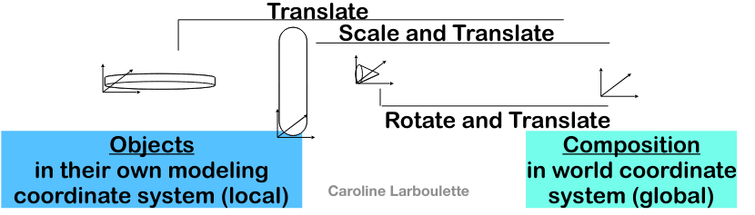

**creation**, **storage** and **manipulation** of models (biological, mathematical, artistic or abstract structures) and images

**Animation Pipeline** = 3 steps: modeling, animating, rendering 

* * *

# Interactive vs Batch Computer Graphics

## **Interactive Computer Graphics**

- Control of content, structure and appearance of objects via **rapid visual feedback**
- Components
    - Input (mouse, stylus, multi-touch, body…)
        
    - Processing (movement + rendering + storage)
        
    - Output/Display (screen, printer, video recorder, VR/AR systems…)
        

## Batch Computer Graphics

- Batch mode means non-interactive
- Used for final production-quality video and film (Maya, FX-special effects), 24 fp
- Slow to compute: rendering of 1 frame of Monsters University (2013) averaged 29 hours on a 24000-core render farm

* * *

# Vector vs Raster Display

## Vector Display Hardware

- Calligraphic (laser beam), stroke (oscilloscope), random-scan (electron beam)
    
- Driven by display commands
    
    - moveto(x,y)
    - char(“A”)
    - lineto(x,y
- Scalable (indefinite zoom)
    

## **Raster Display Hardware**

- TV / screens, bitmap, pixmap
- Driven by an array of pixels
    - No semantics
    - Lowest level of representation
- Aliasing errors (jaggies) due to discrete sampling of continuous primitives

* * *

# Sample-based vs Geometry-based Graphics

## Sample-based Graphics

- Discrete samples are used to describe visual information
    
- Image is defined as pixel-array
    
- Pixels are point locations with associated sample values: light intensities/colors, transparency, and other control information
    
    - Created by digitizing images, using a sample-based “painting” program, camera, scanner  Input numerically (e.g., with numbers from computed dataset): for example, some aspect of the physical world is sampled for visualization, such as temperature across the US
- Image Editing: changes made by user, such as cutting and pasting sections, brush-type tools, and processing selected areas
    
- Image Processing: algorithmic operations that are performed on image (or portion of image) without user intervention. Blurring, sharpening, edge-detection, color balancing, rotating, warping. These are front-end processes to Computer Vision.
    
- Applications: Adobe Photoshop™, GIMP™ , Adobe AfterEffects™
    

### Advantages

- Once image is defined in terms of colors atlocations (x, y) on grid, image change is easy by altering location or color values
    - Example: reversing color mapping and make 1 = white, 0 = black 
- Once image is defined in terms of colors at locations (x,y) on grid, image change is easy by altering location or color values
    - Example: pixel information from one image can be copied and pasted into another, replacing or combining with previously stored pixels 

### Drawbacks

- WYSIAYG (What You See Is All You Get): No additional information
- No depth information
- Can’t change point of view
- At most can play with the individual pixels or groups of pixels to change colors, enhance contrast, find edges, etc.
- But increasingly great success in image-based rendering to fake 3D scenes and arbitrary camera positions. New images constructed by interpolation, composition, warping and other operations.

## **Geometry-based**

- Also called scalable vector graphics or object- oriented graphics
    
- Geometrical models are created and stored along with various appearance attributes (e.g., color, material properties)
    
- Models are mathematical descriptions of geometric elements - lines, polygons, polyhedrons, polygonal meshes…
    
- Geometric elements are primitive shapes, i.e. primitives
    

## Rendering

- Images are synthesized for visualization via sampling of geometry: rendering
    
- 2D applications: Adobe Illustrator™, Adobe Freehand™, Corel CorelDRAW™
    
- 3D applications: Autodesk AutoCAD™, Autodesk Maya™, Autodesk 3D Studio Max™
    

## Advantages

- Aspects of physical world can be simulated
- Animation is done using keyframes and interpolation
- High-level control

## Drawbacks

• Users cannot work directly with individual pixels as user manipulates geometric elements, program resamples and redisplays elements (except with shaders) • Increasingly, rendering combines geometry-and sample-based graphics, both as performance hack and to increase quality of final product

* * *

# Conceptual Framework Interactive Graphics

- Graphics library/package is **intermediary** between application and display hardware (Graphics System)
- Application program maps application objects to views (images) of those objects by calling on **graphics library**. Application model may contain lots of non-graphical data (e.g., non-geometric object properties)
- User interaction results in modification of image and/or model

* * *

# Frame-buffers

- **Monochrome** : 1 bit per pixel (bitmap)
    
- **Full color**: 24 bits/pixel - 8 for each or r,g,b
    
- **Others**: if a LUT is not used, can have as many colors or shades of grey as specified by the number of bits/pixel 8 bits => 256 colors (normally 3,3,2) or shades of grey.-
    
- **Color LUTs (palettes)**
    
    - Each entry in the frame buffer is an index into the LUT. - if n bits/pixel => 2n entries in the LUT- LUT entry then determines the color sent to the screen.
        
    - If each LUT entry is p bits, then can display 2p possible colors (example p=24 => 16 million colors in the palette)
        
    - Can only display 2n colors simultaneously.
        

- Example (typical) :
    
    - frame-buffer: 8 bits/pixel
        
    - LUT: 24 bits/entry
        
    - Therefore, can display 256 colors at any one time out of a possible 16 million
        

## Why use an LUT?

\- cheaper than full color (3 bytes\*1280\*1024 = almost 4MB of memory) - allows more displayable colors than without one. - Can do color table animation (later in course)

* * *

# Scenegraph

- Composition of a scene
    
- Stores objects and relations to one another
    
    - Objects created in decomposition process must be assembled to create final scene.
        
    - Done with affine transformations: T, R, S (not commutative, order matters !
        

* * *

# Lecture’s Overview

- Geometric **transformations** (translation, rotation, scale) are essential for model organization, process of composing complex objects from simpler components and animation (lecture 2)
    
- Once object’s geometry is established, it must be **viewed** on screen: from 3D geometry to 2D projections for viewing (lecture 3)
    
- While mapping from 3D to 2D, object (surface) material properties and lighting effects are used in **rendering** one’s constructions. This rendering process is also called **image synthesis** (lecture 5)