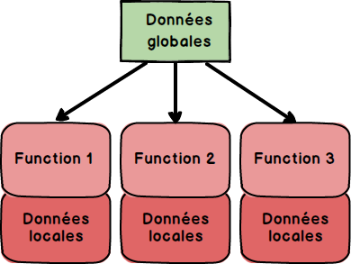

# Péocupation

1.  **fonctionnalité**
    - test
    - compléxité
2.  **Extensibilité**
    - si je veux rajouter une fonctionnalité, est-ce que je dois tout modifier
3.  **Modularité**
    - si je modifie un fichier, est-ce que ca a une conséquence pour les autres fichiers ?réutilisation
        - travail en équipe
            
        - limiter la diffusion des erreurs
            
        - cascades
4.  **Réutilisabilité**
    - duplication de code ?
    - Documentation ?
    - Qualité ?
5.  Testabilité
    - Facile à tester ?
    - Certitude ?
    - Couverture de test ?
6.  Clarté
    - La structure est facile à comprendre ?
    - facile à expliquer ?
    - simple à documenter ?

* * *

# Programmation impérative

- Une séquence d’instruction change un état général
- Détailler une suite d’instruction qui indique comment modifier des variables
- Les variables contiennent les confitions de départ et leur évolution donne le résultat du programme

Démarche : Trouver les structures de données et trouver une séquenec d’instruction qui modifie l’état

## programmation structurée

- Instruction de contrôle
- Blocs de code

## programmation procédurale

## programmation modulaire

modules regroupant fonctions, structures de donnée, types, objets, etc.

C++ / C / Java / PHP / Python / Ruby

## Programmation évènementielle

• Quand il se produit… Faire

## Programmation séquentielle

- Notion de bloc d’exécution
- Région spécifique
- Le sens de l’exécution est important => De gauche à droite et de haut en bas

Trouver une erreur revient à faire des hypothèses et à les vérifier

## POO

- Une collection d'objet en **interaction** via des **méthodes**
- Chaque objet est responsable de code
- Chaque objet possède un état

## Programmation par prototypes

- Self / Javascript
- Object sans (nécéssairement) classes

## Programmation chimique

- Gamma
- Transformation de multi ensembles
- Exemples
- Map/reduce
- On ne s'interesse pas au **comment**, mais au **quoi faire**

# **Programmation déclarative**

Prolog, SQL

# **Programmation par flots de données**

- Définition de dépendances entre données

Excel, Angular

# Fonctionnel

- Le résultat d’un programme c’est la transformation des données de départ
    - Pas besoin de variables
        
    - pas besoin de mémoire
        
    - Distribution
        
    - Fiabilité

# Récursif

- Boucle impérative
    - Parcourir explicitement chaque portion
        
    - Pas besoin de fonction
        
- Boucle récursive
    - Utiliser une fonction
        
    - Faire une petite partie, puis recommencer avec le reste